# 网络入侵检测系统需求与设计文档

## 1. 概述

本项目旨在构建一个轻量级、可扩展的网络入侵检测系统。系统由两大部分组成：**探针（Probe）**和**云端服务（Cloud Service）**。
探针部署在目标环境中，负责实时流量分析和威胁检测；云端服务负责规则管理、下发以及日志的接收和展示。

## 2. 系统架构

系统采用 Client-Server 架构，探针端通过 HTTP 协议与云端服务进行通信。

### 2.1 整体架构图

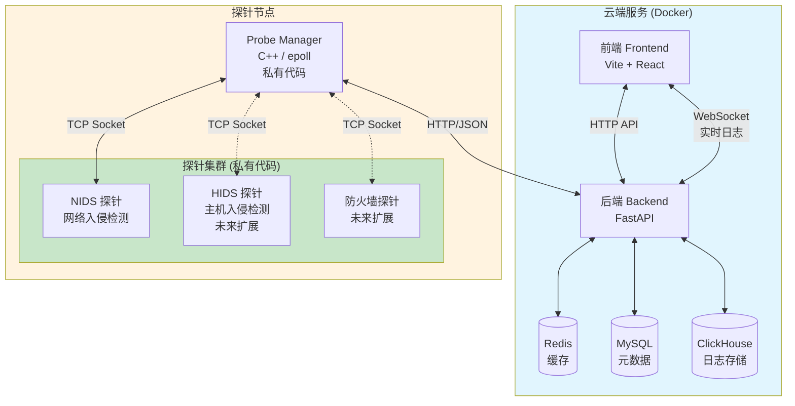
```mermaid
graph TB
    subgraph Cloud["云端服务 (Docker)"]
        FE[前端 Frontend<br/>Vite + React]
        BE[后端 Backend<br/>FastAPI]
        REDIS[(Redis<br/>缓存)]
        MYSQL[(MySQL<br/>元数据)]
        CH[(ClickHouse<br/>日志存储)]

        FE <-->|HTTP API| BE
        FE <-->|WebSocket<br/>实时日志| BE
        BE <--> REDIS
        BE <--> MYSQL
        BE <--> CH
    end

    subgraph ProbeNode["探针节点"]
        PM[Probe Manager<br/>C++ / epoll<br/>私有代码]

        subgraph Probes["探针集群 (私有代码)"]
            NIDS[NIDS 探针<br/>网络入侵检测]
            HIDS[HIDS 探针<br/>主机入侵检测<br/>未来扩展]
            FW[防火墙探针<br/>未来扩展]
        end

        PM <-->|TCP Socket| NIDS
        PM <-.->|TCP Socket| HIDS
        PM <-.->|TCP Socket| FW
    end

    PM <-->|HTTP/JSON| BE

    style Cloud fill:#e1f5fe
    style ProbeNode fill:#fff3e0
    style Probes fill:#c8e6c9
```

### 2.2 云端存储架构

云端采用多数据库架构，根据数据特性选择最适合的存储引擎：

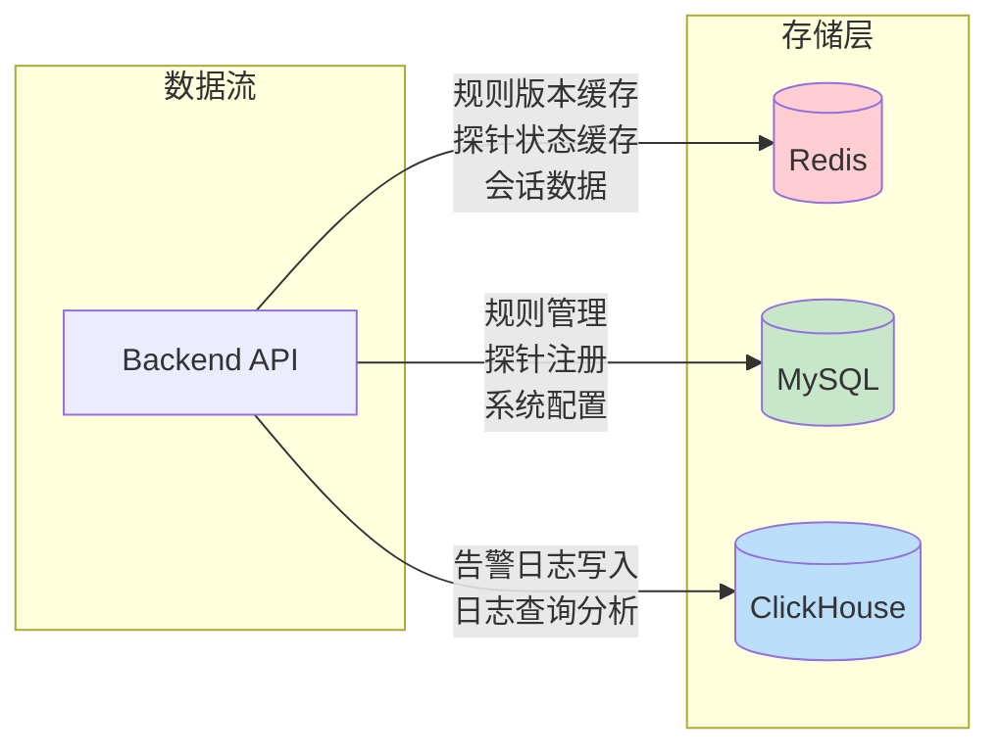
```mermaid
graph LR
    subgraph 数据流
        BE[Backend API]
    end

    subgraph 存储层
        REDIS[(Redis)]
        MYSQL[(MySQL)]
        CH[(ClickHouse)]
    end

    BE -->|规则版本缓存<br/>探针状态缓存<br/>会话数据| REDIS
    BE -->|规则管理<br/>探针注册<br/>系统配置| MYSQL
    BE -->|告警日志写入<br/>日志查询分析| CH

    style REDIS fill:#ffcdd2
    style MYSQL fill:#c8e6c9
    style CH fill:#bbdefb
```

| 存储 | 用途 | 数据类型 |
|:-----|:-----|:---------|
| **Redis** | 缓存层，提升读取性能 | 规则版本号、探针在线状态、最新规则内容缓存 |
| **MySQL** | 关系型数据持久化 | 规则定义、规则版本历史、探针注册信息、系统配置 |
| **ClickHouse** | 时序日志存储与分析 | 告警日志、检测事件、统计分析数据 |

### 2.3 探针类型与扩展性

Probe Manager 设计为通用的探针管理框架，支持管理多种类型的探针：

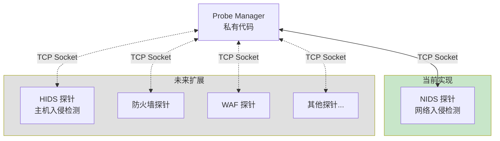
```mermaid
graph TB
    PM[Probe Manager<br/>私有代码]

    subgraph 当前实现
        NIDS[NIDS 探针<br/>网络入侵检测]
    end

    subgraph 未来扩展
        HIDS[HIDS 探针<br/>主机入侵检测]
        FW[防火墙探针]
        WAF[WAF 探针]
        OTHER[其他探针...]
    end

    PM <-->|TCP Socket| NIDS
    PM <-.->|TCP Socket| HIDS
    PM <-.->|TCP Socket| FW
    PM <-.->|TCP Socket| WAF
    PM <-.->|TCP Socket| OTHER

    style 当前实现 fill:#c8e6c9
    style 未来扩展 fill:#e0e0e0
```

| 探针类型 | 说明 | 状态 |
|:---------|:-----|:-----|
| **NIDS 探针** | 网络入侵检测，基于 Suricata | 当前实现 |
| **HIDS 探针** | 主机入侵检测 | 未来扩展 |
| **防火墙探针** | 网络防火墙管理 | 未来扩展 |
| **WAF 探针** | Web 应用防火墙 | 未来扩展 |

### 2.4 NIDS 探针内部架构（GPL 合规设计）

NIDS 探针为私有代码，内部通过**进程隔离**的方式调用 Suricata（GPL），确保 GPL 合规：

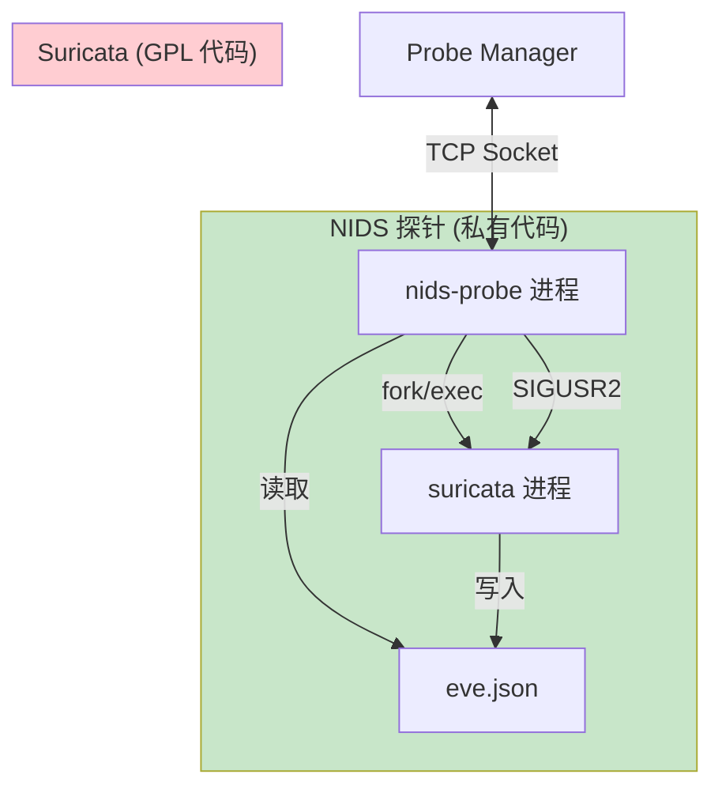
```mermaid
graph TB
    subgraph Private["NIDS 探针 (私有代码)"]
        NA[nids-probe 进程]
        NA -->|fork/exec| SR
        NA -->|读取| EVE[eve.json]
        NA -->|SIGUSR2| SR
    end

    subgraph GPL["Suricata (GPL 代码)"]
        SR[suricata 进程]
        SR -->|写入| EVE
    end

    PM[Probe Manager] <-->|TCP Socket| NA

    style Private fill:#c8e6c9
    style GPL fill:#ffcdd2
```

**GPL 合规要点**：

| 隔离方式 | 说明 |
|:---------|:-----|
| **进程隔离** | NIDS 探针与 Suricata 运行在独立进程中 |
| **文件通信** | 通过 eve.json 文件读取检测日志 |
| **信号通信** | 通过 SIGUSR2 信号触发规则热更新 |
| **无代码链接** | 私有代码不与 GPL 代码静态/动态链接 |

### 2.5 核心组件

1.  **云端服务 (Cloud Service)**
    *   **前端 (Frontend)**: 提供用户交互界面，用于规则编辑、版本管理、日志实时展示和探针管理。
    *   **后端 (Backend)**: 处理业务逻辑，提供 API 接口供前端和探针调用。
    *   **Redis**: 缓存层，缓存规则版本、探针状态等热点数据，提升 API 响应性能。
    *   **MySQL**: 存储规则定义、探针注册信息等关系型数据。
    *   **ClickHouse**: 存储海量告警日志，支持高速写入和复杂分析查询。
    *   **部署方式**: 使用 Docker Compose 进行容器化部署。

2.  **探针管理程序 (Probe Manager)** - 私有代码
    *   系统的核心守护进程
    *   基于 **epoll** 实现高性能 I/O 多路复用
    *   支持管理多种类型的探针（NIDS、HIDS、防火墙等）
    *   负责与云端 HTTP 通信、规则分发、日志聚合上报

3.  **NIDS 探针** - 私有代码
    *   网络入侵检测探针
    *   内部通过进程隔离方式调用 Suricata（GPL）
    *   通过 TCP Socket 与 Probe Manager 通信
    *   负责实际的流量分析和入侵检测

### 2.6 设计原则

*   **GPL 合规性**: NIDS 探针（私有）通过**进程隔离 + 文件/信号通信**的方式与 Suricata（GPL）交互，确保私有代码不被 GPL 传染。
*   **高性能**: Probe Manager 使用 epoll 实现事件驱动架构，支持高并发管理多个探针。云端使用 Redis 缓存和 ClickHouse 列式存储，优化读写性能。
*   **模块化**: Probe Manager 设计为通用框架，当前实现 NIDS 探针，未来可扩展 HIDS、防火墙等探针类型。
*   **可维护性**: 支持 Suricata 源码集成编译，便于后续定制开发。
*   **简单优先**: 系统不设用户权限管理，采用 HTTP 明文通信，适用于内网或可信环境部署。

## 3. 详细需求

### 3.1 云端服务

#### 3.1.1 规则管理
*   支持入侵检测规则的增删改查（CRUD）。
*   **版本控制**: 每次规则集变更应生成新的版本号，支持查看历史版本。
*   **规则下发**: 探针主动拉取规则，云端提供规则下载接口。
*   **基础规则**: 使用 [Emerging Threats Open (ET Open)](https://rules.emergingthreats.net/) 作为默认基础规则集。
*   **缓存优化**: 最新规则版本号和内容缓存在 Redis 中，减少数据库查询。

#### 3.1.2 日志展示
*   接收探针上报的告警和检测日志，存储到 ClickHouse。
*   **实时推送**: 通过 WebSocket 向前端实时推送新日志，无需轮询。
*   提供实时日志展示页面，支持基本的筛选（如时间、探针ID、告警级别）。
*   支持日志聚合统计和趋势分析（利用 ClickHouse 的分析能力）。

#### 3.1.3 探针管理
*   **探针列表**: 展示所有已注册探针的基本信息（ID、名称、IP地址、类型）。
*   **状态查看**: 显示探针在线状态、最后心跳时间、当前规则版本、系统资源使用情况。
*   **状态缓存**: 探针在线状态缓存在 Redis 中，支持快速查询。

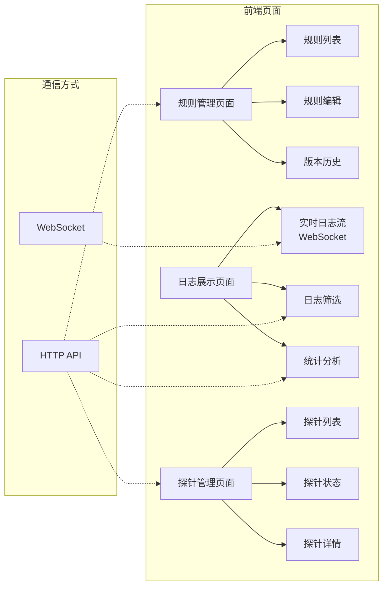
```mermaid
graph LR
    subgraph 前端页面
        A[规则管理页面] --> A1[规则列表]
        A --> A2[规则编辑]
        A --> A3[版本历史]

        B[日志展示页面] --> B1[实时日志流<br/>WebSocket]
        B --> B2[日志筛选]
        B --> B3[统计分析]

        C[探针管理页面] --> C1[探针列表]
        C --> C2[探针状态]
        C --> C3[探针详情]
    end

    subgraph 通信方式
        D[HTTP API] -.-> A
        D -.-> C
        E[WebSocket] -.-> B1
        D -.-> B2
        D -.-> B3
    end
```

### 3.2 探针管理程序 (Probe Manager)

*   **通信能力**: 实现 HTTP 客户端，与云端服务交互（明文 HTTP 协议）。
*   **多探针管理**: 基于 **epoll** 实现事件驱动架构，通过 TCP Socket 同时管理多个不同类型的探针。
*   **规则同步**: 每 **5 分钟**主动向云端检查规则更新，若有新版本则下载并分发给相关探针。
*   **日志聚合**: 从多个探针收集日志，聚合后批量上报至云端。
*   **进程管理**: 负责启动、监控各探针进程，确保其正常运行。

### 3.3 NIDS 探针 (私有组件)

*   **基于 Suricata**: 内部调用 Suricata 作为核心检测引擎。
*   **进程隔离**: Suricata 作为独立子进程运行，通过文件和信号与 NIDS 探针通信。
*   **Socket 通信**: 通过 TCP Socket 与 Probe Manager 通信，接收命令和上报日志。
*   **热更新**: 支持在不重启 Suricata 的情况下重新加载规则（SIGUSR2 信号）。
*   **基础规则**: 内置 ET Open 规则集，确保系统启动即具备基本防护能力。

## 4. 技术方案与设计

### 4.1 技术栈

| 组件 | 技术选型 | 说明 |
| :--- | :--- | :--- |
| **云端后端** | Python (UV) / FastAPI | 高性能异步 Web 框架，依赖管理使用 UV |
| **云端缓存** | Redis | 缓存规则版本、探针状态等热点数据 |
| **云端元数据库** | MySQL | 存储规则、探针注册信息等关系型数据 |
| **云端日志库** | ClickHouse | 列式存储，高速写入，适合海量日志分析 |
| **云端前端** | TypeScript / Vite / Tailwind / Shadcn | 现代化的 React 生态开发栈 |
| **云端部署** | Docker / Docker Compose | 容器化部署，便于环境一致性和快速部署 |
| **Probe Manager** | C++ / CMake / epoll | 高性能系统级编程，事件驱动架构 |
| **NIDS 探针** | C++ / CMake | 网络入侵检测探针，私有代码 |
| **NIDS 引擎** | Suricata (GPL) | 开源高性能网络威胁检测引擎，进程隔离 |
| **内部通信** | TCP Socket / JSON | Manager 与探针之间的 IPC |
| **基础规则** | ET Open | Emerging Threats 开源规则集 |
| **外部通信** | HTTP (明文) | 探针与云端通信，适用于内网环境 |
| **环境** | x86_64 / Ubuntu 22+ | 开发与运行目标环境 |

### 4.2 通信设计

#### 4.2.1 整体通信架构

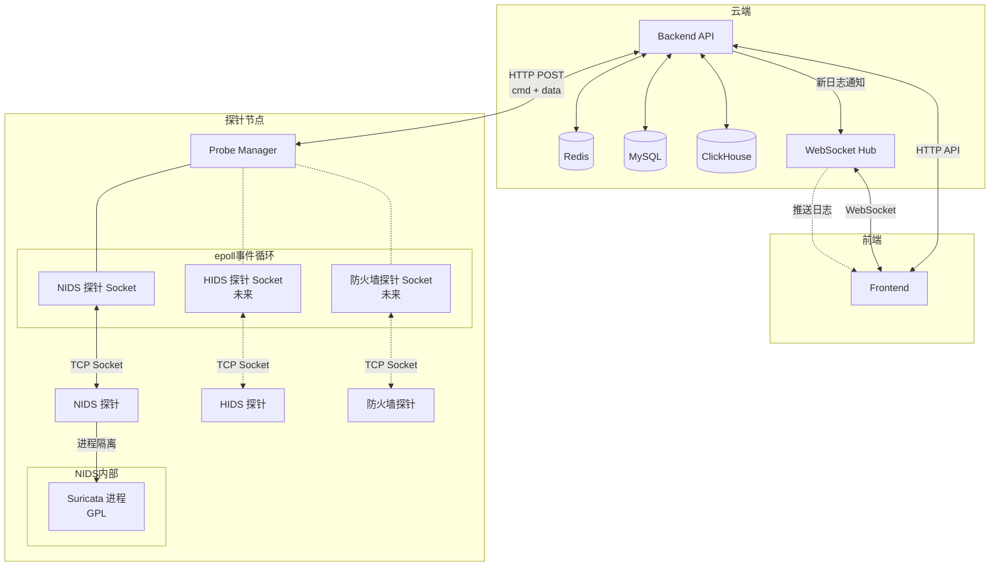
```mermaid
graph TB
    subgraph 云端
        BE[Backend API]
        REDIS[(Redis)]
        MYSQL[(MySQL)]
        CH[(ClickHouse)]
        WS[WebSocket Hub]
    end

    subgraph 前端
        FE[Frontend]
    end

    subgraph 探针节点
        PM[Probe Manager]

        subgraph epoll事件循环
            E1[NIDS 探针 Socket]
            E2[HIDS 探针 Socket<br/>未来]
            E3[防火墙探针 Socket<br/>未来]
        end

        NIDS[NIDS 探针]
        HIDS[HIDS 探针]
        FW[防火墙探针]

        subgraph NIDS内部
            SR[Suricata 进程<br/>GPL]
        end
    end

    FE <-->|HTTP API| BE
    FE <-->|WebSocket| WS
    BE <-->|HTTP POST<br/>cmd + data| PM
    BE <--> REDIS
    BE <--> MYSQL
    BE <--> CH
    WS -.->|推送日志| FE
    BE -->|新日志通知| WS
    PM --- E1
    PM -.- E2
    PM -.- E3
    E1 <-->|TCP Socket| NIDS
    E2 <-.->|TCP Socket| HIDS
    E3 <-.->|TCP Socket| FW
    NIDS -->|进程隔离| SR
```

#### 4.2.2 探针与云端通信协议 (HTTP)

*   **协议**: HTTP/1.1 明文传输
*   **接口**: 统一使用 `POST /api/v1/probe`
*   **数据格式**: JSON (`cmd` + `data` 结构)
*   **规则同步方式**: 探针主动拉取（Pull 模式）
*   **心跳间隔**: 5 分钟

##### 4.2.2.1 协议格式

所有探针与云端的通信均采用统一的 JSON 格式：

```json
// 请求格式
{
    "cmd": <命令码>,
    "data": { <业务数据> }
}

// 响应格式
{
    "cmd": <响应码>,
    "data": { <响应数据> }
}
```

##### 4.2.2.2 命令码定义

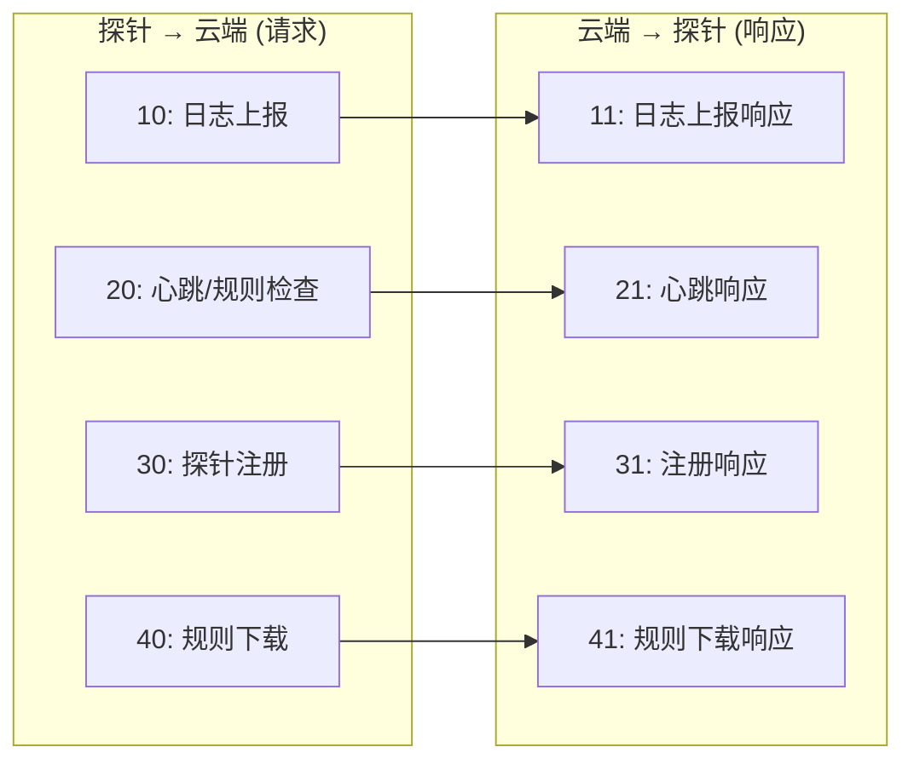
```mermaid
graph LR
    subgraph 探针请求["探针 → 云端 (请求)"]
        C10[10: 日志上报]
        C20[20: 心跳/规则检查]
        C30[30: 探针注册]
        C40[40: 规则下载]
    end

    subgraph 云端响应["云端 → 探针 (响应)"]
        C11[11: 日志上报响应]
        C21[21: 心跳响应]
        C31[31: 注册响应]
        C41[41: 规则下载响应]
    end

    C10 --> C11
    C20 --> C21
    C30 --> C31
    C40 --> C41
```

| cmd | 方向 | 说明 |
|:----|:-----|:-----|
| **10** | 探针 → 云端 | 日志上报 |
| **11** | 云端 → 探针 | 日志上报响应 |
| **20** | 探针 → 云端 | 心跳/规则版本检查 |
| **21** | 云端 → 探针 | 心跳响应（含最新规则版本） |
| **30** | 探针 → 云端 | 探针注册 |
| **31** | 云端 → 探针 | 注册响应 |
| **40** | 探针 → 云端 | 规则下载请求 |
| **41** | 云端 → 探针 | 规则下载响应（含规则内容） |

##### 4.2.2.3 通信时序图

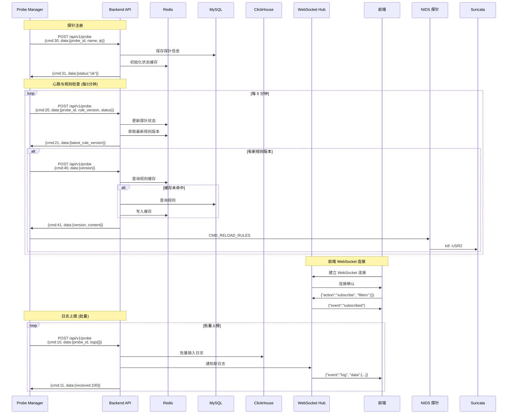
```mermaid
sequenceDiagram
    participant PM as Probe Manager
    participant BE as Backend API
    participant REDIS as Redis
    participant MYSQL as MySQL
    participant CH as ClickHouse
    participant WS as WebSocket Hub
    participant FE as 前端
    participant NP as NIDS 探针
    participant SR as Suricata

    Note over PM,BE: 探针注册
    PM->>BE: POST /api/v1/probe<br/>{cmd:30, data:{probe_id, name, ip}}
    BE->>MYSQL: 保存探针信息
    BE->>REDIS: 初始化状态缓存
    BE->>PM: {cmd:31, data:{status:"ok"}}

    Note over PM,BE: 心跳与规则检查 (每5分钟)
    loop 每 5 分钟
        PM->>BE: POST /api/v1/probe<br/>{cmd:20, data:{probe_id, rule_version, status}}
        BE->>REDIS: 更新探针状态
        BE->>REDIS: 获取最新规则版本
        BE->>PM: {cmd:21, data:{latest_rule_version}}

        alt 有新规则版本
            PM->>BE: POST /api/v1/probe<br/>{cmd:40, data:{version}}
            BE->>REDIS: 查询规则缓存
            alt 缓存未命中
                BE->>MYSQL: 查询规则
                BE->>REDIS: 写入缓存
            end
            BE->>PM: {cmd:41, data:{version, content}}
            PM->>NP: CMD_RELOAD_RULES
            NP->>SR: kill -USR2
        end
    end

    Note over FE,WS: 前端 WebSocket 连接
    FE->>WS: 建立 WebSocket 连接
    WS->>FE: 连接确认
    FE->>WS: {"action":"subscribe", "filters":{}}
    WS->>FE: {"event":"subscribed"}

    Note over PM,BE: 日志上报 (批量)
    loop 批量上报
        PM->>BE: POST /api/v1/probe<br/>{cmd:10, data:{probe_id, logs[]}}
        BE->>CH: 批量插入日志
        BE->>WS: 通知新日志
        WS->>FE: {"event":"log", "data":{...}}
        BE->>PM: {cmd:11, data:{received:100}}
    end
```

##### 4.2.2.4 协议详细定义

**1. 探针注册 (cmd: 30/31)**

```json
// 请求 (cmd: 30)
{
    "cmd": 30,
    "data": {
        "probe_id": "probe-001",
        "name": "生产环境探针1",
        "ip": "192.168.1.100",
        "probe_types": ["nids"]
    }
}

// 响应 (cmd: 31)
{
    "cmd": 31,
    "data": {
        "status": "ok",
        "probe_id": "probe-001",
        "message": "注册成功"
    }
}
```

**2. 心跳/规则检查 (cmd: 20/21)**

```json
// 请求 (cmd: 20)
{
    "cmd": 20,
    "data": {
        "probe_id": "probe-001",
        "rule_version": "v10",
        "status": {
            "cpu_usage": 25.5,
            "memory_usage": 512,
            "uptime": 86400
        },
        "probes": [
            {
                "type": "nids",
                "id": "nids-001",
                "status": "running",
                "interface": "eth0"
            }
        ]
    }
}

// 响应 (cmd: 21)
{
    "cmd": 21,
    "data": {
        "status": "ok",
        "latest_rule_version": "v11",
        "server_time": "2024-01-15T10:30:00Z"
    }
}
```

**3. 规则下载 (cmd: 40/41)**

```json
// 请求 (cmd: 40)
{
    "cmd": 40,
    "data": {
        "probe_id": "probe-001",
        "version": "v11"
    }
}

// 响应 (cmd: 41)
{
    "cmd": 41,
    "data": {
        "status": "ok",
        "version": "v11",
        "content": "# Suricata Rules\nalert tcp any any -> any any (msg:\"...\"; sid:1000001;)\n...",
        "checksum": "sha256:abcdef1234567890..."
    }
}
```

**4. 日志上报 (cmd: 10/11)**

```json
// 请求 (cmd: 10)
{
    "cmd": 10,
    "data": {
        "probe_id": "probe-001",
        "logs": [
            {
                "probe_type": "nids",
                "instance_id": "nids-001",
                "timestamp": "2024-01-15T10:30:00.123Z",
                "src_ip": "192.168.1.100",
                "dest_ip": "10.0.0.1",
                "src_port": 54321,
                "dest_port": 80,
                "protocol": "TCP",
                "alert": {
                    "signature_id": 2000001,
                    "signature": "ET MALWARE Suspicious User-Agent",
                    "severity": 1,
                    "category": "malware"
                },
                "raw": "{...原始eve.json内容...}"
            }
        ]
    }
}

// 响应 (cmd: 11)
{
    "cmd": 11,
    "data": {
        "status": "ok",
        "received": 1,
        "message": "日志接收成功"
    }
}
```

##### 4.2.2.5 错误响应

当请求处理失败时，响应 cmd 码不变，但 data 中包含错误信息：

```json
{
    "cmd": 21,
    "data": {
        "status": "error",
        "error_code": 1001,
        "message": "探针未注册"
    }
}
```

| error_code | 说明 |
|:-----------|:-----|
| 1001 | 探针未注册 |
| 1002 | 无效的 probe_id |
| 1003 | 规则版本不存在 |
| 1004 | 请求参数错误 |
| 1005 | 服务器内部错误 |

#### 4.2.3 Manager 与探针通信 (TCP Socket)

**协议格式**: 长度前缀 + JSON

```
+----------------+------------------+
| Length (4B)    | JSON Payload     |
+----------------+------------------+
```

**命令类型 (Manager -> 探针)**:

| 命令 | 说明 |
|:-----|:-----|
| `CMD_START` | 启动探针检测 |
| `CMD_STOP` | 停止探针检测 |
| `CMD_RELOAD_RULES` | 热更新规则 |
| `CMD_GET_STATUS` | 获取探针状态 |
| `CMD_SHUTDOWN` | 关闭探针进程 |

**事件类型 (探针 -> Manager)**:

| 事件 | 说明 |
|:-----|:-----|
| `EVT_ALERT` | 告警日志 |
| `EVT_STATUS` | 状态上报 |
| `EVT_ERROR` | 错误通知 |
| `EVT_ACK` | 命令确认 |

**协议示例**:

```json
// Manager -> 探针: 重载规则
{
    "cmd": "CMD_RELOAD_RULES",
    "seq": 12345,
    "data": {
        "rules_path": "/var/lib/nids/rules/suricata.rules"
    }
}

// 探针 -> Manager: 告警事件
{
    "event": "EVT_ALERT",
    "probe_type": "nids",
    "probe_id": "nids-001",
    "data": {
        "timestamp": "2024-01-15T10:30:00Z",
        "src_ip": "192.168.1.100",
        "dest_ip": "10.0.0.1",
        "alert": {
            "signature": "ET MALWARE ...",
            "severity": 1
        }
    }
}
```

#### 4.2.4 前端 WebSocket 接口（实时日志推送）

前端通过 WebSocket 连接后端，实时接收告警日志：

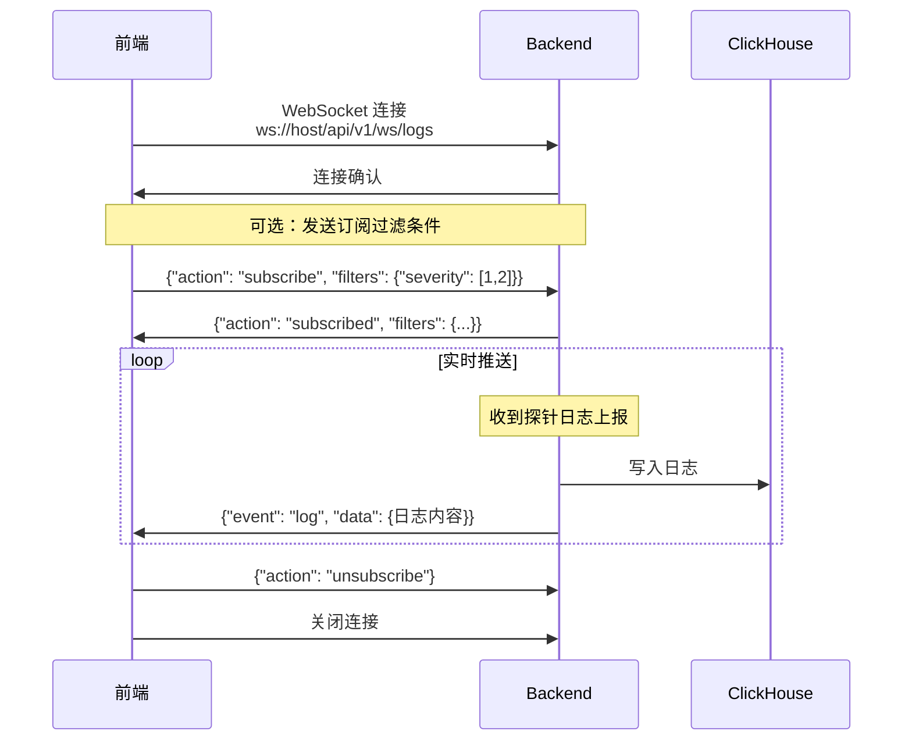
```mermaid
sequenceDiagram
    participant FE as 前端
    participant BE as Backend
    participant CH as ClickHouse

    FE->>BE: WebSocket 连接<br/>ws://host/api/v1/ws/logs
    BE->>FE: 连接确认

    Note over FE,BE: 可选：发送订阅过滤条件
    FE->>BE: {"action": "subscribe", "filters": {"severity": [1,2]}}
    BE->>FE: {"action": "subscribed", "filters": {...}}

    loop 实时推送
        Note over BE: 收到探针日志上报
        BE->>CH: 写入日志
        BE->>FE: {"event": "log", "data": {日志内容}}
    end

    FE->>BE: {"action": "unsubscribe"}
    FE->>BE: 关闭连接
```

**WebSocket 端点**: `ws://host/api/v1/ws/logs`

**客户端发送消息**:

```json
// 订阅日志（可选过滤条件）
{
    "action": "subscribe",
    "filters": {
        "probe_id": "probe-001",      // 可选：指定探针
        "severity": [1, 2],           // 可选：告警级别
        "probe_type": "nids"          // 可选：探针类型
    }
}

// 取消订阅
{
    "action": "unsubscribe"
}

// 心跳保活
{
    "action": "ping"
}
```

**服务端推送消息**:

```json
// 订阅确认
{
    "event": "subscribed",
    "filters": {...}
}

// 实时日志推送
{
    "event": "log",
    "data": {
        "id": "uuid",
        "probe_id": "probe-001",
        "probe_type": "nids",
        "timestamp": "2024-01-15T10:30:00.123Z",
        "src_ip": "192.168.1.100",
        "dest_ip": "10.0.0.1",
        "src_port": 54321,
        "dest_port": 80,
        "protocol": "TCP",
        "alert_msg": "ET MALWARE Suspicious User-Agent",
        "signature_id": 2000001,
        "severity": 1
    }
}

// 心跳响应
{
    "event": "pong"
}

// 错误消息
{
    "event": "error",
    "message": "Invalid filter parameter"
}
```

**连接管理**:

| 参数 | 值 | 说明 |
|:-----|:---|:-----|
| 心跳间隔 | 30 秒 | 客户端发送 ping 保持连接 |
| 超时时间 | 60 秒 | 无心跳则断开连接 |
| 重连策略 | 指数退避 | 1s, 2s, 4s, 8s... 最大 30s |

#### 4.2.5 前端 RESTful API 接口

前端与后端的接口仍采用标准 RESTful 风格：

| 接口 | 方法 | 说明 |
|:-----|:-----|:-----|
| `/api/v1/probes` | GET | 获取探针列表 |
| `/api/v1/probes/{probe_id}` | GET | 获取探针详情 |
| `/api/v1/rules` | GET | 获取规则列表 |
| `/api/v1/rules` | POST | 创建新规则版本 |
| `/api/v1/rules/{version}` | GET | 获取指定版本规则 |
| `/api/v1/logs` | GET | 查询日志（支持筛选） |
| `/api/v1/logs/stats` | GET | 日志统计分析 |

### 4.3 目录结构规划

```
/
├── cloud/
│   ├── backend/              # FastAPI Python 代码
│   │   ├── app/
│   │   │   ├── main.py
│   │   │   ├── routers/
│   │   │   ├── models/
│   │   │   ├── services/
│   │   │   │   ├── redis_service.py
│   │   │   │   ├── mysql_service.py
│   │   │   │   └── clickhouse_service.py
│   │   │   └── config.py
│   │   ├── pyproject.toml
│   │   └── Dockerfile
│   ├── frontend/             # Vite + React 前端代码
│   │   ├── src/
│   │   │   ├── pages/
│   │   │   │   ├── Rules/
│   │   │   │   ├── Logs/
│   │   │   │   └── Probes/
│   │   │   └── components/
│   │   ├── package.json
│   │   └── Dockerfile
│   ├── nginx/                # Nginx 配置
│   │   └── nginx.conf
│   ├── clickhouse/           # ClickHouse 初始化脚本
│   │   └── init.sql
│   └── docker-compose.yml    # 云端服务编排文件
├── probe/
│   ├── common/               # 探针公共库 (私有代码)
│   │   ├── include/
│   │   │   ├── protocol.h    # 通信协议定义
│   │   │   └── probe_base.h  # 探针基类
│   │   └── src/
│   ├── manager/              # Probe Manager (私有代码)
│   │   ├── src/
│   │   │   ├── main.cpp
│   │   │   ├── epoll_server.cpp
│   │   │   ├── probe_manager.cpp
│   │   │   ├── cloud_client.cpp
│   │   │   └── ...
│   │   ├── include/
│   │   └── CMakeLists.txt
│   └── nids/                 # NIDS 探针 (私有代码)
│       ├── src/
│       │   ├── main.cpp
│       │   ├── nids_probe.cpp
│       │   ├── suricata_manager.cpp  # Suricata 进程管理
│       │   ├── eve_parser.cpp        # eve.json 解析
│       │   └── ...
│       ├── include/
│       └── CMakeLists.txt
├── third_party/
│   └── suricata/             # Suricata 源码 (Git Submodule, GPL)
│       └── ...
├── rules/
│   └── et-open/              # ET Open 基础规则
├── specs/                    # 文档
│   └── 0001-spec.md
└── README.md
```

### 4.4 Docker 部署架构

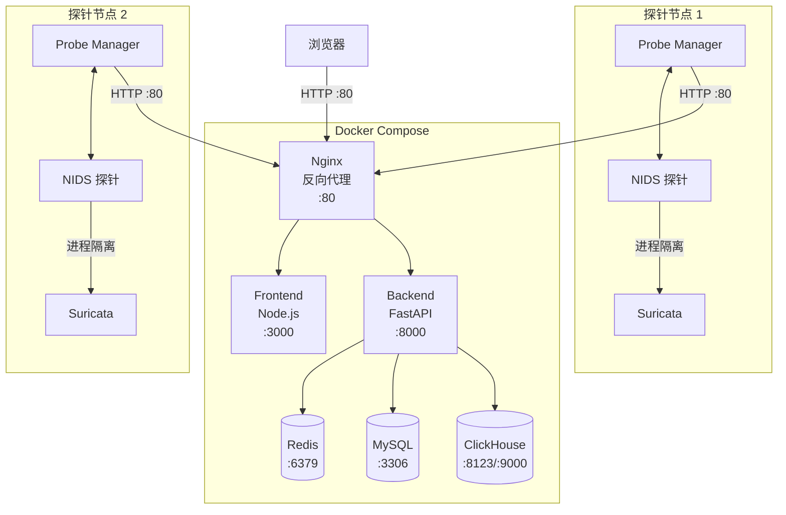
```mermaid
graph TB
    subgraph DockerCompose["Docker Compose"]
        nginx[Nginx<br/>反向代理<br/>:80]
        frontend[Frontend<br/>Node.js<br/>:3000]
        backend[Backend<br/>FastAPI<br/>:8000]
        redis[(Redis<br/>:6379)]
        mysql[(MySQL<br/>:3306)]
        clickhouse[(ClickHouse<br/>:8123/:9000)]

        nginx --> frontend
        nginx --> backend
        backend --> redis
        backend --> mysql
        backend --> clickhouse
    end

    subgraph ProbeNode1["探针节点 1"]
        PM1[Probe Manager]
        NIDS1[NIDS 探针]
        SR1[Suricata]
        PM1 <--> NIDS1
        NIDS1 -->|进程隔离| SR1
    end

    subgraph ProbeNode2["探针节点 2"]
        PM2[Probe Manager]
        NIDS2[NIDS 探针]
        SR2[Suricata]
        PM2 <--> NIDS2
        NIDS2 -->|进程隔离| SR2
    end

    PM1 -->|HTTP :80| nginx
    PM2 -->|HTTP :80| nginx
    Browser[浏览器] -->|HTTP :80| nginx
```

**docker-compose.yml 服务定义:**

| 服务 | 镜像/构建 | 端口 | 说明 |
| :--- | :--- | :--- | :--- |
| nginx | nginx:alpine | 80:80 | 反向代理，统一入口 |
| frontend | ./frontend | 3000 | 前端静态资源服务 |
| backend | ./backend | 8000 | 后端 API 服务 |
| redis | redis:7-alpine | 6379 | 缓存服务 |
| mysql | mysql:8.0 | 3306 | 元数据存储 |
| clickhouse | clickhouse/clickhouse-server | 8123, 9000 | 日志存储与分析 |

### 4.5 Redis 缓存策略

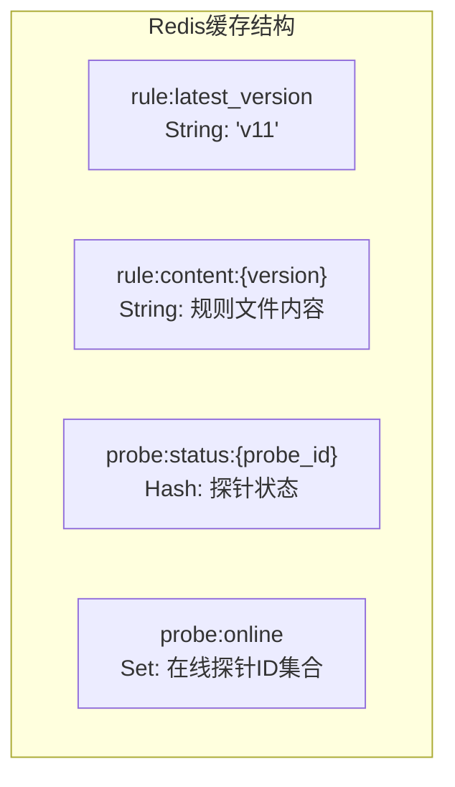
```mermaid
graph TB
    subgraph Redis缓存结构
        K1["rule:latest_version<br/>String: 'v11'"]
        K2["rule:content:{version}<br/>String: 规则文件内容"]
        K3["probe:status:{probe_id}<br/>Hash: 探针状态"]
        K4["probe:online<br/>Set: 在线探针ID集合"]
    end
```

| Key 模式 | 类型 | TTL | 说明 |
|:---------|:-----|:----|:-----|
| `rule:latest_version` | String | 无 | 最新规则版本号 |
| `rule:content:{version}` | String | 1 小时 | 规则文件内容缓存 |
| `probe:status:{probe_id}` | Hash | 10 分钟 | 探针状态信息 |
| `probe:online` | Set | 无 | 在线探针 ID 集合 |

### 4.6 ClickHouse 表结构

```sql
-- 告警日志表 (按日分区)
CREATE TABLE alert_logs (
    id UUID DEFAULT generateUUIDv4(),
    node_id String,
    instance_id String,
    probe_type LowCardinality(String),
    timestamp DateTime64(3),
    src_ip IPv4,
    dest_ip IPv4,
    src_port UInt16,
    dest_port UInt16,
    protocol LowCardinality(String),
    alert_msg String,
    signature_id UInt32,
    severity UInt8,
    raw_log String,
    created_at DateTime DEFAULT now()
) ENGINE = MergeTree()
PARTITION BY toYYYYMMDD(timestamp)
ORDER BY (timestamp, node_id, severity)
TTL timestamp + INTERVAL 90 DAY;

-- 统计物化视图 (按小时聚合)
CREATE MATERIALIZED VIEW alert_stats_hourly
ENGINE = SummingMergeTree()
PARTITION BY toYYYYMM(hour)
ORDER BY (hour, node_id, severity)
AS SELECT
    toStartOfHour(timestamp) AS hour,
    node_id,
    severity,
    count() AS alert_count
FROM alert_logs
GROUP BY hour, node_id, severity;
```

### 4.7 Probe Manager 架构 (epoll)

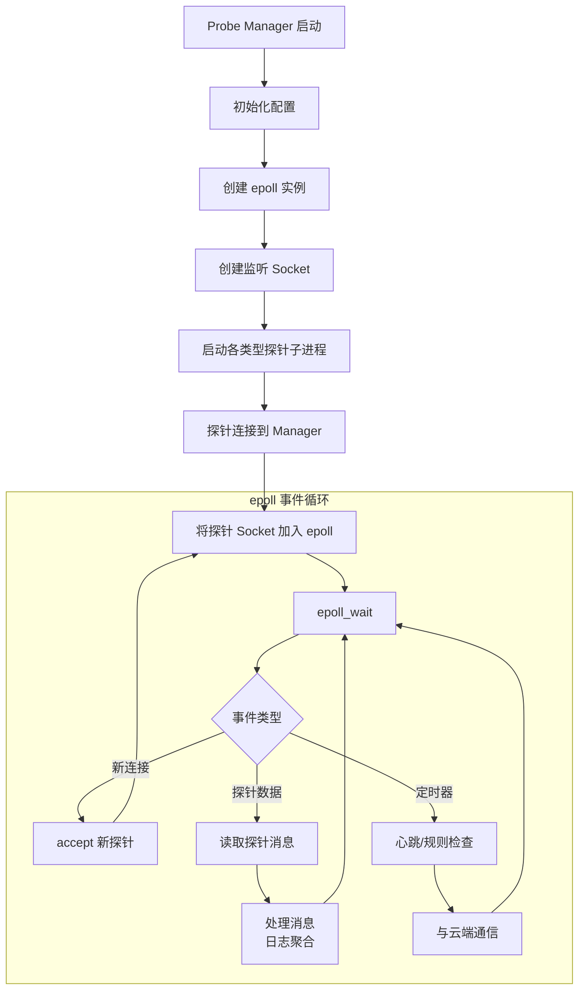
```mermaid
flowchart TD
    A[Probe Manager 启动] --> B[初始化配置]
    B --> C[创建 epoll 实例]
    C --> D[创建监听 Socket]
    D --> E[启动各类型探针子进程]
    E --> F[探针连接到 Manager]
    F --> G[将探针 Socket 加入 epoll]

    subgraph EventLoop["epoll 事件循环"]
        H[epoll_wait]
        H --> I{事件类型}
        I -->|新连接| J[accept 新探针]
        I -->|探针数据| K[读取探针消息]
        I -->|定时器| L[心跳/规则检查]
        J --> G
        K --> M[处理消息<br/>日志聚合]
        L --> N[与云端通信]
        M --> H
        N --> H
    end

    G --> H
```

**epoll 关键实现**:

```cpp
// 伪代码示意
class ProbeManager {
    int epoll_fd;
    std::map<int, ProbeConnection> probes;  // 支持多种类型探针

    void run() {
        epoll_fd = epoll_create1(0);

        // 添加监听 socket
        add_to_epoll(listen_fd, EPOLLIN);

        // 添加定时器 (5分钟心跳)
        add_to_epoll(timer_fd, EPOLLIN);

        while (running) {
            int n = epoll_wait(epoll_fd, events, MAX_EVENTS, -1);
            for (int i = 0; i < n; i++) {
                if (events[i].data.fd == listen_fd) {
                    handle_new_probe();  // 处理新探针连接
                } else if (events[i].data.fd == timer_fd) {
                    handle_heartbeat();
                } else {
                    handle_probe_message(events[i].data.fd);
                }
            }
        }
    }
};
```

### 4.8 NIDS 探针架构

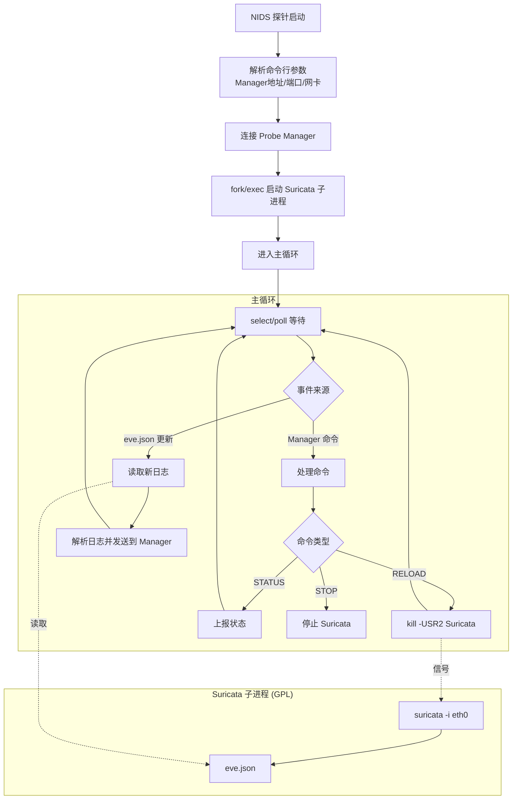
```mermaid
flowchart TD
    A[NIDS 探针启动] --> B[解析命令行参数<br/>Manager地址/端口/网卡]
    B --> C[连接 Probe Manager]
    C --> D[fork/exec 启动 Suricata 子进程]
    D --> E[进入主循环]

    subgraph MainLoop["主循环"]
        F[select/poll 等待]
        F --> G{事件来源}
        G -->|Manager 命令| H[处理命令]
        G -->|eve.json 更新| I[读取新日志]
        H --> J{命令类型}
        J -->|RELOAD| K[kill -USR2 Suricata]
        J -->|STATUS| L[上报状态]
        J -->|STOP| M[停止 Suricata]
        I --> N[解析日志并发送到 Manager]
        K --> F
        L --> F
        N --> F
    end

    E --> F

    subgraph SuricataProcess["Suricata 子进程 (GPL)"]
        SR[suricata -i eth0]
        SR --> EVE[eve.json]
    end

    I -.->|读取| EVE
    K -.->|信号| SR
```

### 4.9 探针运行流程

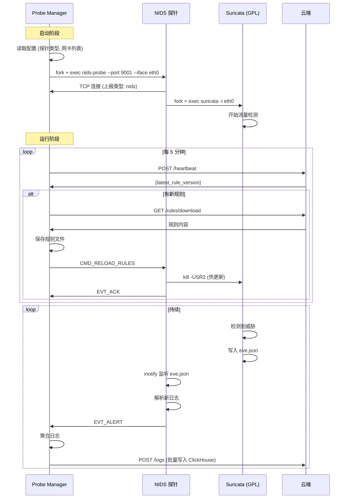
```mermaid
sequenceDiagram
    participant PM as Probe Manager
    participant NP as NIDS 探针
    participant SR as Suricata (GPL)
    participant Cloud as 云端

    Note over PM: 启动阶段
    PM->>PM: 读取配置 (探针类型, 网卡列表)
    PM->>NP: fork + exec nids-probe --port 9001 --iface eth0
    NP->>PM: TCP 连接 (上报类型: nids)
    NP->>SR: fork + exec suricata -i eth0
    SR->>SR: 开始流量检测

    Note over PM: 运行阶段
    loop 每 5 分钟
        PM->>Cloud: POST /heartbeat
        Cloud->>PM: {latest_rule_version}
        alt 有新规则
            PM->>Cloud: GET /rules/download
            Cloud->>PM: 规则内容
            PM->>PM: 保存规则文件
            PM->>NP: CMD_RELOAD_RULES
            NP->>SR: kill -USR2 (热更新)
            NP->>PM: EVT_ACK
        end
    end

    loop 持续
        SR->>SR: 检测到威胁
        SR->>SR: 写入 eve.json
        NP->>NP: inotify 监听 eve.json
        NP->>NP: 解析新日志
        NP->>PM: EVT_ALERT
        PM->>PM: 聚合日志
        PM->>Cloud: POST /logs (批量写入 ClickHouse)
    end
```

### 4.10 规则管理流程

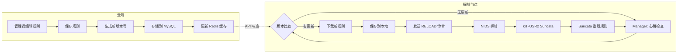
```mermaid
flowchart LR
    subgraph 云端
        A[管理员编辑规则] --> B[保存规则]
        B --> C[生成新版本号]
        C --> D[存储到 MySQL]
        D --> E[更新 Redis 缓存]
    end

    subgraph 探针节点
        F[Manager: 心跳检查] --> G{版本比较}
        G -->|有更新| H[下载新规则]
        H --> I[保存到本地]
        I --> J[发送 RELOAD 命令]
        J --> K[NIDS 探针]
        K --> L[kill -USR2 Suricata]
        L --> M[Suricata 重载规则]
        G -->|无更新| F
        M --> F
    end

    E -.->|API 响应| G
```

## 5. 数据模型

### 5.1 存储分布

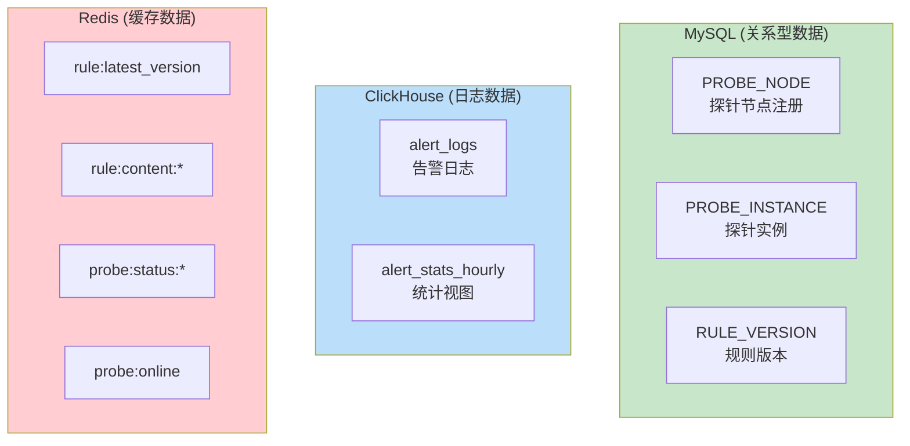
```mermaid
graph TB
    subgraph MySQL["MySQL (关系型数据)"]
        M1[PROBE_NODE<br/>探针节点注册]
        M2[PROBE_INSTANCE<br/>探针实例]
        M3[RULE_VERSION<br/>规则版本]
    end

    subgraph ClickHouse["ClickHouse (日志数据)"]
        C1[alert_logs<br/>告警日志]
        C2[alert_stats_hourly<br/>统计视图]
    end

    subgraph Redis["Redis (缓存数据)"]
        R1[rule:latest_version]
        R2[rule:content:*]
        R3[probe:status:*]
        R4[probe:online]
    end

    style MySQL fill:#c8e6c9
    style ClickHouse fill:#bbdefb
    style Redis fill:#ffcdd2
```

### 5.2 MySQL 实体关系

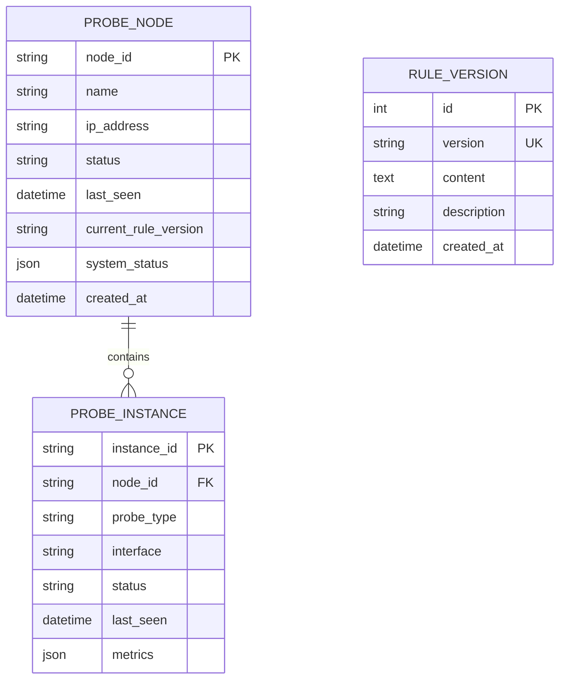
```mermaid
erDiagram
    PROBE_NODE {
        string node_id PK
        string name
        string ip_address
        string status
        datetime last_seen
        string current_rule_version
        json system_status
        datetime created_at
    }

    PROBE_INSTANCE {
        string instance_id PK
        string node_id FK
        string probe_type
        string interface
        string status
        datetime last_seen
        json metrics
    }

    RULE_VERSION {
        int id PK
        string version UK
        text content
        string description
        datetime created_at
    }

    PROBE_NODE ||--o{ PROBE_INSTANCE : contains
```

### 5.3 ClickHouse 日志表

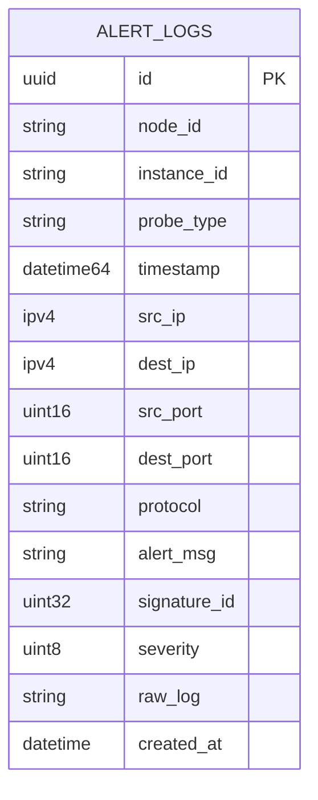
```mermaid
erDiagram
    ALERT_LOGS {
        uuid id PK
        string node_id
        string instance_id
        string probe_type
        datetime64 timestamp
        ipv4 src_ip
        ipv4 dest_ip
        uint16 src_port
        uint16 dest_port
        string protocol
        string alert_msg
        uint32 signature_id
        uint8 severity
        string raw_log
        datetime created_at
    }
```

## 6. 开发计划

1.  **第一阶段**: 环境搭建与基础框架
    *   初始化 Git 仓库
    *   搭建 Cloud Docker 环境 (docker-compose: nginx, backend, frontend, redis, mysql, clickhouse)
    *   编写 Backend FastAPI 基础框架
    *   配置 Redis、MySQL、ClickHouse 连接
    *   编写 Frontend Vite + React 基础框架
    *   编写 Probe Manager 基础 C++ 工程结构 (epoll 框架)
    *   编写探针公共库 (protocol, probe_base)

2.  **第二阶段**: 核心通信实现
    *   实现 Manager 的 epoll 事件循环
    *   实现 Manager 与探针的 TCP Socket 通信协议
    *   实现探针基类和通信框架

3.  **第三阶段**: NIDS 探针与 Suricata 集成
    *   将 Suricata 源码以 Git Submodule 方式合入
    *   实现 NIDS 探针的 Suricata 进程管理（fork/exec）
    *   实现 eve.json 日志解析（inotify 监听）
    *   实现 SIGUSR2 规则热更新
    *   集成 ET Open 基础规则集

4.  **第四阶段**: 规则管理功能
    *   实现 Cloud 规则 CRUD API (MySQL 存储)
    *   实现规则版本管理
    *   实现 Redis 规则缓存
    *   实现 Manager 规则下载（5分钟轮询）
    *   实现规则分发和热更新

5.  **第五阶段**: 日志与探针管理
    *   实现 ClickHouse 日志表和物化视图
    *   实现 Manager 日志聚合和批量上报
    *   实现日志写入 ClickHouse
    *   实现前端日志实时展示页面
    *   实现日志统计分析功能
    *   实现探针管理页面（列表、状态、详情）
    *   实现 Redis 探针状态缓存

## 7. 附录

### 7.1 ET Open 规则集

*   **来源**: https://rules.emergingthreats.net/open/
*   **更新频率**: 每日更新
*   **规则分类**: 恶意软件、漏洞利用、网络扫描、僵尸网络等
*   **许可证**: BSD License，可免费商用

### 7.2 Suricata 进程管理

```bash
# 启动 Suricata (由 NIDS 探针 fork/exec)
suricata -c /etc/suricata/suricata.yaml -i eth0 --pidfile /var/run/suricata.pid

# 热更新规则 (由 NIDS 探针发送信号)
kill -USR2 $(cat /var/run/suricata.pid)

# 或通过 Unix Socket (可选)
suricatasc -c reload-rules
```

### 7.3 配置参数汇总

| 参数 | 默认值 | 说明 |
| :--- | :--- | :--- |
| 心跳间隔 | 5 分钟 | Manager 向云端发送心跳的间隔 |
| 日志批量大小 | 100 条 | 单次上报的最大日志数量 |
| 日志上报间隔 | 10 秒 | 日志批量上报的时间间隔 |
| 探针离线阈值 | 15 分钟 | 超过此时间未收到心跳判定为离线 |
| Manager 监听端口 | 9000 | Manager 监听探针连接的端口 |
| 探针重连间隔 | 5 秒 | 探针断开后重连的间隔 |
| Redis 规则缓存 TTL | 1 小时 | 规则内容缓存过期时间 |
| Redis 探针状态 TTL | 10 分钟 | 探针状态缓存过期时间 |
| ClickHouse 日志保留 | 90 天 | 告警日志自动过期时间 |
| WebSocket 心跳间隔 | 30 秒 | 前端 WebSocket 保活心跳 |
| WebSocket 超时时间 | 60 秒 | 无心跳则断开 WebSocket 连接 |
| WebSocket 重连最大间隔 | 30 秒 | 指数退避重连的最大等待时间 |

### 7.4 GPL 合规说明

本项目通过以下方式确保 GPL 合规：

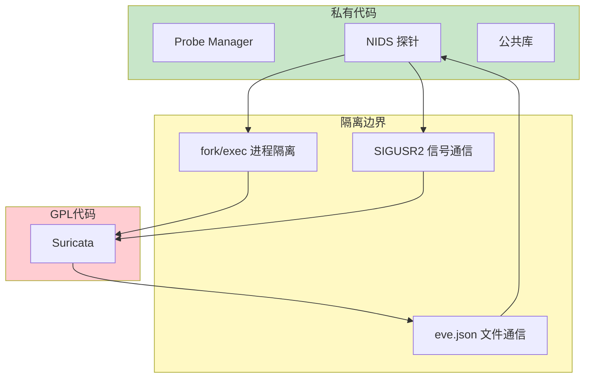
```mermaid
graph TB
    subgraph 私有代码
        PM[Probe Manager]
        NP[NIDS 探针]
        COMMON[公共库]
    end

    subgraph GPL代码
        SR[Suricata]
    end

    subgraph 隔离边界
        FORK[fork/exec 进程隔离]
        FILE[eve.json 文件通信]
        SIG[SIGUSR2 信号通信]
    end

    NP --> FORK --> SR
    SR --> FILE --> NP
    NP --> SIG --> SR

    style 私有代码 fill:#c8e6c9
    style GPL代码 fill:#ffcdd2
    style 隔离边界 fill:#fff9c4
```

| 合规措施 | 说明 |
|:---------|:-----|
| **进程隔离** | NIDS 探针（私有）通过 fork/exec 启动 Suricata（GPL）作为独立子进程 |
| **文件通信** | 通过 eve.json 文件读取 Suricata 的检测日志，无内存共享 |
| **信号通信** | 通过 SIGUSR2 信号触发规则热更新，无函数调用 |
| **无代码链接** | 私有代码不与 GPL 代码进行静态或动态链接 |
| **源码分离** | Suricata 源码放在 `third_party/suricata/` 目录，与私有代码物理分离 |
