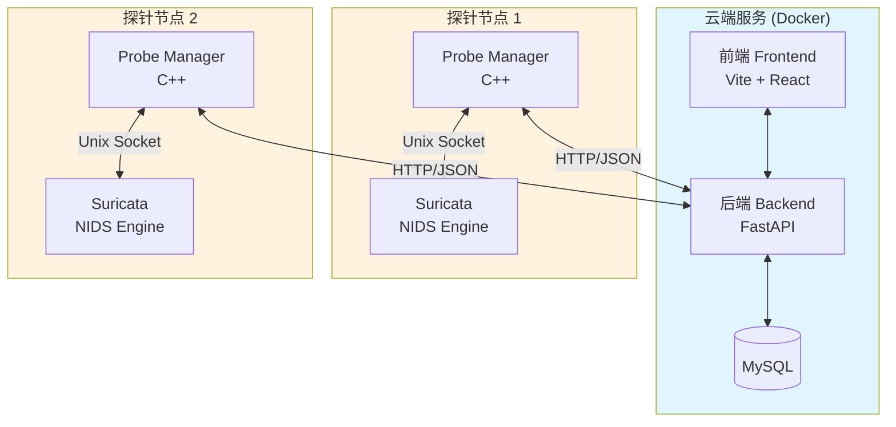
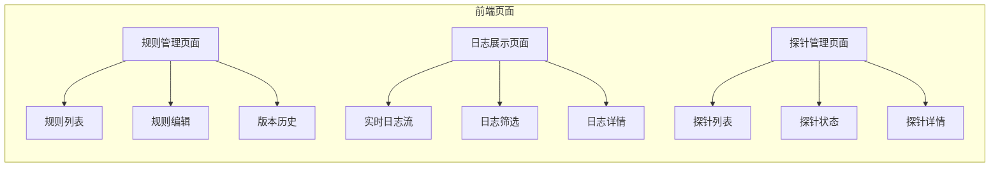
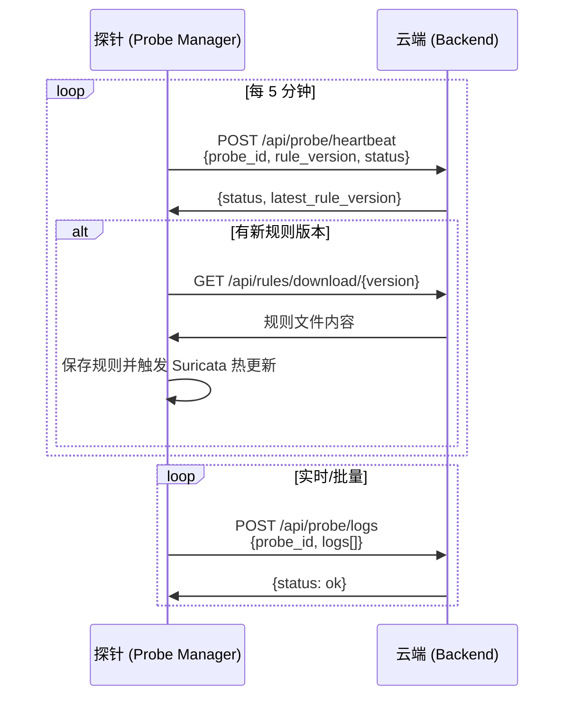
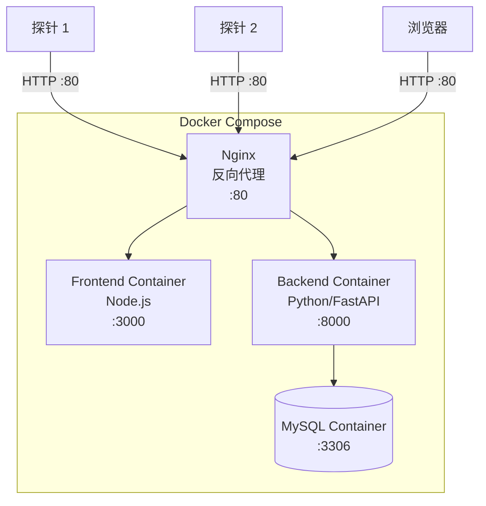
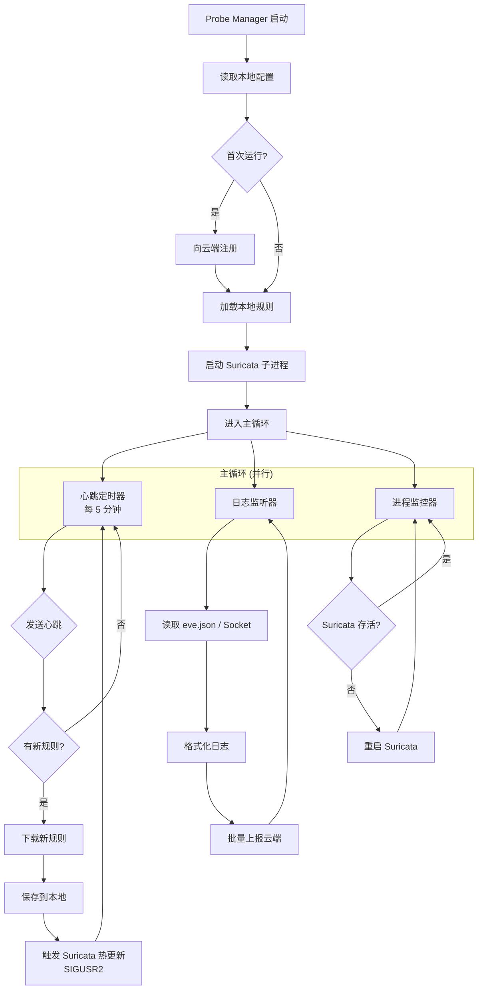
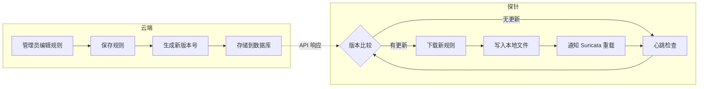
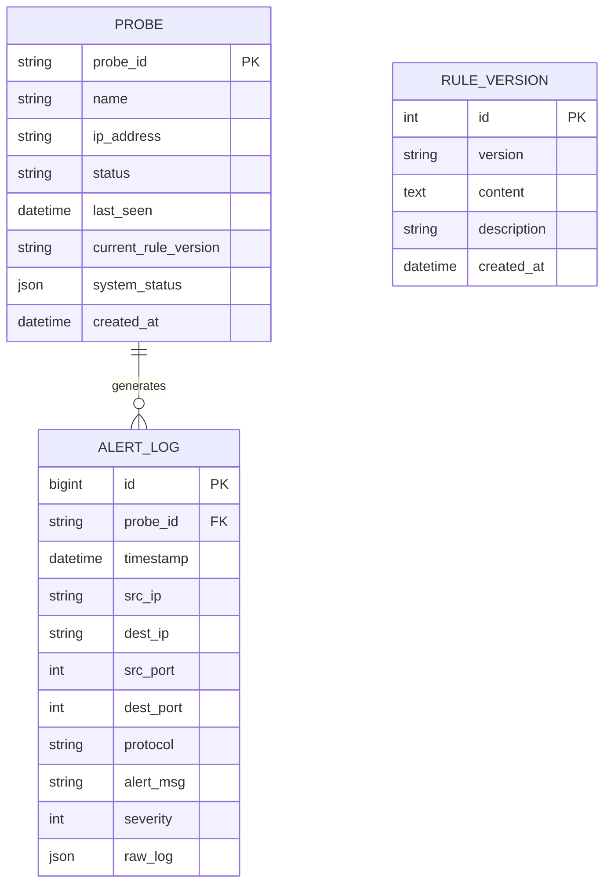

# 网络入侵检测系统需求与设计文档

## 1. 概述

本项目旨在构建一个轻量级、可扩展的网络入侵检测系统。系统由两大部分组成：**探针（Probe）**和**云端服务（Cloud Service）**。
探针部署在目标环境中，负责实时流量分析和威胁检测；云端服务负责规则管理、下发以及日志的接收和展示。

## 2. 系统架构

系统采用 Client-Server 架构，探针端通过 HTTP 协议与云端服务进行通信。

### 2.1 系统架构图



### 2.2 核心组件

1.  **云端服务 (Cloud Service)**
    *   **前端 (Frontend)**: 提供用户交互界面，用于规则编辑、版本管理、日志实时展示和探针管理。
    *   **后端 (Backend)**: 处理业务逻辑，存储规则和日志数据，提供 API 接口供前端和探针调用。
    *   **部署方式**: 使用 Docker Compose 进行容器化部署。

2.  **探针系统 (Probe System)**
    *   **探针管理程序 (Probe Manager)**: 系统的核心守护进程，负责与云端通信，管理具体的检测探针（启动、停止、配置更新），并收集日志上报。
    *   **网络入侵检测探针 (NIDS Probe)**: 基于 Suricata 实现，负责实际的流量分析和入侵检测。

### 2.3 设计原则

*   **GPL 合规性**: 鉴于 Suricata 采用 GPL 协议，本系统采用**进程隔离**的方式。探针管理程序与 Suricata 运行在不同的进程中，通过标准 IPC（如 Unix Domain Socket）或文件进行交互，确保私有代码（探针管理程序）不被 GPL 传染。
*   **模块化**: 探针管理程序设计为通用框架，当前仅实现 NIDS 功能，未来可扩展防火墙、主机入侵检测等功能。
*   **可维护性**: 支持 Suricata 源码集成编译，便于后续定制开发。
*   **简单优先**: 系统不设用户权限管理，采用 HTTP 明文通信，适用于内网或可信环境部署。

## 3. 详细需求

### 3.1 云端服务

#### 3.1.1 规则管理
*   支持入侵检测规则的增删改查（CRUD）。
*   **版本控制**: 每次规则集变更应生成新的版本号，支持查看历史版本。
*   **规则下发**: 探针主动拉取规则，云端提供规则下载接口。
*   **基础规则**: 使用 [Emerging Threats Open (ET Open)](https://rules.emergingthreats.net/) 作为默认基础规则集。

#### 3.1.2 日志展示
*   接收探针上报的告警和检测日志。
*   提供实时日志展示页面，支持基本的筛选（如时间、探针ID、告警级别）。

#### 3.1.3 探针管理
*   **探针列表**: 展示所有已注册探针的基本信息（ID、名称、IP地址）。
*   **状态查看**: 显示探针在线状态、最后心跳时间、当前规则版本、系统资源使用情况。



### 3.2 探针管理程序 (Probe Manager)

*   **通信能力**: 实现 HTTP 客户端，与云端服务交互（明文 HTTP 协议）。
*   **规则同步**: 每 **5 分钟**主动向云端检查规则更新，若有新版本则下载并通知 NIDS 探针进行热更新。
*   **日志收集**: 监听 NIDS 探针产生的日志（如读取 `eve.json` 或监听 Socket），格式化后批量上报至云端。
*   **进程管理**: 负责启动、监控 Suricata 进程，确保其正常运行。

### 3.3 网络入侵检测探针 (NIDS Probe)

*   **基于 Suricata**: 使用 Suricata 作为核心检测引擎。
*   **源码集成**: 将 Suricata 源码纳入项目树，支持在项目中编译 Suricata。
*   **热更新**: 支持在不重启进程的情况下重新加载规则（Suricata Reload 机制）。
*   **基础规则**: 内置 ET Open 规则集，确保系统启动即具备基本防护能力。

## 4. 技术方案与设计

### 4.1 技术栈

| 组件 | 技术选型 | 说明 |
| :--- | :--- | :--- |
| **云端后端** | Python (UV) / FastAPI | 高性能异步 Web 框架，依赖管理使用 UV |
| **云端数据库** | MySQL | 持久化存储规则、日志及配置信息 |
| **云端前端** | TypeScript / Vite / Tailwind / Shadcn | 现代化的 React 生态开发栈 |
| **云端部署** | Docker / Docker Compose | 容器化部署，便于环境一致性和快速部署 |
| **探针管理程序** | C++ / CMake | 高性能系统级编程，跨平台构建支持 |
| **NIDS 引擎** | Suricata | 开源高性能网络威胁检测引擎 |
| **基础规则** | ET Open | Emerging Threats 开源规则集 |
| **通信协议** | HTTP (明文) | 简化部署，适用于内网环境 |
| **环境** | x86_64 / Ubuntu 22+ | 开发与运行目标环境 |

### 4.2 通信设计

#### 4.2.1 通信协议

*   **协议**: HTTP/1.1 明文传输
*   **数据格式**: JSON
*   **规则同步方式**: 探针主动拉取（Pull 模式）
*   **心跳间隔**: 5 分钟



#### 4.2.2 接口定义

1.  **探针注册 (Probe -> Cloud)**
    *   `POST /api/probe/register`
    *   Request: `{ "probe_id": "...", "name": "...", "ip": "..." }`
    *   Response: `{ "status": "ok", "probe_id": "..." }`

2.  **心跳/规则检查 (Probe -> Cloud)**
    *   `POST /api/probe/heartbeat`
    *   Request:
        ```json
        {
            "probe_id": "...",
            "rule_version": "v10",
            "status": {
                "cpu_usage": 25.5,
                "memory_usage": 512,
                "suricata_status": "running"
            }
        }
        ```
    *   Response: `{ "status": "ok", "latest_rule_version": "v11" }`

3.  **日志上报 (Probe -> Cloud)**
    *   `POST /api/probe/logs`
    *   Request: `{ "probe_id": "...", "logs": [ { ...suricata_eve_log... }, ... ] }`
    *   Response: `{ "status": "ok", "received": 100 }`

4.  **规则下载 (Probe -> Cloud)**
    *   `GET /api/rules/download/{version}`
    *   Response: 规则文件内容 (text/plain)

5.  **探针列表 (Frontend -> Cloud)**
    *   `GET /api/probes`
    *   Response: `{ "probes": [{ "probe_id": "...", "name": "...", "status": "online", "last_seen": "...", "rule_version": "..." }, ...] }`

6.  **探针详情 (Frontend -> Cloud)**
    *   `GET /api/probes/{probe_id}`
    *   Response: `{ "probe_id": "...", "name": "...", "ip": "...", "status": {...}, "last_seen": "...", "rule_version": "..." }`

### 4.3 目录结构规划

```
/
├── cloud/
│   ├── backend/           # FastAPI Python 代码
│   │   ├── app/
│   │   │   ├── main.py
│   │   │   ├── routers/
│   │   │   ├── models/
│   │   │   └── services/
│   │   ├── pyproject.toml
│   │   └── Dockerfile
│   ├── frontend/          # Vite + React 前端代码
│   │   ├── src/
│   │   │   ├── pages/
│   │   │   │   ├── Rules/
│   │   │   │   ├── Logs/
│   │   │   │   └── Probes/
│   │   │   └── components/
│   │   ├── package.json
│   │   └── Dockerfile
│   └── docker-compose.yml # 云端服务编排文件
├── probe/
│   ├── manager/           # C++ 探针管理程序源码
│   │   ├── src/
│   │   ├── include/
│   │   └── CMakeLists.txt
│   └── suricata/          # Suricata 源码 (Git Submodule)
│       └── ...
├── rules/
│   └── et-open/           # ET Open 基础规则
├── specs/                 # 文档
│   └── 0001-spec.md
└── README.md
```

### 4.4 Docker 部署架构



**docker-compose.yml 服务定义:**

| 服务 | 镜像/构建 | 端口 | 说明 |
| :--- | :--- | :--- | :--- |
| nginx | nginx:alpine | 80:80 | 反向代理，统一入口 |
| frontend | ./frontend | 3000 | 前端静态资源服务 |
| backend | ./backend | 8000 | 后端 API 服务 |
| mysql | mysql:8.0 | 3306 | 数据库服务 |

### 4.5 探针运行流程



### 4.6 规则管理流程



## 5. 数据模型

### 5.1 核心实体



## 6. 开发计划

1.  **第一阶段**: 环境搭建与基础框架
    *   初始化 Git 仓库
    *   搭建 Cloud Docker 环境 (docker-compose)
    *   编写 Backend FastAPI 基础框架
    *   编写 Frontend Vite + React 基础框架
    *   编写 Probe Manager 基础 C++ 工程结构

2.  **第二阶段**: Suricata 集成
    *   将 Suricata 源码以 Git Submodule 方式合入
    *   实现 Probe Manager 对 Suricata 的启动与监控
    *   集成 ET Open 基础规则集

3.  **第三阶段**: 规则管理功能
    *   实现 Cloud 规则 CRUD API
    *   实现规则版本管理
    *   实现 Probe 规则下载（5分钟轮询）
    *   实现 Suricata 热更新逻辑

4.  **第四阶段**: 日志与探针管理
    *   实现 Suricata eve.json 日志解析
    *   实现日志上报 API
    *   实现前端日志实时展示页面
    *   实现探针管理页面（列表、状态查看）

## 7. 附录

### 7.1 ET Open 规则集

*   **来源**: https://rules.emergingthreats.net/open/
*   **更新频率**: 每日更新
*   **规则分类**: 恶意软件、漏洞利用、网络扫描、僵尸网络等
*   **许可证**: BSD License，可免费商用

### 7.2 Suricata 热更新命令

```bash
# 通过信号触发规则重载
kill -USR2 <suricata_pid>

# 或通过 Unix Socket
suricatasc -c reload-rules
```

### 7.3 配置参数汇总

| 参数 | 默认值 | 说明 |
| :--- | :--- | :--- |
| 心跳间隔 | 5 分钟 | 探针向云端发送心跳的间隔 |
| 日志批量大小 | 100 条 | 单次上报的最大日志数量 |
| 日志上报间隔 | 10 秒 | 日志批量上报的时间间隔 |
| 探针离线阈值 | 15 分钟 | 超过此时间未收到心跳判定为离线 |
