# AI-IDPS 系统设计文档

> 版本: 1.0
> 更新日期: 2026-01-19
> 文档类型: 技术设计文档

---

## 目录

1. [项目概述](#1-项目概述)
2. [系统架构设计](#2-系统架构设计)
3. [技术栈选型](#3-技术栈选型)
4. [核心组件设计](#4-核心组件设计)
5. [数据流设计](#5-数据流设计)
6. [通信协议设计](#6-通信协议设计)
7. [数据存储设计](#7-数据存储设计)
8. [前端设计](#8-前端设计)
9. [探针架构设计](#9-探针架构设计)
10. [安全与合规设计](#10-安全与合规设计)
11. [部署架构设计](#11-部署架构设计)
12. [API 设计](#12-api-设计)
13. [性能设计](#13-性能设计)
14. [附录](#14-附录)

---

## 1. 项目概述

### 1.1 项目背景

AI-IDPS（人工智能入侵检测与防御系统）是一个轻量级、可扩展的网络入侵检测系统。系统采用云端+探针的分布式架构，支持实时流量分析、威胁检测、规则管理和日志可视化。

### 1.2 系统目标

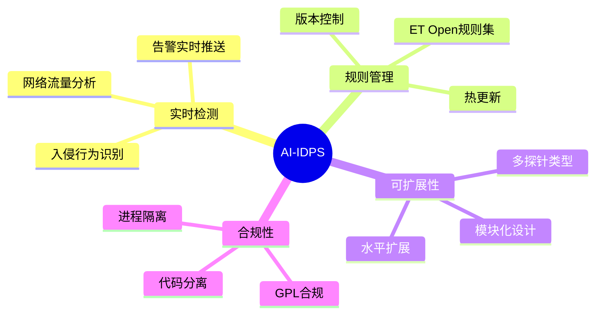
```mermaid
mindmap
  root((AI-IDPS))
    实时检测
      网络流量分析
      入侵行为识别
      告警实时推送
    规则管理
      版本控制
      热更新
      ET Open规则集
    可扩展性
      多探针类型
      水平扩展
      模块化设计
    合规性
      GPL合规
      进程隔离
      代码分离
```

### 1.3 核心功能

| 功能模块 | 描述 | 实现状态 |
|:---------|:-----|:---------|
| 网络入侵检测 | 基于 Suricata 的实时流量分析 | ✅ 已完成 |
| 规则管理 | 支持规则 CRUD、版本控制、热更新 | ✅ 已完成 |
| 日志展示 | 实时日志推送、历史查询、统计分析 | ✅ 已完成 |
| 探针管理 | 探针注册、状态监控、远程控制 | ✅ 已完成 |
| 仪表盘 | 数据可视化、统计概览 | ✅ 已完成 |

---

## 2. 系统架构设计

### 2.1 整体架构

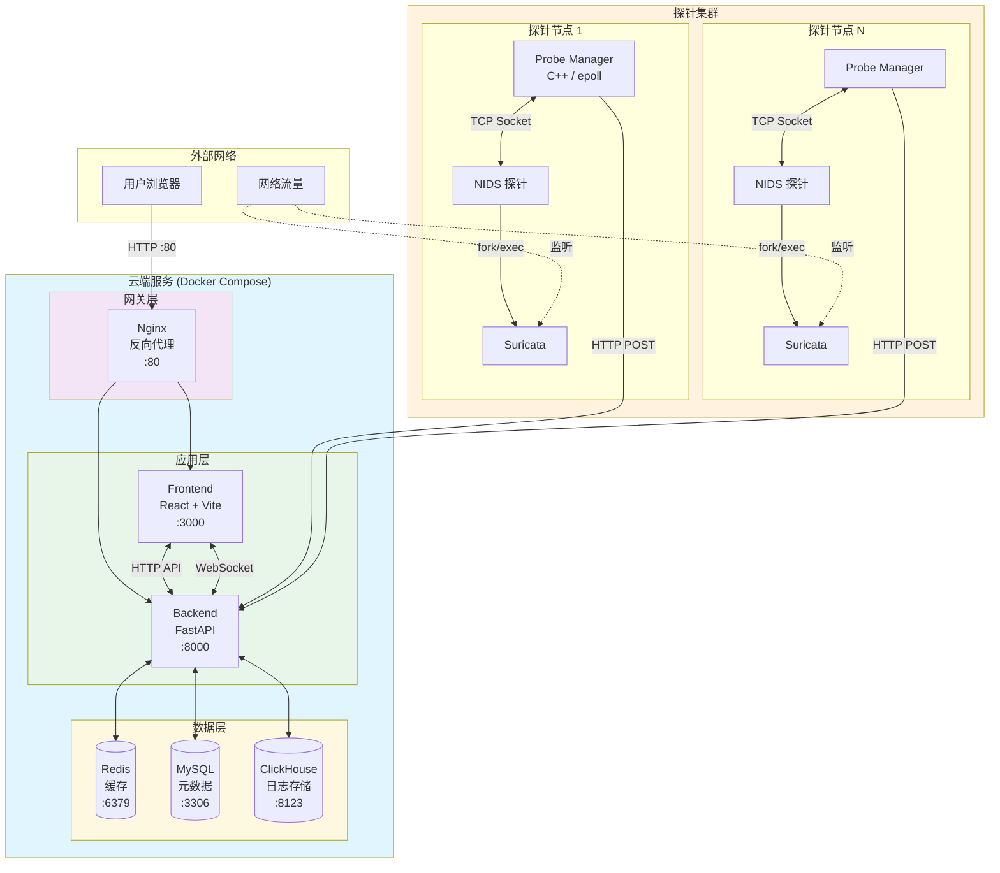
```mermaid
graph TB
    subgraph Internet["外部网络"]
        USER[用户浏览器]
        TRAFFIC[网络流量]
    end

    subgraph Cloud["云端服务 (Docker Compose)"]
        subgraph Gateway["网关层"]
            NGINX[Nginx<br/>反向代理<br/>:80]
        end

        subgraph Application["应用层"]
            FE[Frontend<br/>React + Vite<br/>:3000]
            BE[Backend<br/>FastAPI<br/>:8000]
        end

        subgraph Data["数据层"]
            REDIS[(Redis<br/>缓存<br/>:6379)]
            MYSQL[(MySQL<br/>元数据<br/>:3306)]
            CH[(ClickHouse<br/>日志存储<br/>:8123)]
        end

        NGINX --> FE
        NGINX --> BE
        FE <-->|HTTP API| BE
        FE <-->|WebSocket| BE
        BE <--> REDIS
        BE <--> MYSQL
        BE <--> CH
    end

    subgraph ProbeCluster["探针集群"]
        subgraph Node1["探针节点 1"]
            PM1[Probe Manager<br/>C++ / epoll]
            NIDS1[NIDS 探针]
            SR1[Suricata]
            PM1 <-->|TCP Socket| NIDS1
            NIDS1 -->|fork/exec| SR1
        end

        subgraph Node2["探针节点 N"]
            PM2[Probe Manager]
            NIDS2[NIDS 探针]
            SR2[Suricata]
            PM2 <-->|TCP Socket| NIDS2
            NIDS2 -->|fork/exec| SR2
        end
    end

    USER -->|HTTP :80| NGINX
    PM1 -->|HTTP POST| BE
    PM2 -->|HTTP POST| BE
    TRAFFIC -.->|监听| SR1
    TRAFFIC -.->|监听| SR2

    style Cloud fill:#e1f5fe
    style ProbeCluster fill:#fff3e0
    style Gateway fill:#f3e5f5
    style Application fill:#e8f5e9
    style Data fill:#fff8e1
```

### 2.2 分层架构

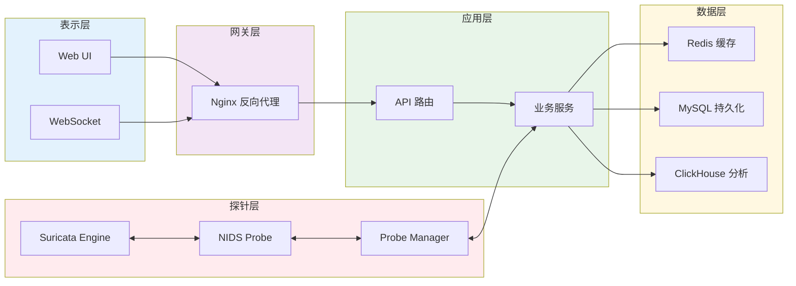
```mermaid
graph LR
    subgraph 表示层
        A1[Web UI]
        A2[WebSocket]
    end

    subgraph 网关层
        B1[Nginx 反向代理]
    end

    subgraph 应用层
        C1[API 路由]
        C2[业务服务]
    end

    subgraph 数据层
        D1[Redis 缓存]
        D2[MySQL 持久化]
        D3[ClickHouse 分析]
    end

    subgraph 探针层
        E1[Probe Manager]
        E2[NIDS Probe]
        E3[Suricata Engine]
    end

    A1 --> B1
    A2 --> B1
    B1 --> C1
    C1 --> C2
    C2 --> D1
    C2 --> D2
    C2 --> D3
    E1 <--> C2
    E2 <--> E1
    E3 <--> E2

    style 表示层 fill:#e3f2fd
    style 网关层 fill:#f3e5f5
    style 应用层 fill:#e8f5e9
    style 数据层 fill:#fff8e1
    style 探针层 fill:#ffebee
```

### 2.3 模块依赖关系

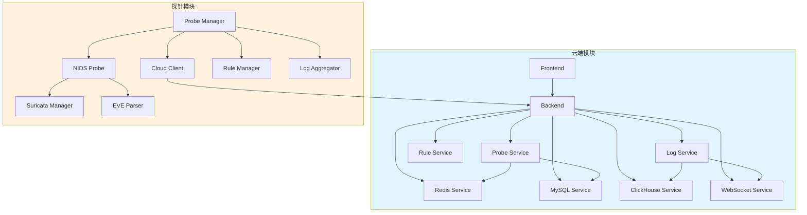
```mermaid
graph TD
    subgraph 云端模块
        FE[Frontend]
        BE[Backend]
        RS[Redis Service]
        MS[MySQL Service]
        CS[ClickHouse Service]
        WS[WebSocket Service]
        PS[Probe Service]
        RUS[Rule Service]
        LS[Log Service]
    end

    subgraph 探针模块
        PM[Probe Manager]
        NP[NIDS Probe]
        CC[Cloud Client]
        RM[Rule Manager]
        LA[Log Aggregator]
        SM[Suricata Manager]
        EP[EVE Parser]
    end

    FE --> BE
    BE --> RS
    BE --> MS
    BE --> CS
    BE --> WS
    BE --> PS
    BE --> RUS
    BE --> LS
    PS --> RS
    PS --> MS
    LS --> CS
    LS --> WS

    PM --> CC
    PM --> RM
    PM --> LA
    PM --> NP
    NP --> SM
    NP --> EP
    CC --> BE

    style 云端模块 fill:#e1f5fe
    style 探针模块 fill:#fff3e0
```

---

## 3. 技术栈选型

### 3.1 技术栈概览

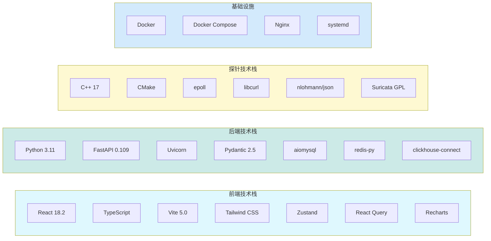
```mermaid
graph LR
    subgraph Frontend["前端技术栈"]
        F1[React 18.2]
        F2[TypeScript]
        F3[Vite 5.0]
        F4[Tailwind CSS]
        F5[Zustand]
        F6[React Query]
        F7[Recharts]
    end

    subgraph Backend["后端技术栈"]
        B1[Python 3.11]
        B2[FastAPI 0.109]
        B3[Uvicorn]
        B4[Pydantic 2.5]
        B5[aiomysql]
        B6[redis-py]
        B7[clickhouse-connect]
    end

    subgraph Probe["探针技术栈"]
        P1[C++ 17]
        P2[CMake]
        P3[epoll]
        P4[libcurl]
        P5[nlohmann/json]
        P6[Suricata GPL]
    end

    subgraph Infra["基础设施"]
        I1[Docker]
        I2[Docker Compose]
        I3[Nginx]
        I4[systemd]
    end

    style Frontend fill:#61dafb33
    style Backend fill:#00968833
    style Probe fill:#f7df1e33
    style Infra fill:#2496ed33
```

### 3.2 技术选型说明

| 组件 | 技术选型 | 选型理由 |
|:-----|:---------|:---------|
| **云端后端** | FastAPI + Python | 高性能异步框架，开发效率高 |
| **云端前端** | React + TypeScript | 类型安全，组件化，生态成熟 |
| **缓存层** | Redis | 高性能内存存储，支持多种数据结构 |
| **元数据库** | MySQL | 成熟稳定，支持事务和复杂查询 |
| **日志数据库** | ClickHouse | 列式存储，高压缩率，适合日志分析 |
| **探针框架** | C++ + epoll | 高性能系统编程，事件驱动 |
| **检测引擎** | Suricata | 开源高性能 IDS/IPS，规则丰富 |
| **容器化** | Docker Compose | 简化部署，环境一致性 |

---

## 4. 核心组件设计

### 4.1 云端后端组件

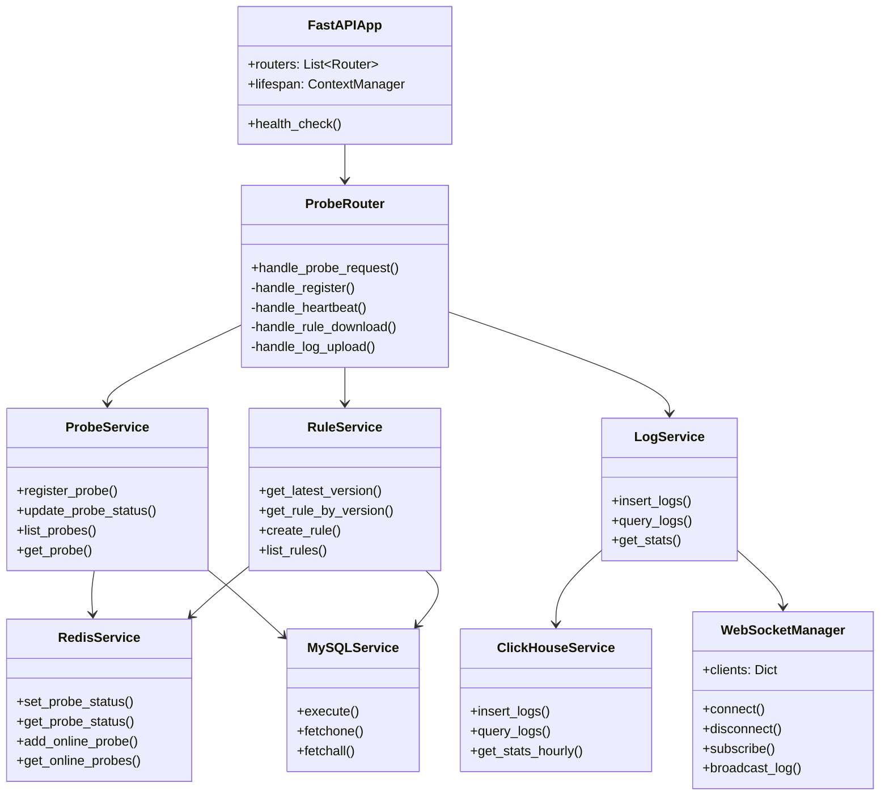
```mermaid
classDiagram
    class FastAPIApp {
        +routers: List~Router~
        +lifespan: ContextManager
        +health_check()
    }

    class ProbeRouter {
        +handle_probe_request()
        -handle_register()
        -handle_heartbeat()
        -handle_rule_download()
        -handle_log_upload()
    }

    class ProbeService {
        +register_probe()
        +update_probe_status()
        +list_probes()
        +get_probe()
    }

    class RuleService {
        +get_latest_version()
        +get_rule_by_version()
        +create_rule()
        +list_rules()
    }

    class LogService {
        +insert_logs()
        +query_logs()
        +get_stats()
    }

    class WebSocketManager {
        +clients: Dict
        +connect()
        +disconnect()
        +subscribe()
        +broadcast_log()
    }

    class RedisService {
        +set_probe_status()
        +get_probe_status()
        +add_online_probe()
        +get_online_probes()
    }

    class MySQLService {
        +execute()
        +fetchone()
        +fetchall()
    }

    class ClickHouseService {
        +insert_logs()
        +query_logs()
        +get_stats_hourly()
    }

    FastAPIApp --> ProbeRouter
    ProbeRouter --> ProbeService
    ProbeRouter --> RuleService
    ProbeRouter --> LogService
    ProbeService --> RedisService
    ProbeService --> MySQLService
    RuleService --> RedisService
    RuleService --> MySQLService
    LogService --> ClickHouseService
    LogService --> WebSocketManager
```

### 4.2 探针组件设计

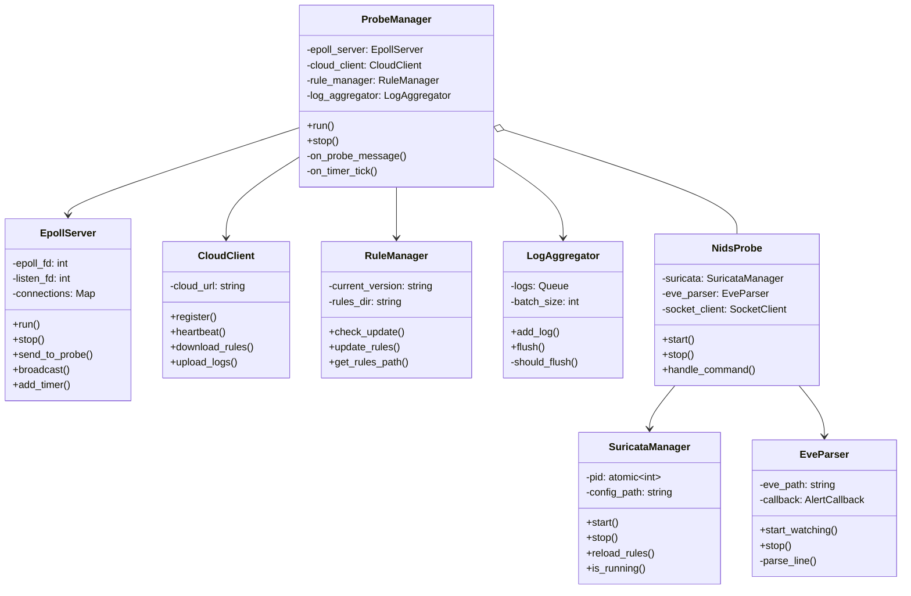
```mermaid
classDiagram
    class ProbeManager {
        -epoll_server: EpollServer
        -cloud_client: CloudClient
        -rule_manager: RuleManager
        -log_aggregator: LogAggregator
        +run()
        +stop()
        -on_probe_message()
        -on_timer_tick()
    }

    class EpollServer {
        -epoll_fd: int
        -listen_fd: int
        -connections: Map
        +run()
        +stop()
        +send_to_probe()
        +broadcast()
        +add_timer()
    }

    class CloudClient {
        -cloud_url: string
        +register()
        +heartbeat()
        +download_rules()
        +upload_logs()
    }

    class RuleManager {
        -current_version: string
        -rules_dir: string
        +check_update()
        +update_rules()
        +get_rules_path()
    }

    class LogAggregator {
        -logs: Queue
        -batch_size: int
        +add_log()
        +flush()
        -should_flush()
    }

    class NidsProbe {
        -suricata: SuricataManager
        -eve_parser: EveParser
        -socket_client: SocketClient
        +start()
        +stop()
        +handle_command()
    }

    class SuricataManager {
        -pid: atomic~int~
        -config_path: string
        +start()
        +stop()
        +reload_rules()
        +is_running()
    }

    class EveParser {
        -eve_path: string
        -callback: AlertCallback
        +start_watching()
        +stop()
        -parse_line()
    }

    ProbeManager --> EpollServer
    ProbeManager --> CloudClient
    ProbeManager --> RuleManager
    ProbeManager --> LogAggregator
    ProbeManager o-- NidsProbe
    NidsProbe --> SuricataManager
    NidsProbe --> EveParser
```

### 4.3 组件交互图

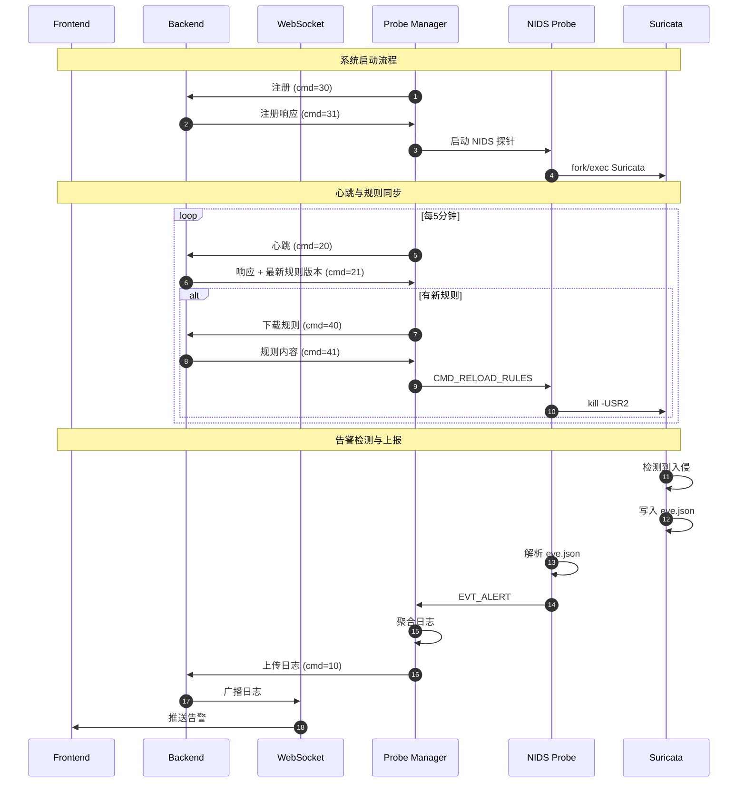
```mermaid
sequenceDiagram
    autonumber
    participant FE as Frontend
    participant BE as Backend
    participant WS as WebSocket
    participant PM as Probe Manager
    participant NP as NIDS Probe
    participant SR as Suricata

    Note over FE,SR: 系统启动流程
    PM->>BE: 注册 (cmd=30)
    BE->>PM: 注册响应 (cmd=31)
    PM->>NP: 启动 NIDS 探针
    NP->>SR: fork/exec Suricata

    Note over FE,SR: 心跳与规则同步
    loop 每5分钟
        PM->>BE: 心跳 (cmd=20)
        BE->>PM: 响应 + 最新规则版本 (cmd=21)
        alt 有新规则
            PM->>BE: 下载规则 (cmd=40)
            BE->>PM: 规则内容 (cmd=41)
            PM->>NP: CMD_RELOAD_RULES
            NP->>SR: kill -USR2
        end
    end

    Note over FE,SR: 告警检测与上报
    SR->>SR: 检测到入侵
    SR->>SR: 写入 eve.json
    NP->>NP: 解析 eve.json
    NP->>PM: EVT_ALERT
    PM->>PM: 聚合日志
    PM->>BE: 上传日志 (cmd=10)
    BE->>WS: 广播日志
    WS->>FE: 推送告警
```

---

## 5. 数据流设计

### 5.1 总体数据流

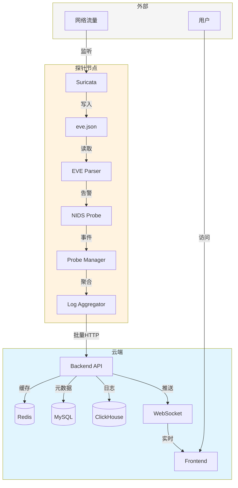
```mermaid
flowchart TB
    subgraph 外部
        TRAFFIC[网络流量]
        USER[用户]
    end

    subgraph 探针节点
        direction TB
        SR[Suricata]
        EVE[eve.json]
        EP[EVE Parser]
        NP[NIDS Probe]
        PM[Probe Manager]
        LA[Log Aggregator]
    end

    subgraph 云端
        direction TB
        BE[Backend API]
        REDIS[(Redis)]
        MYSQL[(MySQL)]
        CH[(ClickHouse)]
        WS[WebSocket]
        FE[Frontend]
    end

    TRAFFIC -->|监听| SR
    SR -->|写入| EVE
    EVE -->|读取| EP
    EP -->|告警| NP
    NP -->|事件| PM
    PM -->|聚合| LA
    LA -->|批量HTTP| BE

    BE -->|缓存| REDIS
    BE -->|元数据| MYSQL
    BE -->|日志| CH
    BE -->|推送| WS
    WS -->|实时| FE
    USER -->|访问| FE

    style 外部 fill:#f5f5f5
    style 探针节点 fill:#fff3e0
    style 云端 fill:#e1f5fe
```

### 5.2 日志数据流详情

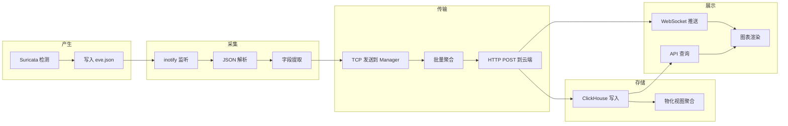
```mermaid
flowchart LR
    subgraph 产生
        A1[Suricata 检测]
        A2[写入 eve.json]
    end

    subgraph 采集
        B1[inotify 监听]
        B2[JSON 解析]
        B3[字段提取]
    end

    subgraph 传输
        C1[TCP 发送到 Manager]
        C2[批量聚合]
        C3[HTTP POST 到云端]
    end

    subgraph 存储
        D1[ClickHouse 写入]
        D2[物化视图聚合]
    end

    subgraph 展示
        E1[WebSocket 推送]
        E2[API 查询]
        E3[图表渲染]
    end

    A1 --> A2 --> B1 --> B2 --> B3
    B3 --> C1 --> C2 --> C3
    C3 --> D1 --> D2
    C3 --> E1 --> E3
    D1 --> E2 --> E3
```

### 5.3 规则同步流程

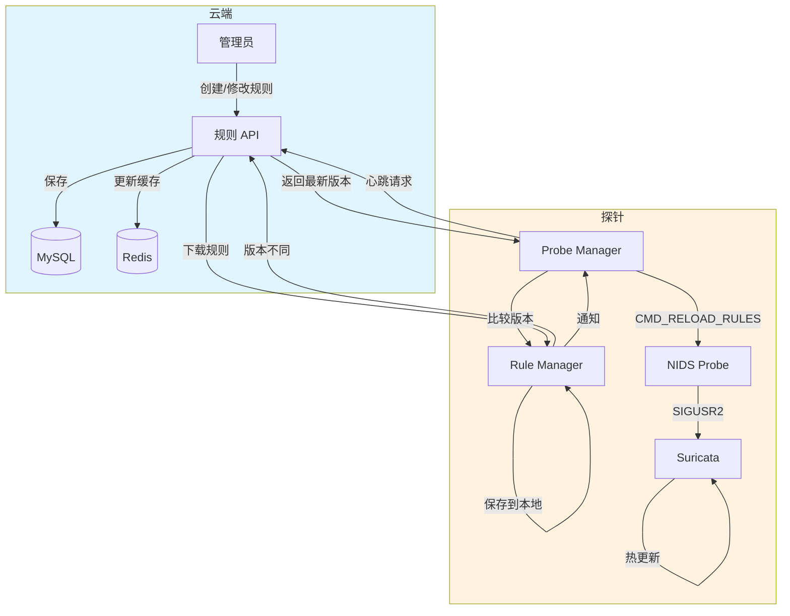
```mermaid
flowchart TD
    subgraph 云端
        ADMIN[管理员]
        API[规则 API]
        MYSQL[(MySQL)]
        REDIS[(Redis)]
    end

    subgraph 探针
        PM[Probe Manager]
        RM[Rule Manager]
        NP[NIDS Probe]
        SR[Suricata]
    end

    ADMIN -->|创建/修改规则| API
    API -->|保存| MYSQL
    API -->|更新缓存| REDIS

    PM -->|心跳请求| API
    API -->|返回最新版本| PM
    PM -->|比较版本| RM

    RM -->|版本不同| API
    API -->|下载规则| RM
    RM -->|保存到本地| RM
    RM -->|通知| PM
    PM -->|CMD_RELOAD_RULES| NP
    NP -->|SIGUSR2| SR
    SR -->|热更新| SR

    style 云端 fill:#e1f5fe
    style 探针 fill:#fff3e0
```

---

## 6. 通信协议设计

### 6.1 协议层次结构

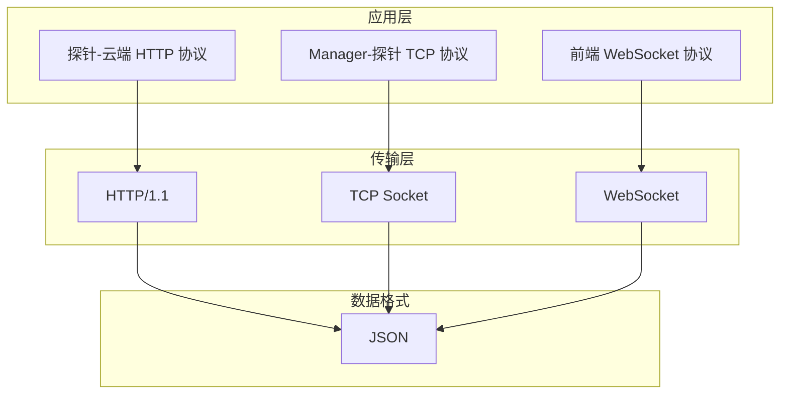
```mermaid
graph TB
    subgraph 应用层
        A1[探针-云端 HTTP 协议]
        A2[Manager-探针 TCP 协议]
        A3[前端 WebSocket 协议]
    end

    subgraph 传输层
        B1[HTTP/1.1]
        B2[TCP Socket]
        B3[WebSocket]
    end

    subgraph 数据格式
        C1[JSON]
    end

    A1 --> B1
    A2 --> B2
    A3 --> B3
    B1 --> C1
    B2 --> C1
    B3 --> C1
```

### 6.2 探针-云端 HTTP 协议

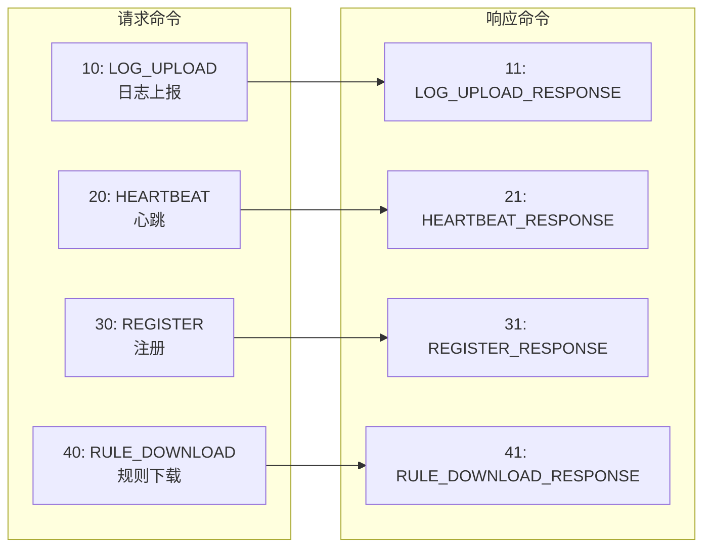
```mermaid
graph LR
    subgraph 请求命令
        R10[10: LOG_UPLOAD<br/>日志上报]
        R20[20: HEARTBEAT<br/>心跳]
        R30[30: REGISTER<br/>注册]
        R40[40: RULE_DOWNLOAD<br/>规则下载]
    end

    subgraph 响应命令
        S11[11: LOG_UPLOAD_RESPONSE]
        S21[21: HEARTBEAT_RESPONSE]
        S31[31: REGISTER_RESPONSE]
        S41[41: RULE_DOWNLOAD_RESPONSE]
    end

    R10 --> S11
    R20 --> S21
    R30 --> S31
    R40 --> S41
```

**协议格式**:

```json
// 请求格式
{
    "cmd": <命令码>,
    "data": { <业务数据> }
}

// 响应格式
{
    "cmd": <响应码>,
    "data": { <响应数据> }
}
```

**命令详情**:

| cmd | 方向 | 说明 | data 字段 |
|:----|:-----|:-----|:----------|
| 10 | Probe→Cloud | 日志上报 | `probe_id`, `logs[]` |
| 11 | Cloud→Probe | 日志上报响应 | `status`, `received` |
| 20 | Probe→Cloud | 心跳 | `probe_id`, `rule_version`, `status`, `probes[]` |
| 21 | Cloud→Probe | 心跳响应 | `status`, `latest_rule_version`, `server_time` |
| 30 | Probe→Cloud | 注册 | `probe_id`, `name`, `ip`, `probe_types[]` |
| 31 | Cloud→Probe | 注册响应 | `status`, `probe_id`, `message` |
| 40 | Probe→Cloud | 规则下载 | `probe_id`, `version` |
| 41 | Cloud→Probe | 规则下载响应 | `status`, `version`, `content`, `checksum` |

### 6.3 Manager-探针 TCP 协议

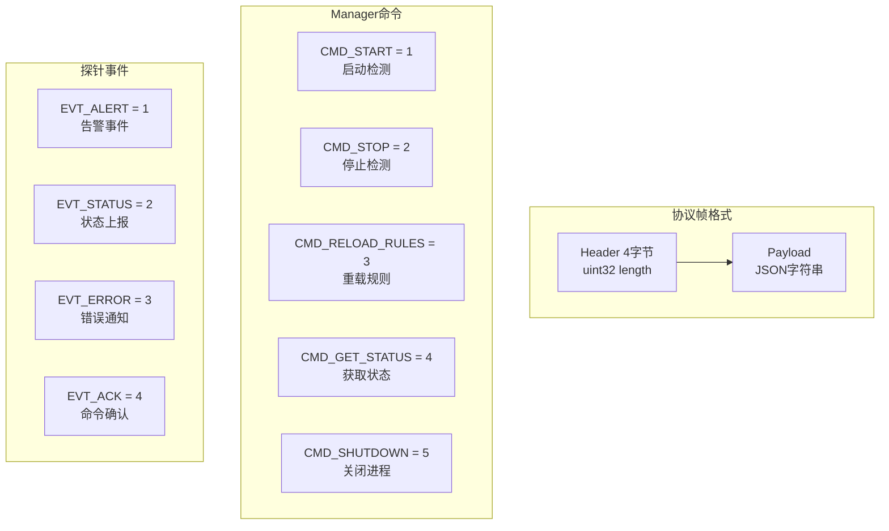
```mermaid
graph TD
    subgraph 协议帧格式
        H[Header 4字节<br/>uint32 length]
        P[Payload<br/>JSON字符串]
        H --> P
    end

    subgraph Manager命令
        C1[CMD_START = 1<br/>启动检测]
        C2[CMD_STOP = 2<br/>停止检测]
        C3[CMD_RELOAD_RULES = 3<br/>重载规则]
        C4[CMD_GET_STATUS = 4<br/>获取状态]
        C5[CMD_SHUTDOWN = 5<br/>关闭进程]
    end

    subgraph 探针事件
        E1[EVT_ALERT = 1<br/>告警事件]
        E2[EVT_STATUS = 2<br/>状态上报]
        E3[EVT_ERROR = 3<br/>错误通知]
        E4[EVT_ACK = 4<br/>命令确认]
    end
```

**消息帧格式**:

```
+--------------------+----------------------+
| Length (4 bytes)   | JSON Payload         |
| uint32, 网络字节序  | UTF-8 字符串          |
+--------------------+----------------------+
```

### 6.4 WebSocket 协议

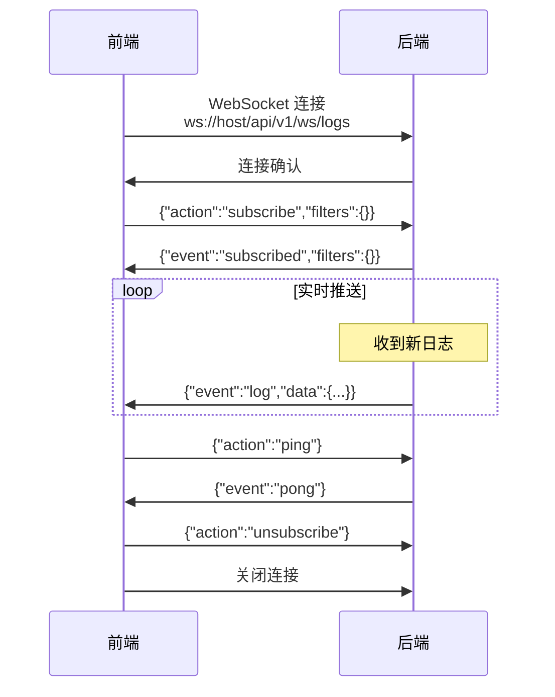
```mermaid
sequenceDiagram
    participant Client as 前端
    participant Server as 后端

    Client->>Server: WebSocket 连接<br/>ws://host/api/v1/ws/logs
    Server->>Client: 连接确认

    Client->>Server: {"action":"subscribe","filters":{}}
    Server->>Client: {"event":"subscribed","filters":{}}

    loop 实时推送
        Note over Server: 收到新日志
        Server->>Client: {"event":"log","data":{...}}
    end

    Client->>Server: {"action":"ping"}
    Server->>Client: {"event":"pong"}

    Client->>Server: {"action":"unsubscribe"}
    Client->>Server: 关闭连接
```

---

## 7. 数据存储设计

### 7.1 存储架构

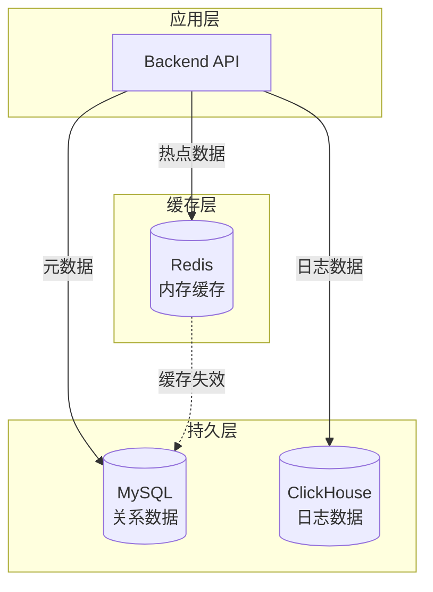
```mermaid
graph TB
    subgraph 应用层
        BE[Backend API]
    end

    subgraph 缓存层
        REDIS[(Redis<br/>内存缓存)]
    end

    subgraph 持久层
        MYSQL[(MySQL<br/>关系数据)]
        CH[(ClickHouse<br/>日志数据)]
    end

    BE -->|热点数据| REDIS
    BE -->|元数据| MYSQL
    BE -->|日志数据| CH

    REDIS -.->|缓存失效| MYSQL
```

### 7.2 MySQL 数据模型

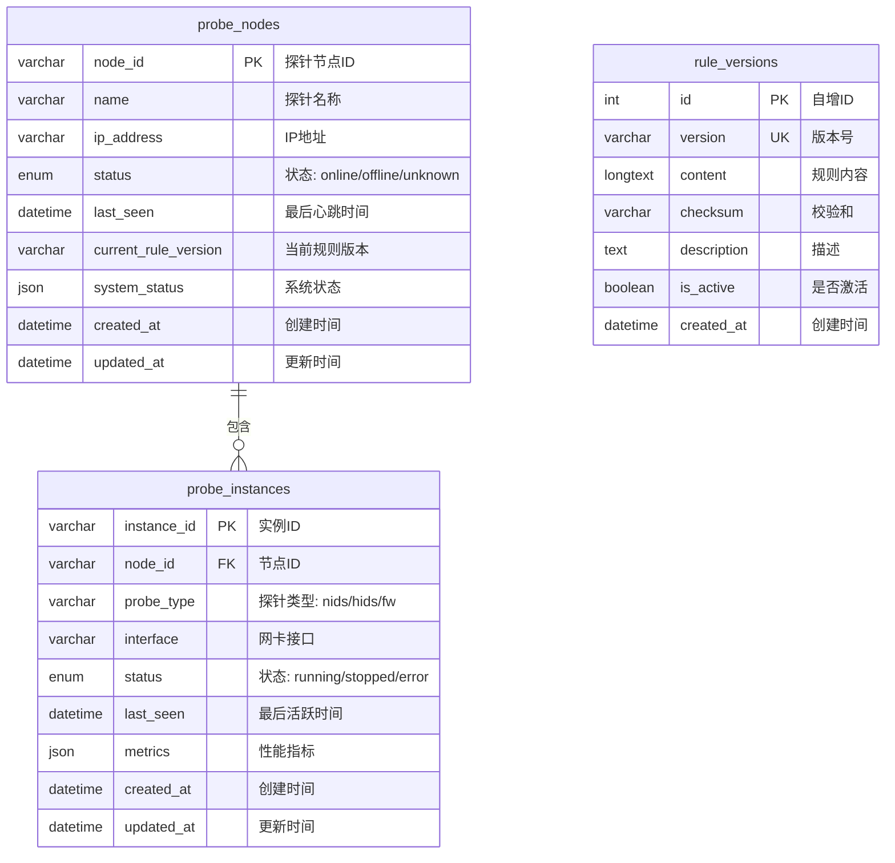
```mermaid
erDiagram
    probe_nodes {
        varchar node_id PK "探针节点ID"
        varchar name "探针名称"
        varchar ip_address "IP地址"
        enum status "状态: online/offline/unknown"
        datetime last_seen "最后心跳时间"
        varchar current_rule_version "当前规则版本"
        json system_status "系统状态"
        datetime created_at "创建时间"
        datetime updated_at "更新时间"
    }

    probe_instances {
        varchar instance_id PK "实例ID"
        varchar node_id FK "节点ID"
        varchar probe_type "探针类型: nids/hids/fw"
        varchar interface "网卡接口"
        enum status "状态: running/stopped/error"
        datetime last_seen "最后活跃时间"
        json metrics "性能指标"
        datetime created_at "创建时间"
        datetime updated_at "更新时间"
    }

    rule_versions {
        int id PK "自增ID"
        varchar version UK "版本号"
        longtext content "规则内容"
        varchar checksum "校验和"
        text description "描述"
        boolean is_active "是否激活"
        datetime created_at "创建时间"
    }

    probe_nodes ||--o{ probe_instances : "包含"
```

### 7.3 ClickHouse 数据模型

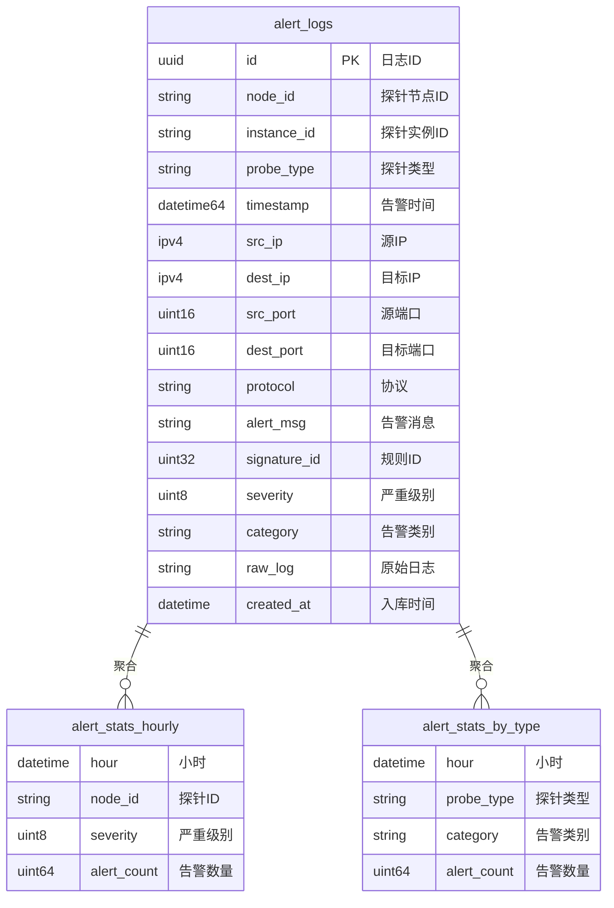
```mermaid
erDiagram
    alert_logs {
        uuid id PK "日志ID"
        string node_id "探针节点ID"
        string instance_id "探针实例ID"
        string probe_type "探针类型"
        datetime64 timestamp "告警时间"
        ipv4 src_ip "源IP"
        ipv4 dest_ip "目标IP"
        uint16 src_port "源端口"
        uint16 dest_port "目标端口"
        string protocol "协议"
        string alert_msg "告警消息"
        uint32 signature_id "规则ID"
        uint8 severity "严重级别"
        string category "告警类别"
        string raw_log "原始日志"
        datetime created_at "入库时间"
    }

    alert_stats_hourly {
        datetime hour "小时"
        string node_id "探针ID"
        uint8 severity "严重级别"
        uint64 alert_count "告警数量"
    }

    alert_stats_by_type {
        datetime hour "小时"
        string probe_type "探针类型"
        string category "告警类别"
        uint64 alert_count "告警数量"
    }

    alert_logs ||--o{ alert_stats_hourly : "聚合"
    alert_logs ||--o{ alert_stats_by_type : "聚合"
```

### 7.4 Redis 缓存设计

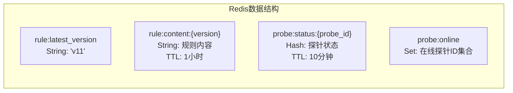
```mermaid
graph LR
    subgraph Redis数据结构
        K1["rule:latest_version<br/>String: 'v11'"]
        K2["rule:content:{version}<br/>String: 规则内容<br/>TTL: 1小时"]
        K3["probe:status:{probe_id}<br/>Hash: 探针状态<br/>TTL: 10分钟"]
        K4["probe:online<br/>Set: 在线探针ID集合"]
    end
```

| Key 模式 | 类型 | TTL | 说明 |
|:---------|:-----|:----|:-----|
| `rule:latest_version` | String | 无 | 最新规则版本号 |
| `rule:content:{version}` | String | 3600s | 规则文件内容缓存 |
| `probe:status:{probe_id}` | Hash | 600s | 探针状态信息 |
| `probe:online` | Set | 无 | 在线探针 ID 集合 |

---

## 8. 前端设计

### 8.1 页面结构

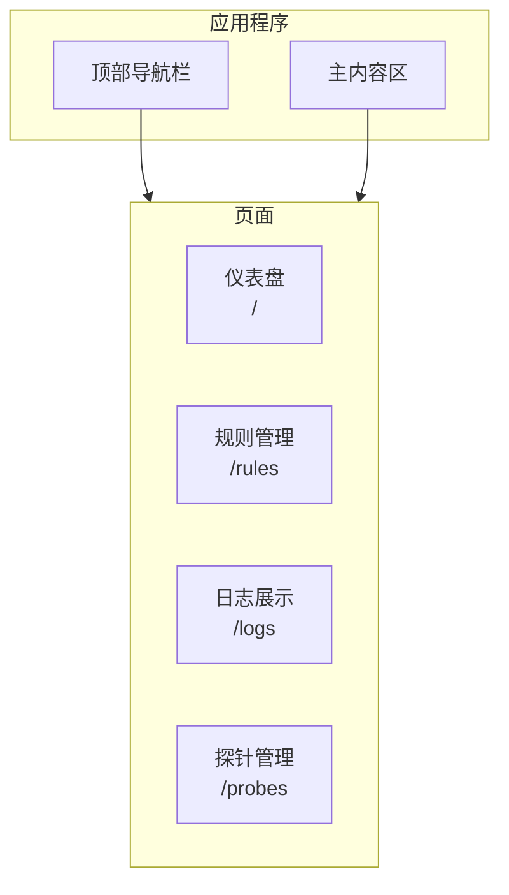
```mermaid
graph TD
    subgraph App[应用程序]
        HEADER[顶部导航栏]
        MAIN[主内容区]
    end

    subgraph Pages[页面]
        DASH[仪表盘<br/>/]
        RULES[规则管理<br/>/rules]
        LOGS[日志展示<br/>/logs]
        PROBES[探针管理<br/>/probes]
    end

    HEADER --> Pages
    MAIN --> Pages
```

### 8.2 组件架构

```mermaid
graph TB
    subgraph 页面组件
        Dashboard[DashboardPage]
        Rules[RulesPage]
        Logs[LogsPage]
        Probes[ProbesPage]
    end

    subgraph 业务组件
        StatCard[统计卡片]
        AlertChart[告警图表]
        LogTable[日志表格]
        ProbeList[探针列表]
    end

    subgraph 状态管理
        Store[Zustand Store]
        Query[React Query]
    end

    subgraph 服务层
        API[API Client]
        WS[WebSocket Hook]
    end

    Dashboard --> StatCard
    Dashboard --> AlertChart
    Logs --> LogTable
    Logs --> WS
    Probes --> ProbeList

    Pages --> Query
    Query --> API
    Logs --> Store
```

### 8.3 数据流

```mermaid
flowchart LR
    subgraph 数据获取
        RQ[React Query]
        WS[useWebSocket]
    end

    subgraph 状态管理
        Store[Zustand Store]
    end

    subgraph 视图渲染
        Component[React Component]
        Chart[Recharts]
    end

    RQ -->|HTTP 响应| Store
    WS -->|实时数据| Store
    Store -->|状态更新| Component
    Component --> Chart
```

### 8.4 仪表盘设计

```mermaid
graph TB
    subgraph Dashboard[仪表盘布局]
        subgraph Stats[统计卡片行]
            S1[在线探针]
            S2[离线探针]
            S3[24小时告警]
            S4[高危告警]
        end

        subgraph Charts[图表行]
            C1[24小时告警趋势<br/>折线图]
            C2[告警级别分布<br/>饼图]
        end

        subgraph ProbeOverview[探针状态概览]
            P1[探针卡片列表]
        end
    end

    Stats --> Charts --> ProbeOverview
```

---

## 9. 探针架构设计

### 9.1 Probe Manager 架构

```mermaid
flowchart TD
    A[启动] --> B[加载配置]
    B --> C[创建 EpollServer]
    C --> D[注册到云端]
    D --> E[启动各类探针]
    E --> F[进入事件循环]

    subgraph EventLoop[epoll 事件循环]
        G[epoll_wait]
        G --> H{事件类型}
        H -->|新连接| I[accept 探针连接]
        H -->|探针数据| J[处理探针消息]
        H -->|定时器| K[心跳/规则检查]
        H -->|错误| L[清理连接]
        I --> G
        J --> M[日志聚合]
        M --> G
        K --> N[云端通信]
        N --> G
        L --> G
    end

    F --> G
```

### 9.2 NIDS 探针架构

```mermaid
flowchart TD
    subgraph NIDSProbe[NIDS 探针进程]
        A[启动] --> B[解析配置]
        B --> C[连接 Manager]
        C --> D[fork/exec Suricata]
        D --> E[启动 EVE Parser]
        E --> F[进入主循环]

        subgraph MainLoop[主循环]
            G[等待事件]
            G --> H{事件类型}
            H -->|Manager 命令| I[处理命令]
            H -->|EVE 告警| J[发送告警]
            I --> K{命令类型}
            K -->|RELOAD| L[发送 SIGUSR2]
            K -->|STATUS| M[上报状态]
            K -->|STOP| N[停止 Suricata]
            L --> G
            M --> G
            N --> G
            J --> G
        end

        F --> G
    end

    subgraph Suricata[Suricata 进程]
        SR[suricata -i eth0]
        SR --> EVE[eve.json]
    end

    D -.->|fork/exec| SR
    EVE -.->|inotify| E
    L -.->|SIGUSR2| SR
```

### 9.3 GPL 合规设计

```mermaid
graph TB
    subgraph 私有代码区["私有代码 (BSD/MIT)"]
        PM[Probe Manager]
        NP[NIDS Probe]
        EP[EVE Parser]
        SC[Socket Client]
        CM[公共模块]
    end

    subgraph GPL代码区["GPL 代码"]
        SR[Suricata 进程]
    end

    subgraph 隔离边界["隔离机制"]
        FORK[fork/exec<br/>进程隔离]
        FILE[eve.json<br/>文件通信]
        SIG[SIGUSR2<br/>信号通信]
    end

    NP -->|创建| FORK
    FORK -->|执行| SR
    SR -->|写入| FILE
    FILE -->|读取| EP
    NP -->|发送| SIG
    SIG -->|热更新| SR

    style 私有代码区 fill:#c8e6c9
    style GPL代码区 fill:#ffcdd2
    style 隔离边界 fill:#fff9c4
```

**GPL 合规要点**:

| 隔离方式 | 说明 | 实现 |
|:---------|:-----|:-----|
| 进程隔离 | 独立进程空间 | `fork()` + `exec()` |
| 文件通信 | 无内存共享 | eve.json |
| 信号通信 | 无函数调用 | `SIGUSR2` |
| 代码分离 | 物理隔离 | `third_party/suricata/` |

---

## 10. 安全与合规设计

### 10.1 安全考虑

```mermaid
graph TB
    subgraph 当前设计["当前设计 (内网环境)"]
        A1[HTTP 明文通信]
        A2[无用户认证]
        A3[信任探针请求]
    end

    subgraph 未来增强["未来安全增强"]
        B1[HTTPS 加密]
        B2[API Token 认证]
        B3[探针证书验证]
        B4[输入校验加固]
    end

    A1 -.->|升级| B1
    A2 -.->|升级| B2
    A3 -.->|升级| B3
```

### 10.2 数据安全

```mermaid
flowchart LR
    subgraph 数据保护
        D1[日志 TTL 90天]
        D2[敏感数据脱敏]
        D3[访问日志记录]
    end

    subgraph 传输安全
        T1[内网部署]
        T2[可选 HTTPS]
    end

    subgraph 存储安全
        S1[数据库密码管理]
        S2[Docker Volume 隔离]
    end
```

---

## 11. 部署架构设计

### 11.1 Docker Compose 部署

```mermaid
graph TB
    subgraph DockerCompose["Docker Compose 集群"]
        subgraph 网关
            NGINX[nginx:alpine<br/>:80]
        end

        subgraph 应用
            FE[frontend<br/>Node.js<br/>:3000]
            BE[backend<br/>Python<br/>:8000]
        end

        subgraph 数据
            REDIS[redis:7-alpine<br/>:6379]
            MYSQL[mysql:8.0<br/>:3306]
            CH[clickhouse-server<br/>:8123/:9000]
        end

        NGINX --> FE
        NGINX --> BE
        BE --> REDIS
        BE --> MYSQL
        BE --> CH
    end

    subgraph 持久化
        V1[(redis_data)]
        V2[(mysql_data)]
        V3[(clickhouse_data)]
    end

    REDIS --> V1
    MYSQL --> V2
    CH --> V3
```

### 11.2 探针部署

```mermaid
graph TB
    subgraph 探针节点["探针节点 (systemd)"]
        PM[probe-manager.service]
        NP[nids-probe.service]
        SR[Suricata 子进程]

        PM -->|管理| NP
        NP -->|fork| SR
    end

    subgraph 配置文件
        C1["/etc/probe-manager/config.json"]
        C2["/etc/nids-probe/config.json"]
        C3["/etc/suricata/suricata.yaml"]
    end

    subgraph 规则文件
        R1["/var/lib/nids/rules/"]
    end

    subgraph 日志文件
        L1["/var/log/suricata/eve.json"]
    end

    PM --> C1
    NP --> C2
    SR --> C3
    SR --> R1
    SR --> L1
```

### 11.3 网络架构

```mermaid
graph TB
    subgraph 外网
        USER[用户]
    end

    subgraph 云端网络["云端网络 (host mode)"]
        NGINX[Nginx :80]
        FE[Frontend :3000]
        BE[Backend :8000]
        REDIS[Redis :6379]
        MYSQL[MySQL :3306]
        CH[ClickHouse :8123]
    end

    subgraph 探针网络
        PM1[Probe Manager 1<br/>:9010]
        PM2[Probe Manager 2<br/>:9010]
        NP1[NIDS Probe 1]
        NP2[NIDS Probe 2]
    end

    USER -->|:80| NGINX
    NGINX -->|:3000| FE
    NGINX -->|:8000| BE
    BE -->|:6379| REDIS
    BE -->|:3306| MYSQL
    BE -->|:8123| CH
    PM1 -->|HTTP :80| NGINX
    PM2 -->|HTTP :80| NGINX
    NP1 -->|TCP :9010| PM1
    NP2 -->|TCP :9010| PM2

    style 云端网络 fill:#e1f5fe
    style 探针网络 fill:#fff3e0
```

---

## 12. API 设计

### 12.1 API 概览

```mermaid
graph LR
    subgraph 探针通信API
        A1[POST /api/v1/probe<br/>统一探针接口]
    end

    subgraph 前端API
        B1[GET /api/v1/probes<br/>探针列表]
        B2[GET /api/v1/probes/:id<br/>探针详情]
        B3[GET /api/v1/rules<br/>规则列表]
        B4[POST /api/v1/rules<br/>创建规则]
        B5[GET /api/v1/logs<br/>日志查询]
        B6[GET /api/v1/logs/stats<br/>日志统计]
    end

    subgraph WebSocket
        C1[WS /api/v1/ws/logs<br/>实时日志]
    end
```

### 12.2 API 详细设计

**探针统一接口**: `POST /api/v1/probe`

```mermaid
flowchart TD
    REQ[POST /api/v1/probe] --> PARSE[解析 cmd]
    PARSE --> SWITCH{cmd 值}
    SWITCH -->|10| LOG[日志上报处理]
    SWITCH -->|20| HB[心跳处理]
    SWITCH -->|30| REG[注册处理]
    SWITCH -->|40| RULE[规则下载处理]
    SWITCH -->|其他| ERR[错误响应]

    LOG --> RESP[返回响应]
    HB --> RESP
    REG --> RESP
    RULE --> RESP
    ERR --> RESP
```

**前端 RESTful API**:

| 接口 | 方法 | 说明 | 请求参数 | 响应 |
|:-----|:-----|:-----|:---------|:-----|
| `/api/v1/probes` | GET | 探针列表 | - | `{"probes": [...]}` |
| `/api/v1/probes/{id}` | GET | 探针详情 | `probe_id` | `{probe_data}` |
| `/api/v1/rules` | GET | 规则列表 | - | `{"rules": [...]}` |
| `/api/v1/rules` | POST | 创建规则 | `content`, `description` | `{"version": "..."}` |
| `/api/v1/rules/{version}` | GET | 获取规则 | `version` | `{rule_data}` |
| `/api/v1/logs` | GET | 日志查询 | `limit`, `offset`, `filters` | `{"logs": [...]}` |
| `/api/v1/logs/stats` | GET | 日志统计 | `hours` | `{"stats": [...]}` |
| `/health` | GET | 健康检查 | - | `{"status": "ok"}` |

---

## 13. 性能设计

### 13.1 性能目标

| 指标 | 目标值 | 说明 |
|:-----|:-------|:-----|
| 日志写入吞吐 | ≥1000 条/秒 | ClickHouse 批量写入 |
| API 响应时间 | ≤100ms (P95) | 热点数据 Redis 缓存 |
| WebSocket 并发 | ≥100 连接 | 异步广播 |
| 探针并发 | ≥50 个 | epoll 事件驱动 |

### 13.2 性能优化策略

```mermaid
graph TB
    subgraph 缓存优化
        A1[Redis 缓存规则版本]
        A2[Redis 缓存探针状态]
        A3[Redis 缓存规则内容]
    end

    subgraph 批量处理
        B1[日志批量聚合]
        B2[ClickHouse 批量插入]
        B3[WebSocket 批量推送]
    end

    subgraph 异步处理
        C1[FastAPI 异步 IO]
        C2[aiomysql 异步查询]
        C3[异步 WebSocket]
    end

    subgraph 索引优化
        D1[MySQL 索引优化]
        D2[ClickHouse 分区优化]
        D3[ClickHouse 物化视图]
    end
```

### 13.3 容量规划

```mermaid
graph LR
    subgraph 日志存储容量
        L1[单条日志 ~1KB]
        L2[日均 100万条]
        L3[压缩后 ~100MB/天]
        L4[90天保留 ~9GB]
    end

    subgraph 内存占用
        M1[Redis ~100MB]
        M2[MySQL ~500MB]
        M3[ClickHouse ~1GB]
        M4[Backend ~200MB]
    end

    L1 --> L2 --> L3 --> L4
```

---

## 14. 附录

### 14.1 目录结构

```
ai-idps/
├── cloud/                          # 云端服务
│   ├── backend/                    # FastAPI 后端
│   │   ├── app/
│   │   │   ├── main.py            # 应用入口
│   │   │   ├── config.py          # 配置管理
│   │   │   ├── routers/           # API 路由
│   │   │   │   ├── probe.py       # 探针通信接口
│   │   │   │   ├── probes.py      # 探针管理接口
│   │   │   │   ├── rules.py       # 规则管理接口
│   │   │   │   ├── logs.py        # 日志查询接口
│   │   │   │   └── websocket.py   # WebSocket 接口
│   │   │   ├── services/          # 业务服务
│   │   │   │   ├── probe_service.py
│   │   │   │   ├── rule_service.py
│   │   │   │   ├── log_service.py
│   │   │   │   ├── redis_service.py
│   │   │   │   ├── mysql_service.py
│   │   │   │   ├── clickhouse_service.py
│   │   │   │   └── websocket_service.py
│   │   │   └── models/            # 数据模型
│   │   │       └── probe_protocol.py
│   │   ├── pyproject.toml
│   │   └── Dockerfile
│   ├── frontend/                   # React 前端
│   │   ├── src/
│   │   │   ├── App.tsx
│   │   │   ├── main.tsx
│   │   │   ├── pages/             # 页面组件
│   │   │   │   ├── Dashboard/
│   │   │   │   ├── Rules/
│   │   │   │   ├── Logs/
│   │   │   │   └── Probes/
│   │   │   ├── services/          # API 客户端
│   │   │   ├── hooks/             # 自定义 Hook
│   │   │   └── store/             # 状态管理
│   │   ├── package.json
│   │   └── Dockerfile
│   ├── nginx/                      # Nginx 配置
│   ├── mysql/                      # MySQL 初始化
│   ├── clickhouse/                 # ClickHouse 初始化
│   └── docker-compose.yml
├── probe/                          # 探针代码
│   ├── common/                     # 公共库
│   │   ├── include/
│   │   │   ├── protocol.h
│   │   │   ├── probe_base.h
│   │   │   └── logger.h
│   │   └── src/
│   ├── manager/                    # Probe Manager
│   │   ├── include/
│   │   │   ├── epoll_server.h
│   │   │   ├── cloud_client.h
│   │   │   ├── rule_manager.h
│   │   │   └── log_aggregator.h
│   │   └── src/
│   ├── nids/                       # NIDS 探针
│   │   ├── include/
│   │   │   ├── nids_probe.h
│   │   │   ├── suricata_manager.h
│   │   │   └── eve_parser.h
│   │   └── src/
│   └── CMakeLists.txt
├── third_party/
│   └── suricata/                   # Suricata (Git Submodule)
├── rules/                          # 规则文件
│   └── emerging-all.rules
├── scripts/                        # 脚本
├── fixtures/                       # 测试用例
├── specs/                          # 文档
│   ├── 0001-spec.md
│   ├── 0002-implementation-plan.md
│   ├── 0003-rule.md
│   └── 0004-design.md (本文档)
├── Makefile
└── README.md
```

### 14.2 配置参数

| 参数 | 默认值 | 说明 |
|:-----|:-------|:-----|
| 心跳间隔 | 5 分钟 | Manager 心跳周期 |
| 日志批量大小 | 100 条 | 单次上报最大日志数 |
| 日志上报间隔 | 10 秒 | 日志批量上报周期 |
| 探针离线阈值 | 15 分钟 | 超时判定为离线 |
| Manager 监听端口 | 9010 | TCP 监听端口 |
| Redis 规则缓存 TTL | 1 小时 | 规则内容缓存时间 |
| Redis 状态缓存 TTL | 10 分钟 | 探针状态缓存时间 |
| ClickHouse 日志保留 | 90 天 | 日志自动过期时间 |
| WebSocket 心跳间隔 | 30 秒 | 前端心跳周期 |
| WebSocket 超时时间 | 60 秒 | 无心跳断开时间 |

### 14.3 错误码定义

| 错误码 | 说明 |
|:-------|:-----|
| 1001 | 探针未注册 |
| 1002 | 无效的 probe_id |
| 1003 | 规则版本不存在 |
| 1004 | 请求参数错误 |
| 1005 | 服务器内部错误 |

### 14.4 开发阶段完成状态

| 阶段 | 描述 | 状态 |
|:-----|:-----|:-----|
| Phase 1 | 环境搭建与基础框架 | ✅ 已完成 |
| Phase 2 | 云端后端核心功能 | ✅ 已完成 |
| Phase 3 | Probe Manager 实现 | ✅ 已完成 |
| Phase 4 | NIDS Probe 实现 | ✅ 已完成 |
| Phase 5 | 云端前端实现 | ✅ 已完成 |
| Phase 6 | 集成测试与优化 | ✅ 已完成 |

---

> **文档维护**: 本文档应随系统演进持续更新
> **最后更新**: 2026-01-19
