# 规则更新与攻击测试功能需求与设计文档

> 版本: 1.0
> 更新日期: 2026-01-19
> 文档类型: 需求与设计文档

---

## 目录

1. [需求概述](#1-需求概述)
2. [功能需求](#2-功能需求)
3. [系统架构设计](#3-系统架构设计)
4. [数据模型设计](#4-数据模型设计)
5. [规则更新功能设计](#5-规则更新功能设计)
6. [攻击测试功能设计](#6-攻击测试功能设计)
7. [API 设计](#7-api-设计)
8. [前端设计](#8-前端设计)
9. [探针端设计](#9-探针端设计)
10. [实现计划](#10-实现计划)
11. [附录](#11-附录)

---

## 1. 需求概述

### 1.1 背景

当前系统已实现基础的规则管理功能，支持规则的 CRUD 和版本控制。为了提升系统的实用性和可维护性，需要增加以下两个核心功能：

1. **规则自动更新**：自动从 ET Open 下载最新规则，进行分析、分类和增量更新
2. **攻击测试验证**：针对规则发起模拟攻击，验证检测能力，关联规则与告警日志

### 1.2 目标

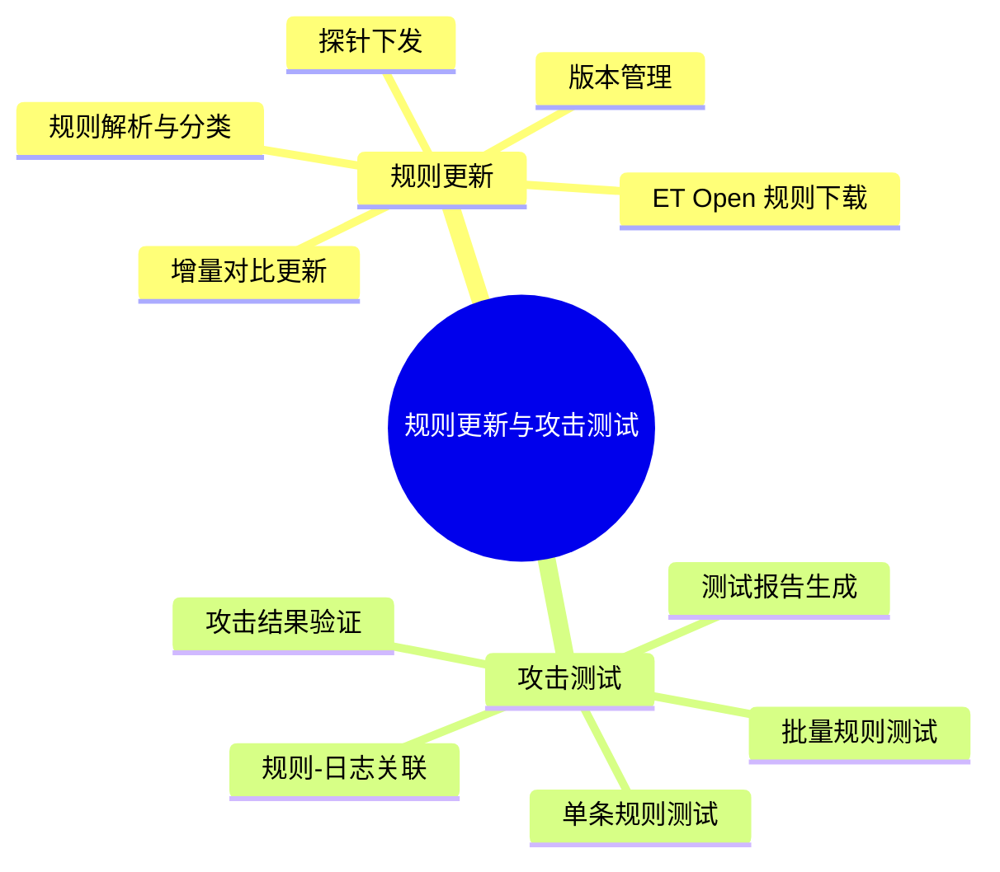

### 1.3 核心价值

| 功能 | 价值 |
|:-----|:-----|
| 规则自动更新 | 保持规则库最新，及时覆盖新威胁 |
| 规则分类管理 | 便于规则的查找、筛选和管理 |
| 攻击测试验证 | 验证规则有效性，确保检测能力 |
| 规则-日志关联 | 快速定位告警来源，便于分析 |

### 1.4 架构设计原则

本功能采用 **Pull（拉取）模式**，与现有系统架构保持一致：

| 特性 | 说明 |
|:-----|:-----|
| 通信协议 | HTTP + JSON（与现有探针通信一致） |
| 规则同步 | 探针定期轮询云端检查版本更新（默认 5 分钟） |
| 任务获取 | 探针定期轮询云端获取攻击测试任务（默认 5 秒） |
| 结果上报 | 探针主动 POST 执行结果到云端 |

**Pull 模式优势**：
- 架构简单，无需云端维护探针连接状态
- 与现有规则同步机制一致，降低开发复杂度
- 探针可部署在 NAT 后，无需公网 IP
- 云端无状态，易于水平扩展

---

## 2. 功能需求

### 2.1 规则更新功能需求

#### 2.1.1 ET Open 规则下载

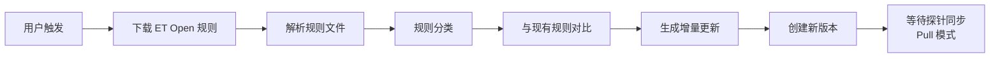

**功能要求**：

| 编号 | 需求描述 | 优先级 |
|:-----|:---------|:-------|
| R1.1 | 支持手动触发下载 ET Open 最新规则 | P0 |
| R1.2 | 支持定时自动下载（可配置周期） | P1 |
| R1.3 | 下载过程显示进度，支持取消 | P1 |
| R1.4 | 下载失败时提供错误信息和重试机制 | P0 |

#### 2.1.2 规则解析与分类

**功能要求**：

| 编号 | 需求描述 | 优先级 |
|:-----|:---------|:-------|
| R2.1 | 解析 Suricata 规则格式，提取关键字段 | P0 |
| R2.2 | 按 classtype 分类（web-application-attack, trojan-activity 等） | P0 |
| R2.3 | 按 msg 前缀分类（MALWARE, EXPLOIT, SCAN 等） | P0 |
| R2.4 | 提取 MITRE ATT&CK 映射信息 | P1 |
| R2.5 | 统计各分类规则数量 | P0 |

**规则字段提取**：

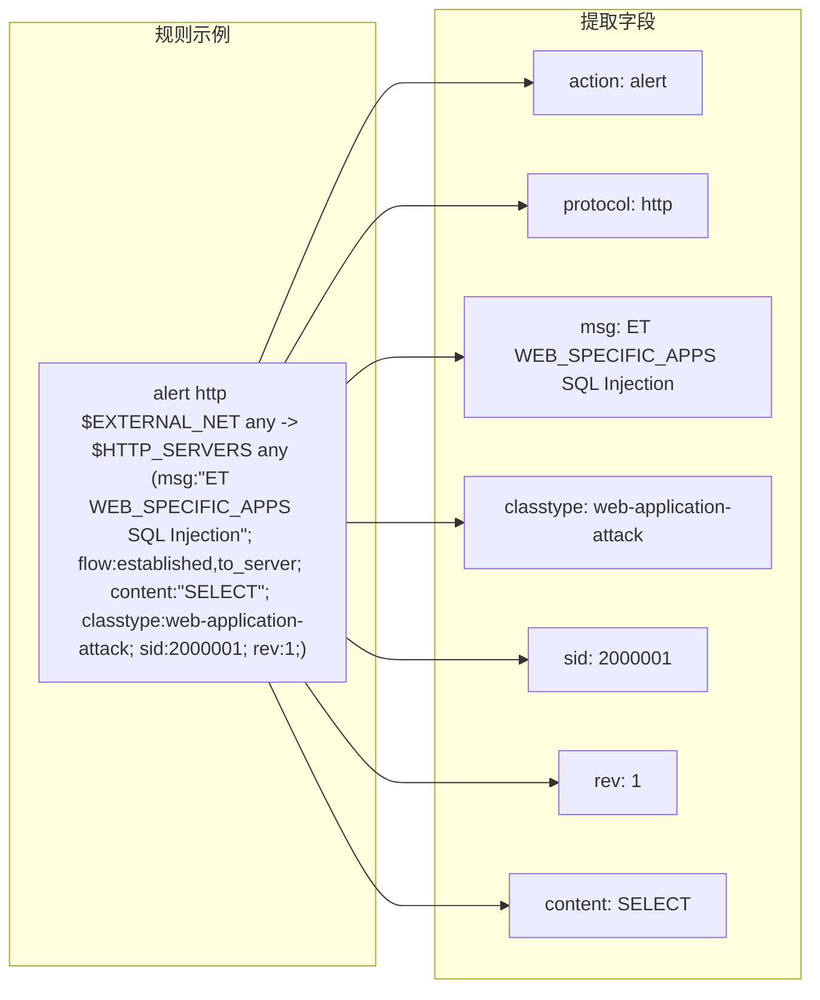

#### 2.1.3 增量更新

**功能要求**：

| 编号 | 需求描述 | 优先级 |
|:-----|:---------|:-------|
| R3.1 | 对比新旧规则，识别新增规则 | P0 |
| R3.2 | 识别修改的规则（相同 SID，不同 rev） | P0 |
| R3.3 | 识别删除/禁用的规则 | P1 |
| R3.4 | 提供预览功能，展示变更内容 | P0 |
| R3.5 | 支持选择性更新（勾选要更新的规则） | P1 |

#### 2.1.4 版本管理

**功能要求**：

| 编号 | 需求描述 | 优先级 |
|:-----|:---------|:-------|
| R4.1 | 更新后自动创建新版本 | P0 |
| R4.2 | 记录版本变更日志（新增/修改/删除数量） | P0 |
| R4.3 | 支持版本回滚 | P1 |
| R4.4 | 支持版本对比 | P2 |

#### 2.1.5 探针同步（Pull 模式）

**功能要求**：

| 编号 | 需求描述 | 优先级 |
|:-----|:---------|:-------|
| R5.1 | 探针定期轮询云端检查规则版本更新 | P0 |
| R5.2 | 云端提供规则版本检查和下载 API | P0 |
| R5.3 | 显示各探针的规则版本状态 | P0 |
| R5.4 | 支持配置轮询间隔（默认 5 分钟） | P1 |

**Pull 模式说明**：

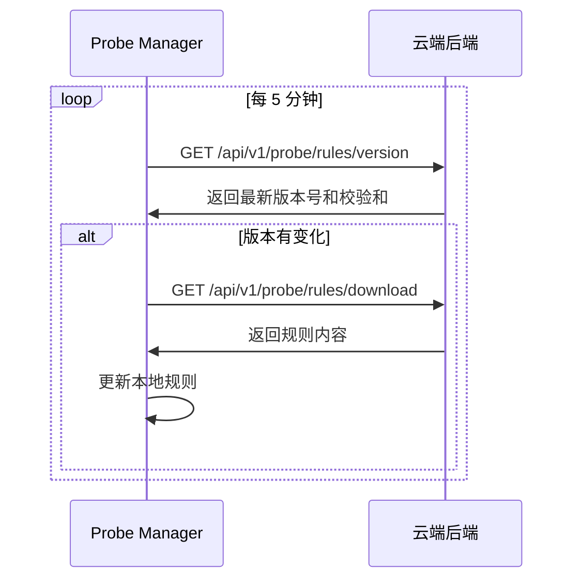

### 2.2 攻击测试功能需求

#### 2.2.1 攻击测试基本功能

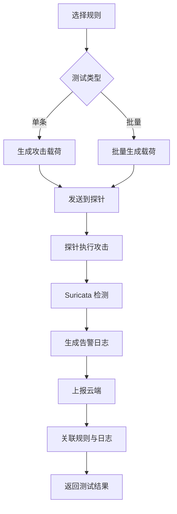

**功能要求**：

| 编号 | 需求描述 | 优先级 |
|:-----|:---------|:-------|
| T1.1 | 针对单条规则发起攻击测试 | P0 |
| T1.2 | 支持批量选择规则进行测试 | P0 |
| T1.3 | 根据规则类型自动生成攻击载荷 | P0 |
| T1.4 | 显示测试进度和状态 | P0 |
| T1.5 | 支持取消正在进行的测试 | P1 |

#### 2.2.2 攻击载荷生成

**功能要求**：

| 编号 | 需求描述 | 优先级 |
|:-----|:---------|:-------|
| T2.1 | 解析规则内容，提取检测特征 | P0 |
| T2.2 | 根据特征生成触发告警的流量 | P0 |
| T2.3 | 支持多种攻击类型（HTTP, TCP, UDP, DNS 等） | P0 |
| T2.4 | 内置常见攻击模板库 | P1 |
| T2.5 | 支持自定义攻击载荷 | P2 |

#### 2.2.3 测试结果验证

**功能要求**：

| 编号 | 需求描述 | 优先级 |
|:-----|:---------|:-------|
| T3.1 | 验证是否产生对应告警日志 | P0 |
| T3.2 | 支持设置验证超时时间 | P0 |
| T3.3 | 显示测试成功/失败状态 | P0 |
| T3.4 | 失败时提供可能原因分析 | P1 |

#### 2.2.4 规则-日志关联

**功能要求**：

| 编号 | 需求描述 | 优先级 |
|:-----|:---------|:-------|
| T4.1 | 通过 SID 关联规则和告警日志 | P0 |
| T4.2 | 在规则详情页显示关联的告警日志 | P0 |
| T4.3 | 在日志详情页显示关联的规则 | P0 |
| T4.4 | 支持从日志跳转到规则详情 | P0 |

#### 2.2.5 测试报告

**功能要求**：

| 编号 | 需求描述 | 优先级 |
|:-----|:---------|:-------|
| T5.1 | 生成测试结果汇总报告 | P1 |
| T5.2 | 统计测试成功率 | P1 |
| T5.3 | 记录测试历史 | P1 |
| T5.4 | 支持导出测试报告 | P2 |

---

## 3. 系统架构设计

### 3.1 整体架构

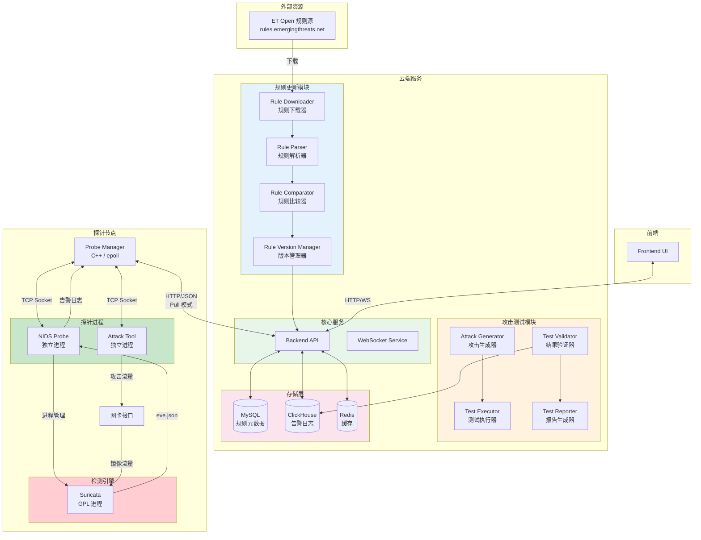

### 3.1.1 探针节点架构详图

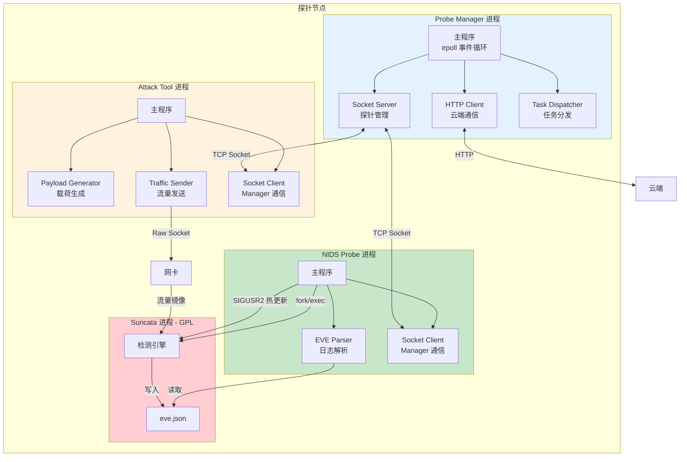

### 3.2 规则更新模块架构

```mermaid
graph TB
    subgraph RuleUpdateModule[规则更新模块]
        subgraph Downloader[下载器]
            D1[HTTP Client]
            D2[Progress Tracker]
            D3[Retry Handler]
        end

        subgraph Parser[解析器]
            P1[Rule Tokenizer<br/>词法分析]
            P2[Rule Extractor<br/>字段提取]
            P3[Rule Classifier<br/>分类器]
        end

        subgraph Comparator[比较器]
            C1[SID Matcher<br/>SID 匹配]
            C2[Diff Generator<br/>差异生成]
            C3[Change Detector<br/>变更检测]
        end

        subgraph VersionManager[版本管理器]
            V1[Version Creator<br/>版本创建]
            V2[Change Logger<br/>变更记录]
            V3[Rollback Handler<br/>回滚处理]
        end
    end

    D1 --> D2
    D2 --> D3
    D3 --> P1
    P1 --> P2
    P2 --> P3
    P3 --> C1
    C1 --> C2
    C2 --> C3
    C3 --> V1
    V1 --> V2
    V2 --> V3
```

### 3.3 攻击测试模块架构

```mermaid
graph TB
    subgraph AttackTestModule[攻击测试模块]
        subgraph Generator[攻击生成器]
            G1[Rule Analyzer<br/>规则分析]
            G2[Payload Builder<br/>载荷构建]
            G3[Template Engine<br/>模板引擎]
        end

        subgraph Executor[测试执行器]
            E1[Task Scheduler<br/>任务调度]
            E2[Probe Dispatcher<br/>探针分发]
            E3[Progress Monitor<br/>进度监控]
        end

        subgraph Validator[结果验证器]
            V1[Log Watcher<br/>日志监听]
            V2[SID Matcher<br/>SID 匹配]
            V3[Result Analyzer<br/>结果分析]
        end

        subgraph Reporter[报告生成器]
            R1[Stats Calculator<br/>统计计算]
            R2[Report Formatter<br/>报告格式化]
            R3[History Recorder<br/>历史记录]
        end
    end

    G1 --> G2
    G2 --> G3
    G3 --> E1
    E1 --> E2
    E2 --> E3
    E3 --> V1
    V1 --> V2
    V2 --> V3
    V3 --> R1
    R1 --> R2
    R2 --> R3
```

### 3.4 组件交互时序图（Pull 模式）

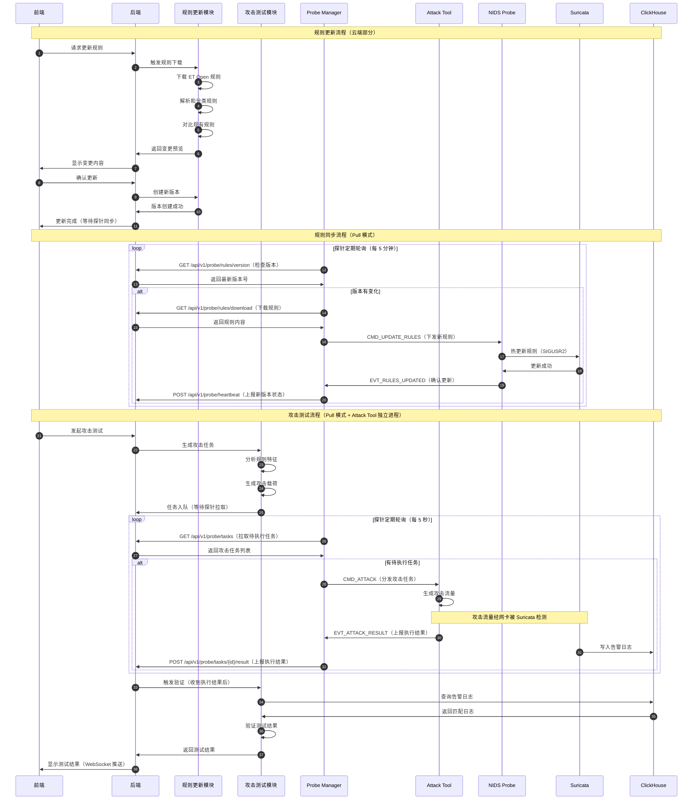

---

## 4. 数据模型设计

### 4.1 MySQL 数据模型

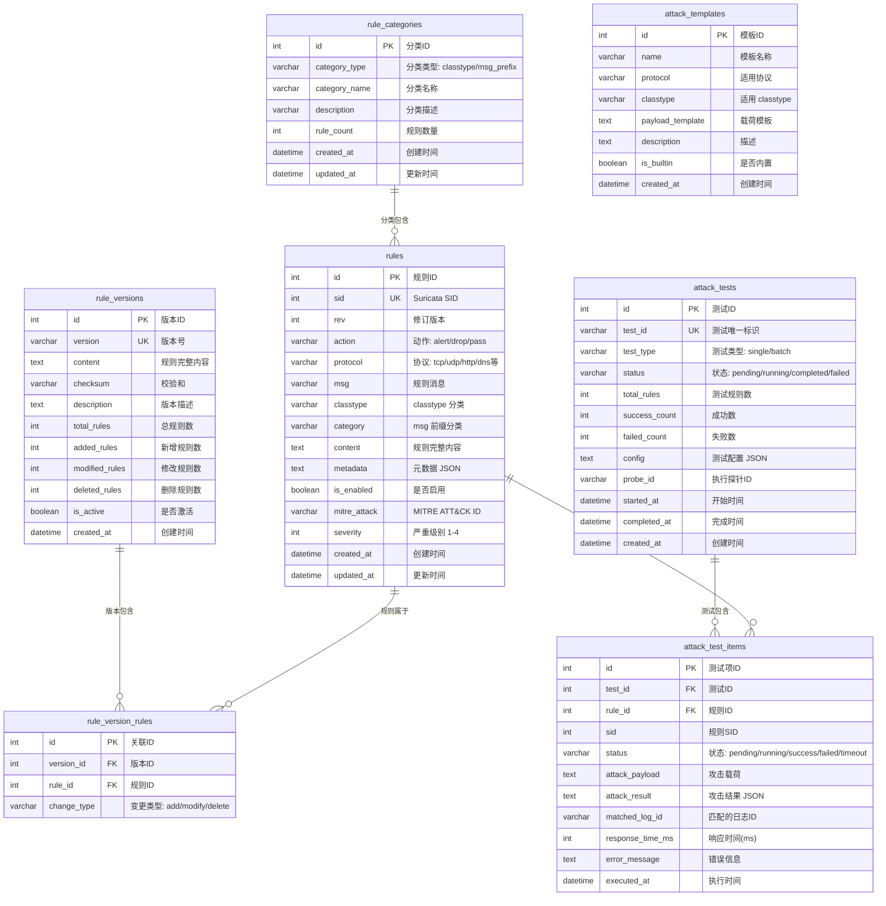

### 4.2 ClickHouse 数据模型扩展

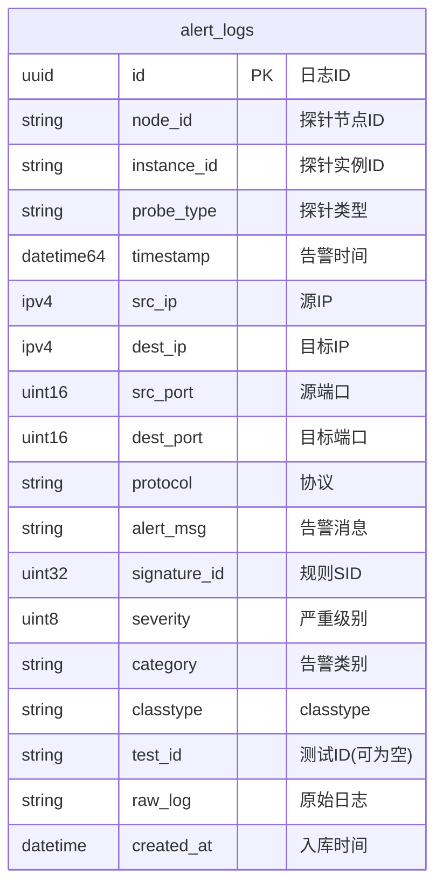

### 4.3 Redis 缓存设计

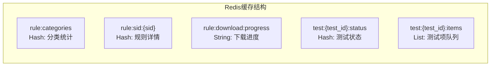

| Key 模式 | 类型 | TTL | 说明 |
|:---------|:-----|:----|:-----|
| `rule:categories` | Hash | 1小时 | 规则分类统计缓存 |
| `rule:sid:{sid}` | Hash | 10分钟 | 单条规则详情缓存 |
| `rule:download:progress` | String | 无 | 下载进度 |
| `test:{test_id}:status` | Hash | 1小时 | 测试状态 |
| `test:{test_id}:items` | List | 1小时 | 待测试规则队列 |

---

## 5. 规则更新功能设计

### 5.1 规则下载流程

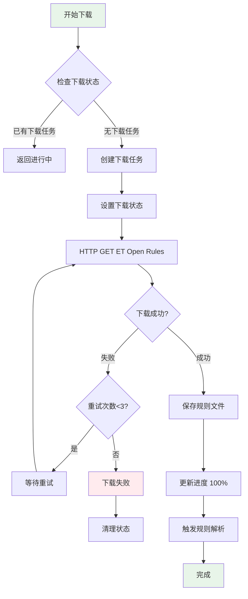

**下载配置**：

```python
class RuleDownloadConfig:
    ET_OPEN_URL = "https://rules.emergingthreats.net/open/suricata-7.0.3/emerging-all.rules"
    DOWNLOAD_TIMEOUT = 300  # 5分钟超时
    MAX_RETRIES = 3
    RETRY_DELAY = 10  # 秒
```

### 5.2 规则解析流程

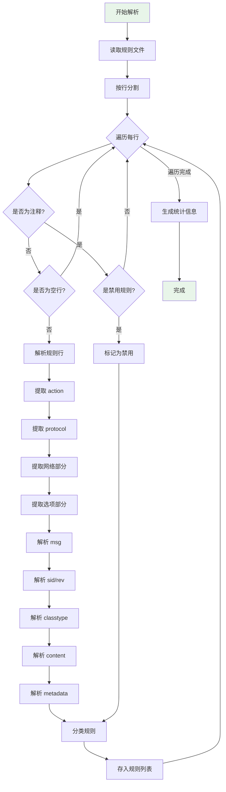

**规则解析正则表达式**：

```python
RULE_PATTERN = r'^(alert|drop|pass|reject)\s+(\w+)\s+(.+?)\s*\((.+)\)\s*$'
MSG_PATTERN = r'msg\s*:\s*"([^"]+)"'
SID_PATTERN = r'sid\s*:\s*(\d+)'
REV_PATTERN = r'rev\s*:\s*(\d+)'
CLASSTYPE_PATTERN = r'classtype\s*:\s*([^;]+)'
CONTENT_PATTERN = r'content\s*:\s*"([^"]+)"'
```

### 5.3 规则分类体系

```mermaid
graph TB
    subgraph 分类维度
        D1[按 classtype]
        D2[按 msg 前缀]
        D3[按协议]
        D4[按严重级别]
    end

    subgraph classtype分类
        C1[web-application-attack]
        C2[trojan-activity]
        C3[command-and-control]
        C4[attempted-admin]
        C5[exploit-kit]
        C6[shellcode-detect]
        C7[attempted-dos]
        C8[credential-theft]
    end

    subgraph msg前缀分类
        M1[MALWARE]
        M2[EXPLOIT]
        M3[SCAN]
        M4[WEB_SPECIFIC_APPS]
        M5[PHISHING]
        M6[DOS]
        M7[SHELLCODE]
        M8[INFO]
    end

    D1 --> C1
    D1 --> C2
    D1 --> C3
    D1 --> C4
    D1 --> C5
    D1 --> C6
    D1 --> C7
    D1 --> C8

    D2 --> M1
    D2 --> M2
    D2 --> M3
    D2 --> M4
    D2 --> M5
    D2 --> M6
    D2 --> M7
    D2 --> M8
```

### 5.4 增量对比算法

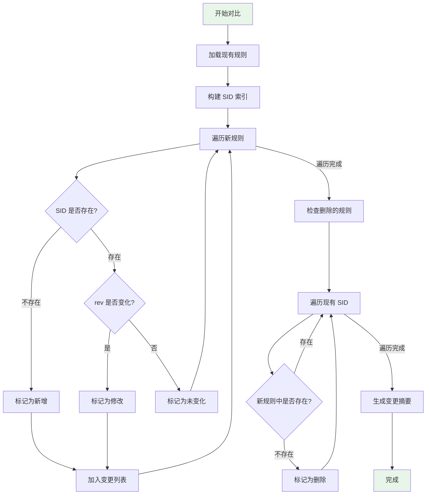

**变更摘要数据结构**：

```python
@dataclass
class RuleChangeSummary:
    added: List[Rule]      # 新增规则
    modified: List[Rule]   # 修改规则
    deleted: List[int]     # 删除的 SID
    unchanged: int         # 未变化数量

    @property
    def total_changes(self) -> int:
        return len(self.added) + len(self.modified) + len(self.deleted)
```

### 5.5 版本创建流程

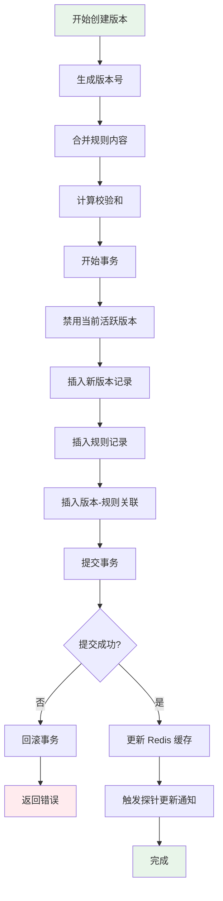

---

## 6. 攻击测试功能设计

### 6.1 攻击载荷生成策略

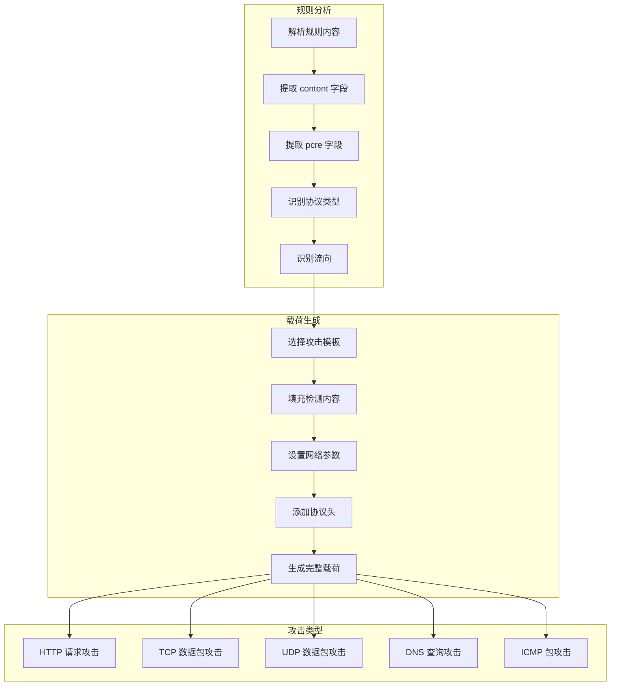

### 6.2 攻击模板设计

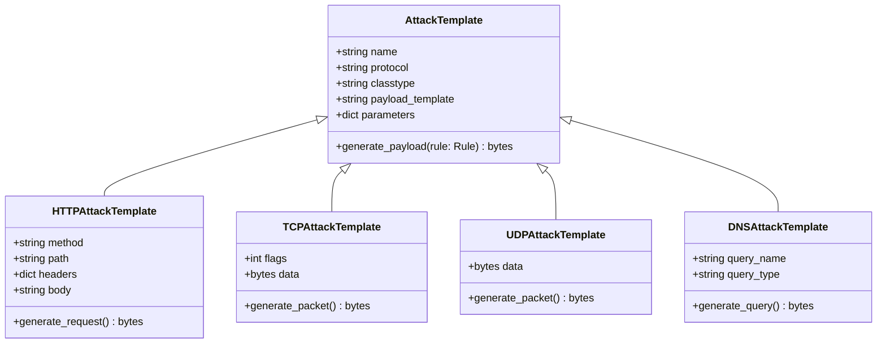

**内置攻击模板**：

| 模板名称 | 适用规则类型 | 攻击方式 |
|:---------|:-------------|:---------|
| SQL 注入模板 | web-application-attack | HTTP GET/POST 注入 |
| XSS 攻击模板 | web-application-attack | HTTP 请求含 script 标签 |
| 命令注入模板 | web-application-attack | HTTP 请求含命令字符 |
| 端口扫描模板 | attempted-recon | TCP SYN 扫描 |
| DNS 放大模板 | attempted-dos | DNS ANY 查询 |
| Shellcode 模板 | shellcode-detect | TCP 包含 shellcode |
| C2 通信模板 | command-and-control | HTTP/DNS 信标 |

### 6.3 测试执行流程

```mermaid
flowchart TD
    A[创建测试任务] --> B[初始化测试状态]
    B --> C[将规则加入队列]
    C --> D{队列是否为空?}

    D -->|否| E[取出下一个规则]
    E --> F[生成攻击载荷]
    F --> G{生成成功?}

    G -->|否| H[标记为失败]
    H --> I[记录错误原因]
    I --> D

    G -->|是| J[发送到探针]
    J --> K[探针执行攻击]
    K --> L[等待检测结果]
    L --> M{超时?}

    M -->|是| N[标记为超时]
    N --> D

    M -->|否| O[查询告警日志]
    O --> P{找到匹配日志?}

    P -->|是| Q[标记为成功]
    Q --> R[关联日志ID]
    R --> D

    P -->|否| S[继续等待]
    S --> M

    D -->|是| T[生成测试报告]
    T --> U[完成]

    style A fill:#e8f5e9
    style U fill:#e8f5e9
```

### 6.4 结果验证机制

```mermaid
sequenceDiagram
    autonumber
    participant TE as 测试执行器
    participant PM as Probe Manager
    participant NP as NIDS Probe
    participant SR as Suricata
    participant CH as ClickHouse
    participant TV as 结果验证器

    TE->>PM: 发送攻击任务
    PM->>NP: 分发攻击命令
    NP->>NP: 生成攻击流量
    Note over NP,SR: 攻击流量经过 Suricata 检测
    SR->>SR: 匹配规则
    SR->>SR: 生成告警
    SR->>CH: 写入告警日志(含 SID)

    loop 轮询检测 (最多 30 秒)
        TE->>TV: 触发验证
        TV->>CH: 查询告警日志
        Note over TV,CH: 条件: SID 匹配 + 时间范围 + test_id
        CH->>TV: 返回查询结果
        alt 找到匹配日志
            TV->>TE: 验证成功
        else 未找到
            TV->>TE: 继续等待
        end
    end
```

**验证查询 SQL**：

```sql
SELECT *
FROM alert_logs
WHERE signature_id = {sid}
  AND timestamp >= {test_start_time}
  AND timestamp <= {test_start_time} + INTERVAL 30 SECOND
  AND (test_id = {test_id} OR test_id IS NULL)
ORDER BY timestamp DESC
LIMIT 1
```

### 6.5 规则-日志关联设计

```mermaid
graph TB
    subgraph 关联方式
        A1[SID 精确匹配]
        A2[时间范围过滤]
        A3[test_id 标记]
    end

    subgraph 关联展示
        B1[规则详情页<br/>显示关联告警]
        B2[日志详情页<br/>显示关联规则]
        B3[测试结果页<br/>显示规则-日志对]
    end

    subgraph 关联操作
        C1[从规则跳转到日志]
        C2[从日志跳转到规则]
        C3[批量关联查询]
    end

    A1 --> B1
    A1 --> B2
    A2 --> B1
    A3 --> B3

    B1 --> C1
    B2 --> C2
    B3 --> C1
    B3 --> C2
```

---

## 7. API 设计

### 7.1 规则更新 API

```mermaid
graph LR
    subgraph 规则下载
        A1["POST /api/v1/rules/download<br/>触发下载"]
        A2["GET /api/v1/rules/download/status<br/>获取下载状态"]
        A3["DELETE /api/v1/rules/download<br/>取消下载"]
    end

    subgraph 规则解析
        B1["GET /api/v1/rules/preview<br/>预览变更"]
        B2["GET /api/v1/rules/categories<br/>获取分类统计"]
    end

    subgraph 规则更新
        C1["POST /api/v1/rules/update<br/>确认更新"]
        C2["POST /api/v1/rules/rollback<br/>版本回滚"]
    end

    subgraph 规则查询
        D1["GET /api/v1/rules<br/>规则列表"]
        D2["GET /api/v1/rules/{sid}<br/>规则详情"]
        D3["GET /api/v1/rules/search<br/>规则搜索"]
    end
```

**API 详细定义**：

#### 7.1.1 触发规则下载

```
POST /api/v1/rules/download
```

**请求体**：
```json
{
    "source": "et_open",  // 规则源
    "force": false        // 是否强制重新下载
}
```

**响应**：
```json
{
    "task_id": "download-123456",
    "status": "started",
    "message": "规则下载已开始"
}
```

#### 7.1.2 获取下载状态

```
GET /api/v1/rules/download/status
```

**响应**：
```json
{
    "status": "downloading",  // pending/downloading/parsing/completed/failed
    "progress": 65,           // 进度百分比
    "downloaded_bytes": 15728640,
    "total_bytes": 24000000,
    "message": "正在下载规则文件..."
}
```

#### 7.1.3 预览变更

```
GET /api/v1/rules/preview
```

**响应**：
```json
{
    "summary": {
        "total_new": 25314,
        "added": 156,
        "modified": 89,
        "deleted": 12,
        "unchanged": 25057
    },
    "changes": {
        "added": [
            {
                "sid": 2050001,
                "msg": "ET MALWARE New Trojan Detected",
                "classtype": "trojan-activity",
                "category": "MALWARE"
            }
        ],
        "modified": [
            {
                "sid": 2000001,
                "msg": "ET WEB_SPECIFIC_APPS SQL Injection",
                "old_rev": 5,
                "new_rev": 6,
                "changes": ["content 字段更新"]
            }
        ],
        "deleted": [2001234, 2001235]
    }
}
```

#### 7.1.4 确认更新

```
POST /api/v1/rules/update
```

**请求体**：
```json
{
    "description": "更新 ET Open 规则 2026-01-19",
    "selected_sids": null  // null 表示全部更新，或指定 SID 列表
}
```

> **注意**：Pull 模式下无需通知探针，探针会自动通过轮询获取最新版本。

**响应**：
```json
{
    "version": "v1737302400",
    "checksum": "sha256:abc123...",
    "total_rules": 25314,
    "added": 156,
    "modified": 89,
    "deleted": 12
}
```

#### 7.1.5 获取规则列表

```
GET /api/v1/rules?page=1&size=50&classtype=web-application-attack&category=MALWARE&enabled=true&search=SQL
```

**响应**：
```json
{
    "total": 4428,
    "page": 1,
    "size": 50,
    "rules": [
        {
            "id": 1,
            "sid": 2000001,
            "rev": 6,
            "action": "alert",
            "protocol": "http",
            "msg": "ET WEB_SPECIFIC_APPS SQL Injection Attempt",
            "classtype": "web-application-attack",
            "category": "WEB_SPECIFIC_APPS",
            "is_enabled": true,
            "severity": 2,
            "alert_count_24h": 15
        }
    ]
}
```

#### 7.1.6 获取规则详情

```
GET /api/v1/rules/{sid}
```

**响应**：
```json
{
    "sid": 2000001,
    "rev": 6,
    "action": "alert",
    "protocol": "http",
    "msg": "ET WEB_SPECIFIC_APPS SQL Injection Attempt",
    "classtype": "web-application-attack",
    "category": "WEB_SPECIFIC_APPS",
    "content": "alert http $EXTERNAL_NET any -> $HTTP_SERVERS any (msg:\"ET WEB_SPECIFIC_APPS SQL Injection Attempt\"; flow:established,to_server; content:\"SELECT\"; nocase; content:\"FROM\"; nocase; classtype:web-application-attack; sid:2000001; rev:6;)",
    "is_enabled": true,
    "severity": 2,
    "mitre_attack": "T1190",
    "metadata": {
        "created_at": "2020-01-01",
        "updated_at": "2026-01-15"
    },
    "recent_alerts": [
        {
            "id": "uuid-123",
            "timestamp": "2026-01-19T10:30:00Z",
            "src_ip": "192.168.1.100",
            "dest_ip": "10.0.0.1"
        }
    ],
    "test_history": [
        {
            "test_id": "test-456",
            "status": "success",
            "tested_at": "2026-01-18T15:00:00Z"
        }
    ]
}
```

### 7.2 攻击测试 API

```mermaid
graph LR
    subgraph 测试管理
        A1["POST /api/v1/tests<br/>创建测试"]
        A2["GET /api/v1/tests<br/>测试列表"]
        A3["GET /api/v1/tests/{id}<br/>测试详情"]
        A4["DELETE /api/v1/tests/{id}<br/>取消测试"]
    end

    subgraph 测试执行
        B1["POST /api/v1/tests/{id}/start<br/>开始测试"]
        B2["GET /api/v1/tests/{id}/status<br/>测试状态"]
        B3["GET /api/v1/tests/{id}/items<br/>测试项详情"]
    end

    subgraph 测试报告
        C1["GET /api/v1/tests/{id}/report<br/>测试报告"]
        C2["GET /api/v1/tests/{id}/export<br/>导出报告"]
    end
```

**API 详细定义**：

#### 7.2.1 创建测试任务

```
POST /api/v1/tests
```

**请求体**：
```json
{
    "name": "SQL 注入规则测试",
    "test_type": "batch",  // single 或 batch
    "rule_sids": [2000001, 2000002, 2000003],  // 要测试的规则 SID
    "probe_id": "probe-001",  // 执行测试的探针
    "config": {
        "timeout": 30,        // 单条规则超时时间(秒)
        "parallel": 5,        // 并行测试数
        "retry": 1            // 失败重试次数
    }
}
```

**响应**：
```json
{
    "test_id": "test-789",
    "name": "SQL 注入规则测试",
    "status": "created",
    "total_rules": 3,
    "created_at": "2026-01-19T10:00:00Z"
}
```

#### 7.2.2 开始测试

```
POST /api/v1/tests/{test_id}/start
```

**响应**：
```json
{
    "test_id": "test-789",
    "status": "running",
    "started_at": "2026-01-19T10:01:00Z"
}
```

#### 7.2.3 获取测试状态

```
GET /api/v1/tests/{test_id}/status
```

**响应**：
```json
{
    "test_id": "test-789",
    "status": "running",
    "progress": {
        "total": 3,
        "completed": 2,
        "success": 1,
        "failed": 1,
        "pending": 1
    },
    "current_rule": {
        "sid": 2000003,
        "msg": "ET WEB_SPECIFIC_APPS Command Injection"
    },
    "elapsed_time": 45
}
```

#### 7.2.4 获取测试项详情

```
GET /api/v1/tests/{test_id}/items
```

**响应**：
```json
{
    "items": [
        {
            "rule_sid": 2000001,
            "rule_msg": "ET WEB_SPECIFIC_APPS SQL Injection",
            "status": "success",
            "attack_payload": "GET /page.php?id=1' OR '1'='1 HTTP/1.1",
            "matched_log": {
                "id": "log-uuid-123",
                "timestamp": "2026-01-19T10:01:15Z",
                "alert_msg": "ET WEB_SPECIFIC_APPS SQL Injection"
            },
            "response_time_ms": 1250,
            "executed_at": "2026-01-19T10:01:10Z"
        },
        {
            "rule_sid": 2000002,
            "rule_msg": "ET WEB_SPECIFIC_APPS XSS Attempt",
            "status": "failed",
            "attack_payload": "GET /page.php?name=<script>alert(1)</script> HTTP/1.1",
            "matched_log": null,
            "error_message": "未检测到告警，可能原因：规则未启用或流量未匹配",
            "response_time_ms": 30000,
            "executed_at": "2026-01-19T10:01:20Z"
        }
    ]
}
```

#### 7.2.5 获取测试报告

```
GET /api/v1/tests/{test_id}/report
```

**响应**：
```json
{
    "test_id": "test-789",
    "name": "SQL 注入规则测试",
    "summary": {
        "total_rules": 3,
        "success_count": 2,
        "failed_count": 1,
        "success_rate": 66.7,
        "total_time": 95,
        "avg_response_time": 15000
    },
    "by_category": {
        "web-application-attack": {
            "total": 3,
            "success": 2,
            "failed": 1
        }
    },
    "failed_rules": [
        {
            "sid": 2000002,
            "msg": "ET WEB_SPECIFIC_APPS XSS Attempt",
            "reason": "未检测到告警"
        }
    ],
    "started_at": "2026-01-19T10:01:00Z",
    "completed_at": "2026-01-19T10:02:35Z"
}
```

### 7.3 探针端 API（Pull 模式）

探针通过 HTTP 轮询以下 API 获取规则更新和攻击任务：

```mermaid
graph LR
    subgraph 规则同步
        P1["GET /api/v1/probe/rules/version<br/>检查规则版本"]
        P2["GET /api/v1/probe/rules/download<br/>下载规则内容"]
    end

    subgraph 任务拉取
        P3["GET /api/v1/probe/tasks<br/>拉取待执行任务"]
        P4["POST /api/v1/probe/tasks/{id}/result<br/>上报任务结果"]
    end

    subgraph 状态上报
        P5["POST /api/v1/probe/heartbeat<br/>心跳与状态上报"]
    end
```

**API 详细定义**：

#### 7.3.1 检查规则版本

```
GET /api/v1/probe/rules/version?probe_id=probe-001
```

**响应**：
```json
{
    "version": "v1737302400",
    "checksum": "sha256:abc123...",
    "total_rules": 25314,
    "updated_at": "2026-01-19T10:00:00Z"
}
```

#### 7.3.2 下载规则内容

```
GET /api/v1/probe/rules/download?probe_id=probe-001&version=v1737302400
```

**响应**：
```json
{
    "version": "v1737302400",
    "checksum": "sha256:abc123...",
    "rules_content": "# ET Open Rules\nalert http ...\nalert tcp ...",
    "total_rules": 25314
}
```

#### 7.3.3 拉取待执行任务

```
GET /api/v1/probe/tasks?probe_id=probe-001&task_type=attack&limit=10
```

**响应**：
```json
{
    "tasks": [
        {
            "task_id": "task-001",
            "task_type": "attack",
            "test_id": "test-789",
            "rule_sid": 2000001,
            "priority": 1,
            "attack_config": {
                "attack_type": "http",
                "payload": {
                    "method": "GET",
                    "url": "/page.php?id=1' OR '1'='1",
                    "headers": {"User-Agent": "Mozilla/5.0"}
                },
                "target": {"host": "127.0.0.1", "port": 80}
            },
            "timeout": 30,
            "created_at": "2026-01-19T10:00:00Z"
        }
    ],
    "has_more": false,
    "next_poll_interval": 5
}
```

#### 7.3.4 上报任务结果

```
POST /api/v1/probe/tasks/{task_id}/result
```

**请求体**：
```json
{
    "probe_id": "probe-001",
    "task_id": "task-001",
    "test_id": "test-789",
    "rule_sid": 2000001,
    "status": "completed",
    "result": {
        "sent": true,
        "sent_at": "2026-01-19T10:01:10.123Z",
        "bytes_sent": 256,
        "response_code": 200
    },
    "error": null,
    "executed_at": "2026-01-19T10:01:10Z",
    "duration_ms": 150
}
```

**响应**：
```json
{
    "status": "accepted",
    "message": "Task result recorded"
}
```

#### 7.3.5 心跳与状态上报

```
POST /api/v1/probe/heartbeat
```

**请求体**：
```json
{
    "probe_id": "probe-001",
    "probe_type": "nids",
    "rule_version": "v1737302400",
    "status": "running",
    "system_info": {
        "cpu_usage": 25.5,
        "memory_usage": 60.2,
        "uptime": 86400
    },
    "suricata_status": {
        "pid": 12345,
        "state": "running",
        "rules_loaded": 25314
    }
}
```

**响应**：
```json
{
    "status": "ok",
    "server_time": "2026-01-19T10:05:00Z",
    "commands": []
}
```

### 7.4 WebSocket 实时推送

```mermaid
sequenceDiagram
    participant FE as 前端
    participant WS as WebSocket Server
    participant TE as 测试执行器

    FE->>WS: 连接 /api/v1/ws/tests
    WS->>FE: 连接确认

    FE->>WS: {"action":"subscribe","test_id":"test-789"}
    WS->>FE: {"event":"subscribed"}

    loop 测试进行中
        TE->>WS: 测试进度更新
        WS->>FE: {"event":"progress","data":{...}}

        TE->>WS: 测试项完成
        WS->>FE: {"event":"item_completed","data":{...}}
    end

    TE->>WS: 测试完成
    WS->>FE: {"event":"completed","data":{...}}
```

---

## 8. 前端设计

### 8.1 页面结构

```mermaid
graph TB
    subgraph 规则管理页面
        R1[规则列表]
        R2[规则详情]
        R3[规则更新]
        R4[版本历史]
    end

    subgraph 攻击测试页面
        T1[测试列表]
        T2[创建测试]
        T3[测试详情]
        T4[测试报告]
    end

    R1 --> R2
    R1 --> R3
    R1 --> R4
    R2 --> T2

    T1 --> T3
    T2 --> T3
    T3 --> T4
```

### 8.2 规则管理页面设计

```mermaid
graph TB
    subgraph RulesPage[规则管理页面]
        subgraph Header[顶部操作区]
            H1[更新规则按钮]
            H2[搜索框]
            H3[分类筛选]
            H4[状态筛选]
        end

        subgraph Sidebar[左侧分类树]
            S1[按 classtype]
            S2[按 msg 前缀]
            S3[按严重级别]
        end

        subgraph Content[规则列表]
            C1[表格视图]
            C2[分页控件]
        end

        subgraph RuleDetail[规则详情弹窗]
            D1[规则基本信息]
            D2[规则内容]
            D3[关联告警]
            D4[测试历史]
            D5[发起测试按钮]
        end
    end

    Header --> Content
    Sidebar --> Content
    Content --> RuleDetail
```

**规则列表表格列**：

| 列名 | 说明 | 排序 |
|:-----|:-----|:-----|
| SID | 规则 ID | ✓ |
| 消息 | 规则描述 | - |
| 分类 | classtype | ✓ |
| 类别 | msg 前缀 | ✓ |
| 严重级别 | 1-4 级 | ✓ |
| 24h 告警 | 24 小时告警数 | ✓ |
| 状态 | 启用/禁用 | ✓ |
| 操作 | 查看/测试 | - |

### 8.3 规则更新弹窗设计

```mermaid
graph TB
    subgraph UpdateDialog[规则更新弹窗]
        subgraph Step1[步骤1: 下载]
            S1A[下载进度条]
            S1B[下载状态]
        end

        subgraph Step2[步骤2: 预览]
            S2A[变更统计]
            S2B[新增规则列表]
            S2C[修改规则列表]
            S2D[删除规则列表]
        end

        subgraph Step3[步骤3: 确认]
            S3A[版本描述输入]
            S3B[选择要更新的规则]
            S3C[确认更新按钮]
        end

        subgraph Step4[步骤4: 完成]
            S4A[更新结果]
            S4B[探针同步状态]
        end
    end

    Step1 --> Step2 --> Step3 --> Step4
```

### 8.4 攻击测试页面设计

```mermaid
graph TB
    subgraph TestPage[攻击测试页面]
        subgraph Header[顶部操作区]
            H1[创建测试按钮]
            H2[筛选条件]
        end

        subgraph TestList[测试列表]
            L1[测试任务卡片]
            L2[状态标签]
            L3[进度条]
        end

        subgraph TestDetail[测试详情]
            D1[测试配置信息]
            D2[实时进度]
            D3[测试项列表]
            D4[结果统计]
        end

        subgraph TestReport[测试报告]
            R1[成功率统计]
            R2[分类统计图]
            R3[失败规则列表]
            R4[导出按钮]
        end
    end

    Header --> TestList
    TestList --> TestDetail
    TestDetail --> TestReport
```

### 8.5 创建测试弹窗设计

```mermaid
graph TB
    subgraph CreateTestDialog[创建测试弹窗]
        subgraph BasicInfo[基本信息]
            B1[测试名称]
            B2[选择探针]
        end

        subgraph RuleSelection[规则选择]
            R1[按分类选择]
            R2[按 SID 选择]
            R3[已选规则列表]
            R4[规则数量统计]
        end

        subgraph Config[测试配置]
            C1[超时时间]
            C2[并行数量]
            C3[重试次数]
        end

        subgraph Actions[操作按钮]
            A1[取消]
            A2[创建并开始]
        end
    end

    BasicInfo --> RuleSelection --> Config --> Actions
```

### 8.6 UI 原型示意

**规则详情页面**：

```
┌─────────────────────────────────────────────────────────────────┐
│  规则详情                                              [×] 关闭  │
├─────────────────────────────────────────────────────────────────┤
│  基本信息                                                       │
│  ┌─────────────┬─────────────────────────────────────────────┐ │
│  │ SID         │ 2000001                                     │ │
│  │ 消息        │ ET WEB_SPECIFIC_APPS SQL Injection Attempt  │ │
│  │ 分类        │ web-application-attack                      │ │
│  │ 类别        │ WEB_SPECIFIC_APPS                           │ │
│  │ 严重级别    │ ⚠️ 高 (2)                                    │ │
│  │ MITRE ATT&CK│ T1190 - Exploit Public-Facing Application   │ │
│  └─────────────┴─────────────────────────────────────────────┘ │
│                                                                 │
│  规则内容                                                       │
│  ┌─────────────────────────────────────────────────────────────┐│
│  │ alert http $EXTERNAL_NET any -> $HTTP_SERVERS any (        ││
│  │   msg:"ET WEB_SPECIFIC_APPS SQL Injection Attempt";        ││
│  │   flow:established,to_server;                               ││
│  │   content:"SELECT"; nocase;                                 ││
│  │   content:"FROM"; nocase;                                   ││
│  │   classtype:web-application-attack;                         ││
│  │   sid:2000001; rev:6;                                       ││
│  │ )                                                           ││
│  └─────────────────────────────────────────────────────────────┘│
│                                                                 │
│  关联告警 (最近 10 条)                                          │
│  ┌──────────────────┬────────────────┬────────────────────────┐│
│  │ 时间              │ 源 IP          │ 目标 IP               ││
│  ├──────────────────┼────────────────┼────────────────────────┤│
│  │ 2026-01-19 10:30 │ 192.168.1.100  │ 10.0.0.1              ││
│  │ 2026-01-19 10:25 │ 192.168.1.101  │ 10.0.0.1              ││
│  └──────────────────┴────────────────┴────────────────────────┘│
│                                                                 │
│  ┌──────────────────┐                                          │
│  │  🚀 发起攻击测试  │                                          │
│  └──────────────────┘                                          │
└─────────────────────────────────────────────────────────────────┘
```

**测试详情页面**：

```
┌─────────────────────────────────────────────────────────────────┐
│  攻击测试: SQL 注入规则测试                      状态: 进行中 🔄  │
├─────────────────────────────────────────────────────────────────┤
│                                                                 │
│  进度: ████████████░░░░░░░░  60% (18/30)                        │
│                                                                 │
│  统计: ✅ 成功: 15  ❌ 失败: 3  ⏳ 等待: 12                       │
│                                                                 │
│  测试项列表                                                     │
│  ┌──────┬───────────────────────────────┬────────┬─────────────┐│
│  │ SID  │ 规则描述                      │ 状态   │ 耗时        ││
│  ├──────┼───────────────────────────────┼────────┼─────────────┤│
│  │ 2001 │ SQL Injection SELECT          │ ✅ 成功 │ 1.2s       ││
│  │ 2002 │ SQL Injection UNION           │ ✅ 成功 │ 0.8s       ││
│  │ 2003 │ SQL Injection INSERT          │ ❌ 失败 │ 30.0s      ││
│  │ 2004 │ XSS Script Tag                │ 🔄 执行中│ -          ││
│  │ 2005 │ XSS Event Handler             │ ⏳ 等待 │ -          ││
│  └──────┴───────────────────────────────┴────────┴─────────────┘│
│                                                                 │
│  失败详情 (SID: 2003)                                           │
│  ┌─────────────────────────────────────────────────────────────┐│
│  │ 原因: 超时未检测到告警                                      ││
│  │ 可能原因:                                                   ││
│  │ - 规则未启用                                                ││
│  │ - 攻击载荷未匹配规则条件                                    ││
│  │ - Suricata 配置问题                                         ││
│  └─────────────────────────────────────────────────────────────┘│
│                                                                 │
│  ┌────────────┐  ┌────────────┐                                │
│  │  取消测试   │  │  查看报告   │                                │
│  └────────────┘  └────────────┘                                │
└─────────────────────────────────────────────────────────────────┘
```

---

## 9. 探针端设计

### 9.1 Attack Tool 独立进程架构

Attack Tool 作为**独立进程**运行，通过 TCP Socket 与 Probe Manager 通信，与 NIDS Probe 的通信方式保持一致。

```mermaid
graph TB
    subgraph AttackToolProcess[Attack Tool 进程]
        AT_MAIN[Main<br/>主程序]

        subgraph Connection[连接管理]
            AT_SOCK[Socket Client<br/>与 Manager 通信]
            AT_RECONN[Reconnect Handler<br/>断线重连]
        end

        subgraph Generators[载荷生成器]
            G1[HTTP Generator]
            G2[TCP Generator]
            G3[UDP Generator]
            G4[DNS Generator]
        end

        subgraph Senders[流量发送器]
            S1[Raw Socket Sender]
            S2[HTTP Client Sender]
            S3[DNS Client Sender]
        end

        subgraph TaskQueue[任务队列]
            TQ[Task Queue<br/>待执行任务]
            TE[Task Executor<br/>任务执行器]
        end
    end

    PM[Probe Manager] <-->|TCP Socket<br/>JSON 协议| AT_SOCK
    AT_MAIN --> AT_SOCK
    AT_MAIN --> AT_RECONN
    AT_SOCK --> TQ
    TQ --> TE
    TE --> G1
    TE --> G2
    TE --> G3
    TE --> G4
    G1 --> S2
    G2 --> S1
    G3 --> S1
    G4 --> S3
    S1 -->|Raw Socket| NIC[网卡]
    S2 -->|HTTP| NIC
    S3 -->|UDP| NIC

    style AttackToolProcess fill:#fff3e0
    style Connection fill:#e3f2fd
    style Generators fill:#c8e6c9
    style Senders fill:#ffcdd2
```

### 9.1.1 进程生命周期

```mermaid
stateDiagram-v2
    [*] --> Starting: 启动
    Starting --> Connecting: 初始化完成
    Connecting --> Connected: 连接 Manager 成功
    Connecting --> Reconnecting: 连接失败
    Reconnecting --> Connecting: 重试
    Connected --> Idle: 注册成功
    Idle --> Executing: 收到任务
    Executing --> Idle: 任务完成
    Executing --> Idle: 任务失败
    Idle --> Reconnecting: 连接断开
    Connected --> Reconnecting: 连接断开
    Idle --> Stopping: 收到停止信号
    Executing --> Stopping: 收到停止信号
    Stopping --> [*]: 退出
```

### 9.1.2 进程管理

Probe Manager 负责管理 Attack Tool 进程的生命周期：

| 操作 | 说明 |
|:-----|:-----|
| 启动 | Probe Manager 通过 fork/exec 启动 Attack Tool |
| 监控 | 监听 Attack Tool 的 TCP 连接状态 |
| 重启 | Attack Tool 异常退出时自动重启 |
| 停止 | 发送 CMD_SHUTDOWN 命令优雅停止 |

### 9.1.3 Attack Tool 与 Probe Manager 通信协议

Attack Tool 与 Probe Manager 之间采用与 NIDS Probe 相同的 TCP Socket + JSON 协议：

**消息帧格式**：
```
+----------------+------------------+
| Length (4字节)  | JSON Payload     |
| 网络字节序      | UTF-8 编码       |
+----------------+------------------+
```

**命令定义**：

```mermaid
graph LR
    subgraph Manager发送的命令
        C1[CMD_ATTACK = 10<br/>执行攻击任务]
        C2[CMD_ATTACK_CANCEL = 11<br/>取消攻击任务]
        C3[CMD_SHUTDOWN = 99<br/>关闭进程]
    end

    subgraph AttackTool上报的事件
        E1[EVT_REGISTER = 1<br/>注册连接]
        E2[EVT_ATTACK_RESULT = 10<br/>攻击结果]
        E3[EVT_HEARTBEAT = 100<br/>心跳]
    end
```

**消息示例**：

```json
// Attack Tool -> Manager: 注册
{
    "event": "EVT_REGISTER",
    "probe_type": "attack",
    "probe_id": "attack-001",
    "data": {
        "version": "1.0.0",
        "capabilities": ["http", "tcp", "udp", "dns"]
    }
}

// Manager -> Attack Tool: 执行攻击
{
    "cmd": "CMD_ATTACK",
    "seq": 12345,
    "data": {
        "task_id": "task-001",
        "test_id": "test-789",
        "rule_sid": 2000001,
        "attack_type": "http",
        "payload": {
            "method": "GET",
            "url": "/page.php?id=1' OR '1'='1",
            "headers": {"User-Agent": "Mozilla/5.0"}
        },
        "target": {
            "host": "127.0.0.1",
            "port": 80
        },
        "timeout": 30
    }
}

// Attack Tool -> Manager: 攻击结果
{
    "event": "EVT_ATTACK_RESULT",
    "probe_type": "attack",
    "probe_id": "attack-001",
    "data": {
        "task_id": "task-001",
        "test_id": "test-789",
        "rule_sid": 2000001,
        "status": "completed",
        "result": {
            "sent": true,
            "sent_at": "2026-01-19T10:01:10.123Z",
            "bytes_sent": 256,
            "response_code": 200
        },
        "error": null
    }
}

// Manager -> Attack Tool: 取消攻击
{
    "cmd": "CMD_ATTACK_CANCEL",
    "seq": 12346,
    "data": {
        "task_id": "task-001",
        "reason": "user_cancelled"
    }
}
```

### 9.2 任务拉取协议设计（Pull 模式）

探针端通过 HTTP 轮询云端获取待执行任务，保持与现有架构一致：

```mermaid
graph LR
    subgraph 云端 API
        A1["GET /api/v1/probe/tasks<br/>拉取待执行任务"]
        A2["POST /api/v1/probe/tasks/{id}/result<br/>上报执行结果"]
    end

    subgraph 任务状态
        S1[pending<br/>待执行]
        S2[assigned<br/>已分配]
        S3[running<br/>执行中]
        S4[completed<br/>已完成]
        S5[failed<br/>失败]
    end

    S1 -->|探针拉取| S2
    S2 -->|开始执行| S3
    S3 -->|执行成功| S4
    S3 -->|执行失败| S5
```

**任务拉取请求**：

```http
GET /api/v1/probe/tasks?probe_id=probe-001&task_type=attack&limit=10
```

**响应**：
```json
{
    "tasks": [
        {
            "task_id": "task-001",
            "task_type": "attack",
            "test_id": "test-789",
            "rule_sid": 2000001,
            "attack_type": "http",
            "payload": {
                "method": "GET",
                "url": "/page.php?id=1' OR '1'='1",
                "headers": {
                    "User-Agent": "Mozilla/5.0"
                }
            },
            "target": {
                "host": "127.0.0.1",
                "port": 80
            },
            "created_at": "2026-01-19T10:00:00Z"
        }
    ],
    "has_more": false
}
```

**任务结果上报**：

```http
POST /api/v1/probe/tasks/task-001/result
Content-Type: application/json

{
    "probe_id": "probe-001",
    "task_id": "task-001",
    "test_id": "test-789",
    "rule_sid": 2000001,
    "status": "completed",
    "result": {
        "sent": true,
        "sent_at": "2026-01-19T10:01:10.123Z",
        "bytes_sent": 256
    },
    "error": null
}
```

### 9.3 攻击执行流程（Pull 模式 + 独立进程）

**Probe Manager 端流程**：

```mermaid
flowchart TD
    A[定时触发任务轮询] --> B[HTTP GET /api/v1/probe/tasks]
    B --> C{有待执行任务?}

    C -->|否| D[等待下次轮询]
    D --> A

    C -->|是| E[遍历任务列表]
    E --> F{Attack Tool 已连接?}
    F -->|否| G[等待 Attack Tool 连接]
    G --> F
    F -->|是| H[通过 TCP Socket 发送 CMD_ATTACK]
    H --> I[等待 EVT_ATTACK_RESULT]
    I --> J[HTTP POST 上报结果到云端]
    J --> K{还有更多任务?}
    K -->|是| E
    K -->|否| D

    style A fill:#e8f5e9
    style D fill:#fff3e0
```

**Attack Tool 端流程**：

```mermaid
flowchart TD
    A[启动 Attack Tool] --> B[连接 Probe Manager]
    B --> C{连接成功?}
    C -->|否| D[等待重试]
    D --> B
    C -->|是| E[发送 EVT_REGISTER]
    E --> F[进入等待状态]

    F --> G{收到命令?}
    G -->|CMD_ATTACK| H[解析攻击参数]
    G -->|CMD_SHUTDOWN| Z[优雅退出]

    H --> I{攻击类型}
    I -->|HTTP| J1[构建 HTTP 请求]
    I -->|TCP| J2[构建 TCP 包]
    I -->|UDP| J3[构建 UDP 包]
    I -->|DNS| J4[构建 DNS 查询]

    J1 --> K[发送流量到网卡]
    J2 --> K
    J3 --> K
    J4 --> K

    K --> L{发送成功?}
    L -->|是| M[构建成功结果]
    L -->|否| N[构建失败结果]

    M --> O[发送 EVT_ATTACK_RESULT]
    N --> O
    O --> F

    style A fill:#e8f5e9
    style Z fill:#ffcdd2
```

**轮询配置**：

| 参数 | 默认值 | 说明 |
|:-----|:-------|:-----|
| TASK_POLL_INTERVAL | 5s | Probe Manager 任务轮询间隔 |
| TASK_BATCH_SIZE | 10 | 单次拉取最大任务数 |
| ATK_RECONNECT_INTERVAL | 5s | Attack Tool 断线重连间隔 |
| ATK_HEARTBEAT_INTERVAL | 30s | Attack Tool 心跳间隔 |
| TASK_TIMEOUT | 30s | 单个任务执行超时 |

### 9.4 HTTP 攻击生成器

```cpp
class HTTPAttackGenerator {
public:
    struct Config {
        std::string method;
        std::string path;
        std::map<std::string, std::string> headers;
        std::string body;
        std::string target_host;
        int target_port;
    };

    std::string generate_request(const Config& config) {
        std::stringstream ss;
        ss << config.method << " " << config.path << " HTTP/1.1\r\n";
        ss << "Host: " << config.target_host << "\r\n";
        for (const auto& [key, value] : config.headers) {
            ss << key << ": " << value << "\r\n";
        }
        ss << "Content-Length: " << config.body.size() << "\r\n";
        ss << "\r\n";
        ss << config.body;
        return ss.str();
    }
};
```

---

## 10. 实现计划

### 10.1 阶段划分

```mermaid
gantt
    title 规则更新与攻击测试功能实现计划
    dateFormat  YYYY-MM-DD
    section 阶段1: 规则更新
    数据库表设计           :a1, 2026-01-20, 2d
    规则下载服务           :a2, after a1, 3d
    规则解析服务           :a3, after a2, 3d
    增量对比服务           :a4, after a3, 2d
    版本管理服务           :a5, after a4, 2d
    规则更新 API           :a6, after a5, 2d
    规则管理前端           :a7, after a6, 3d

    section 阶段2: 攻击测试
    攻击模板设计           :b1, after a7, 2d
    攻击生成服务           :b2, after b1, 3d
    探针攻击工具           :b3, after b2, 4d
    测试执行服务           :b4, after b3, 3d
    结果验证服务           :b5, after b4, 2d
    攻击测试 API           :b6, after b5, 2d
    攻击测试前端           :b7, after b6, 3d

    section 阶段3: 集成测试
    功能集成测试           :c1, after b7, 3d
    性能优化               :c2, after c1, 2d
    文档完善               :c3, after c2, 2d
```

### 10.2 阶段 1: 规则更新功能 (约 17 天)

| 任务 | 工作内容 | 预计工作量 |
|:-----|:---------|:-----------|
| 1.1 | 数据库表设计与创建 | 2 天 |
| 1.2 | 规则下载服务实现 | 3 天 |
| 1.3 | 规则解析与分类服务 | 3 天 |
| 1.4 | 增量对比算法实现 | 2 天 |
| 1.5 | 版本管理服务 | 2 天 |
| 1.6 | 规则更新 API 开发 | 2 天 |
| 1.7 | 规则管理前端页面 | 3 天 |

### 10.3 阶段 2: 攻击测试功能 (约 19 天)

| 任务 | 工作内容 | 预计工作量 |
|:-----|:---------|:-----------|
| 2.1 | 攻击模板库设计 | 2 天 |
| 2.2 | 攻击载荷生成服务 | 3 天 |
| 2.3 | 探针攻击工具开发 | 4 天 |
| 2.4 | 测试执行调度服务 | 3 天 |
| 2.5 | 结果验证与关联服务 | 2 天 |
| 2.6 | 攻击测试 API 开发 | 2 天 |
| 2.7 | 攻击测试前端页面 | 3 天 |

### 10.4 阶段 3: 集成与优化 (约 7 天)

| 任务 | 工作内容 | 预计工作量 |
|:-----|:---------|:-----------|
| 3.1 | 端到端功能测试 | 3 天 |
| 3.2 | 性能测试与优化 | 2 天 |
| 3.3 | 文档完善 | 2 天 |

---

## 11. 附录

### 11.1 ET Open 规则分类参考

| classtype | 说明 | 严重级别 |
|:----------|:-----|:---------|
| web-application-attack | Web 应用攻击 | 高 |
| trojan-activity | 木马活动 | 高 |
| command-and-control | C2 通信 | 高 |
| shellcode-detect | Shellcode 检测 | 高 |
| attempted-admin | 尝试管理权限 | 高 |
| exploit-kit | 漏洞利用工具包 | 高 |
| attempted-user | 尝试用户权限 | 中 |
| attempted-recon | 侦察活动 | 中 |
| attempted-dos | 拒绝服务 | 中 |
| policy-violation | 策略违规 | 低 |
| misc-activity | 杂项活动 | 低 |

### 11.2 攻击载荷示例

**SQL 注入攻击**:
```http
GET /page.php?id=1' OR '1'='1 HTTP/1.1
Host: target.com
User-Agent: Mozilla/5.0
```

**XSS 攻击**:
```http
GET /search?q=<script>alert(document.cookie)</script> HTTP/1.1
Host: target.com
User-Agent: Mozilla/5.0
```

**命令注入攻击**:
```http
POST /cmd.php HTTP/1.1
Host: target.com
Content-Type: application/x-www-form-urlencoded

cmd=ls;cat /etc/passwd
```

### 11.3 错误码定义

| 错误码 | 说明 |
|:-------|:-----|
| 2001 | 规则下载失败 |
| 2002 | 规则解析失败 |
| 2003 | 版本创建失败 |
| 2004 | 探针通知失败 |
| 3001 | 测试创建失败 |
| 3002 | 攻击生成失败 |
| 3003 | 探针执行失败 |
| 3004 | 验证超时 |
| 3005 | 规则不存在 |

### 11.4 配置参数

| 参数 | 默认值 | 说明 |
|:-----|:-------|:-----|
| ET_OPEN_URL | rules.emergingthreats.net/open/suricata-7.0.3/emerging-all.rules | ET Open 规则 URL |
| DOWNLOAD_TIMEOUT | 300s | 下载超时时间 |
| PARSE_BATCH_SIZE | 1000 | 解析批次大小 |
| TEST_TIMEOUT | 30s | 单条规则测试超时 |
| TEST_PARALLEL | 5 | 并行测试数 |
| VERIFY_POLL_INTERVAL | 1s | 验证轮询间隔 |
| VERIFY_MAX_WAIT | 30s | 验证最大等待时间 |
| RULE_POLL_INTERVAL | 300s | 规则版本检查轮询间隔（Probe Manager） |
| TASK_POLL_INTERVAL | 5s | 攻击任务拉取轮询间隔（Probe Manager） |
| TASK_BATCH_SIZE | 10 | 单次拉取最大任务数（Probe Manager） |
| HEARTBEAT_INTERVAL | 60s | 心跳上报间隔（Probe Manager） |
| ATK_RECONNECT_INTERVAL | 5s | Attack Tool 断线重连间隔 |
| ATK_HEARTBEAT_INTERVAL | 30s | Attack Tool 心跳间隔 |
| ATK_SOCKET_PORT | 9528 | Attack Tool 连接 Probe Manager 的端口 |

---

> **文档维护**: 本文档应随功能开发持续更新
> **最后更新**: 2026-01-20
> **架构模式**: Pull 模式（探针主动轮询云端）
