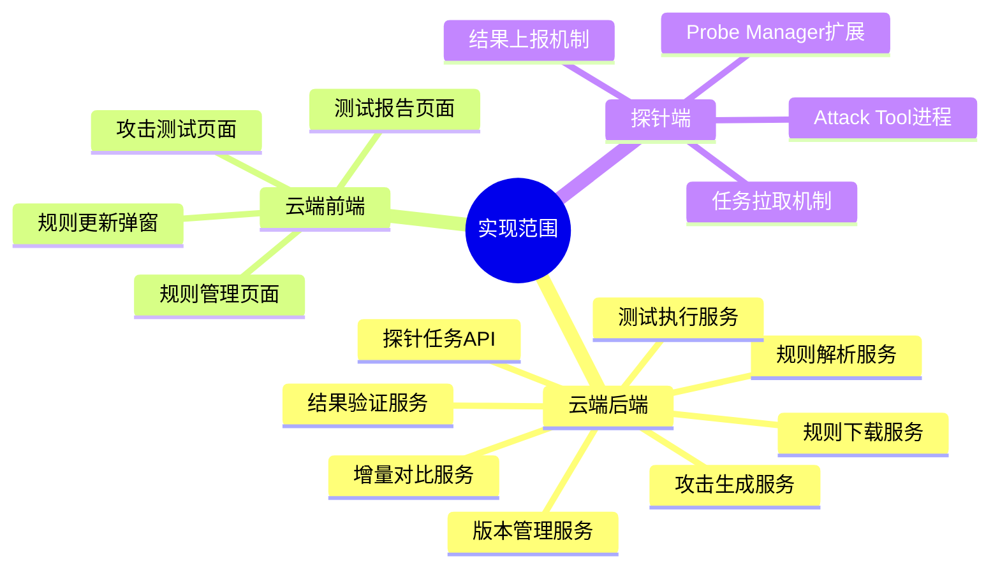
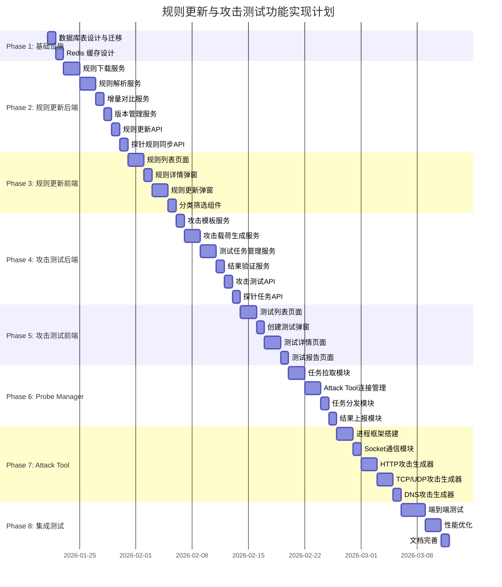
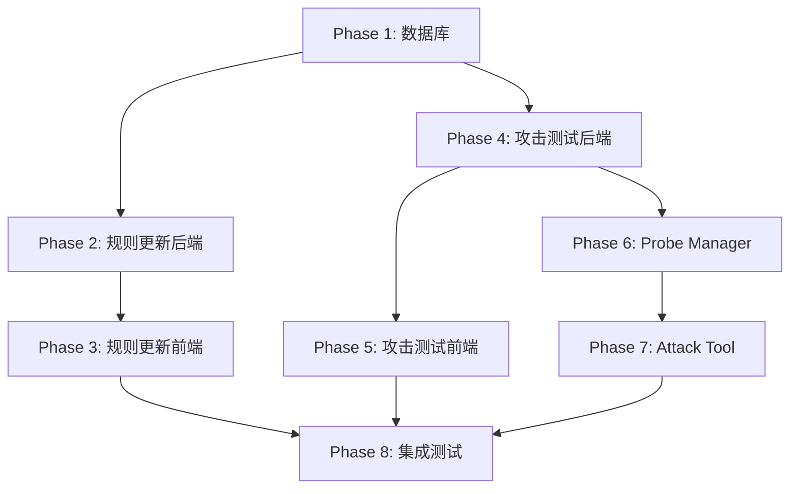

# 规则更新与攻击测试功能实现计划

> 版本: 1.0
> 创建日期: 2026-01-20
> 关联文档: [0005-rule-spec.md](./0005-rule-spec.md)

---

## 目录

1. [实现概述](#1-实现概述)
2. [阶段划分](#2-阶段划分)
3. [Phase 1: 数据库与基础设施](#3-phase-1-数据库与基础设施)
4. [Phase 2: 规则更新后端服务](#4-phase-2-规则更新后端服务)
5. [Phase 3: 规则更新前端页面](#5-phase-3-规则更新前端页面)
6. [Phase 4: 攻击测试后端服务](#6-phase-4-攻击测试后端服务)
7. [Phase 5: 攻击测试前端页面](#7-phase-5-攻击测试前端页面)
8. [Phase 6: Probe Manager 扩展](#8-phase-6-probe-manager-扩展)
9. [Phase 7: Attack Tool 独立进程](#9-phase-7-attack-tool-独立进程)
10. [Phase 8: 集成测试与优化](#10-phase-8-集成测试与优化)
11. [风险与依赖](#11-风险与依赖)

---

## 1. 实现概述

### 1.1 项目范围

本实现计划涵盖以下功能模块：



### 1.2 技术栈

| 层级 | 技术选型 |
|:-----|:---------|
| 云端后端 | Python / FastAPI / SQLAlchemy / httpx |
| 云端前端 | TypeScript / React / Vite / TailwindCSS / Shadcn |
| 数据库 | MySQL (规则元数据) / ClickHouse (日志) / Redis (缓存) |
| 探针端 | C++ / CMake / libcurl / nlohmann-json |
| 通信协议 | HTTP/JSON (云端-探针) / TCP Socket/JSON (Manager-探针) |

### 1.3 架构模式

采用 **Pull（拉取）模式**：
- Probe Manager 定期轮询云端获取规则更新和攻击任务
- Attack Tool 作为独立进程，通过 TCP Socket 与 Probe Manager 通信
- 所有结果通过 HTTP POST 主动上报到云端

---

## 2. 阶段划分

### 2.1 整体时间线



### 2.2 阶段摘要

| 阶段 | 名称 | 主要交付物 | 预估工时 |
|:-----|:-----|:-----------|:---------|
| Phase 1 | 数据库与基础设施 | 数据库表、迁移脚本、缓存设计 | 2 天 |
| Phase 2 | 规则更新后端服务 | 下载/解析/对比/版本管理服务 | 8 天 |
| Phase 3 | 规则更新前端页面 | 规则列表/详情/更新页面 | 6 天 |
| Phase 4 | 攻击测试后端服务 | 攻击生成/任务管理/验证服务 | 8 天 |
| Phase 5 | 攻击测试前端页面 | 测试列表/详情/报告页面 | 6 天 |
| Phase 6 | Probe Manager 扩展 | 任务拉取/分发/上报模块 | 6 天 |
| Phase 7 | Attack Tool 进程 | 独立进程/攻击生成器 | 8 天 |
| Phase 8 | 集成测试与优化 | 测试用例/性能优化/文档 | 6 天 |
| **总计** | | | **50 天** |

---

## 3. Phase 1: 数据库与基础设施

### 3.1 任务列表

| 任务ID | 任务名称 | 详细描述 | 优先级 |
|:-------|:---------|:---------|:-------|
| P1-01 | 创建 rule_categories 表 | 规则分类表，存储 classtype 和 msg 前缀分类 | P0 |
| P1-02 | 扩展 rules 表 | 添加 classtype、category、mitre_attack、severity 字段 | P0 |
| P1-03 | 创建 rule_version_rules 表 | 版本-规则关联表，记录变更类型 | P0 |
| P1-04 | 创建 attack_tests 表 | 攻击测试主表 | P0 |
| P1-05 | 创建 attack_test_items 表 | 攻击测试项表 | P0 |
| P1-06 | 创建 attack_templates 表 | 攻击模板表 | P1 |
| P1-07 | 创建 probe_tasks 表 | 探针任务队列表 | P0 |
| P1-08 | 扩展 ClickHouse alert_logs | 添加 test_id 字段 | P0 |
| P1-09 | 设计 Redis 缓存结构 | 规则缓存、下载进度、测试状态 | P0 |
| P1-10 | 编写数据库迁移脚本 | Alembic 迁移脚本 | P0 |

### 3.2 数据库表结构

#### 3.2.1 rule_categories 表

```sql
CREATE TABLE rule_categories (
    id INT AUTO_INCREMENT PRIMARY KEY,
    category_type VARCHAR(32) NOT NULL COMMENT '分类类型: classtype/msg_prefix',
    category_name VARCHAR(128) NOT NULL COMMENT '分类名称',
    description TEXT COMMENT '分类描述',
    rule_count INT DEFAULT 0 COMMENT '规则数量',
    created_at DATETIME DEFAULT CURRENT_TIMESTAMP,
    updated_at DATETIME DEFAULT CURRENT_TIMESTAMP ON UPDATE CURRENT_TIMESTAMP,
    UNIQUE KEY uk_type_name (category_type, category_name)
) ENGINE=InnoDB DEFAULT CHARSET=utf8mb4 COMMENT='规则分类表';
```

#### 3.2.2 rules 表扩展

```sql
ALTER TABLE rules ADD COLUMN classtype VARCHAR(64) COMMENT 'classtype 分类';
ALTER TABLE rules ADD COLUMN category VARCHAR(64) COMMENT 'msg 前缀分类';
ALTER TABLE rules ADD COLUMN mitre_attack VARCHAR(32) COMMENT 'MITRE ATT&CK ID';
ALTER TABLE rules ADD COLUMN severity TINYINT DEFAULT 3 COMMENT '严重级别 1-4';
ALTER TABLE rules ADD INDEX idx_classtype (classtype);
ALTER TABLE rules ADD INDEX idx_category (category);
ALTER TABLE rules ADD INDEX idx_severity (severity);
```

#### 3.2.3 attack_tests 表

```sql
CREATE TABLE attack_tests (
    id INT AUTO_INCREMENT PRIMARY KEY,
    test_id VARCHAR(64) NOT NULL UNIQUE COMMENT '测试唯一标识',
    name VARCHAR(256) COMMENT '测试名称',
    test_type ENUM('single', 'batch') NOT NULL COMMENT '测试类型',
    status ENUM('pending', 'running', 'completed', 'failed', 'cancelled') DEFAULT 'pending',
    total_rules INT DEFAULT 0 COMMENT '测试规则数',
    success_count INT DEFAULT 0 COMMENT '成功数',
    failed_count INT DEFAULT 0 COMMENT '失败数',
    config JSON COMMENT '测试配置',
    probe_id VARCHAR(64) COMMENT '执行探针ID',
    started_at DATETIME COMMENT '开始时间',
    completed_at DATETIME COMMENT '完成时间',
    created_at DATETIME DEFAULT CURRENT_TIMESTAMP,
    INDEX idx_status (status),
    INDEX idx_probe_id (probe_id),
    INDEX idx_created_at (created_at)
) ENGINE=InnoDB DEFAULT CHARSET=utf8mb4 COMMENT='攻击测试表';
```

#### 3.2.4 attack_test_items 表

```sql
CREATE TABLE attack_test_items (
    id INT AUTO_INCREMENT PRIMARY KEY,
    test_id INT NOT NULL COMMENT '测试ID',
    rule_id INT NOT NULL COMMENT '规则ID',
    sid INT NOT NULL COMMENT '规则SID',
    status ENUM('pending', 'running', 'success', 'failed', 'timeout') DEFAULT 'pending',
    attack_payload TEXT COMMENT '攻击载荷',
    attack_config JSON COMMENT '攻击配置',
    attack_result JSON COMMENT '攻击结果',
    matched_log_id VARCHAR(64) COMMENT '匹配的日志ID',
    response_time_ms INT COMMENT '响应时间(ms)',
    error_message TEXT COMMENT '错误信息',
    executed_at DATETIME COMMENT '执行时间',
    created_at DATETIME DEFAULT CURRENT_TIMESTAMP,
    INDEX idx_test_id (test_id),
    INDEX idx_status (status),
    INDEX idx_sid (sid),
    FOREIGN KEY (test_id) REFERENCES attack_tests(id) ON DELETE CASCADE
) ENGINE=InnoDB DEFAULT CHARSET=utf8mb4 COMMENT='攻击测试项表';
```

#### 3.2.5 probe_tasks 表

```sql
CREATE TABLE probe_tasks (
    id INT AUTO_INCREMENT PRIMARY KEY,
    task_id VARCHAR(64) NOT NULL UNIQUE COMMENT '任务唯一标识',
    task_type ENUM('attack', 'rule_update') NOT NULL COMMENT '任务类型',
    probe_id VARCHAR(64) COMMENT '目标探针ID，NULL表示任意探针',
    status ENUM('pending', 'assigned', 'running', 'completed', 'failed') DEFAULT 'pending',
    priority INT DEFAULT 5 COMMENT '优先级 1-10',
    payload JSON NOT NULL COMMENT '任务载荷',
    result JSON COMMENT '执行结果',
    assigned_at DATETIME COMMENT '分配时间',
    completed_at DATETIME COMMENT '完成时间',
    expire_at DATETIME COMMENT '过期时间',
    created_at DATETIME DEFAULT CURRENT_TIMESTAMP,
    INDEX idx_status_probe (status, probe_id),
    INDEX idx_task_type (task_type),
    INDEX idx_expire_at (expire_at)
) ENGINE=InnoDB DEFAULT CHARSET=utf8mb4 COMMENT='探针任务队列表';
```

### 3.3 Redis 缓存设计

```python
# 缓存 Key 设计
REDIS_KEYS = {
    # 规则相关
    "rule:version:latest": "string",           # 最新规则版本号
    "rule:categories": "hash",                  # 分类统计 {category: count}
    "rule:sid:{sid}": "hash",                   # 单条规则详情
    "rule:download:progress": "hash",           # 下载进度 {status, progress, message}

    # 测试相关
    "test:{test_id}:status": "hash",            # 测试状态
    "test:{test_id}:progress": "hash",          # 测试进度 {total, completed, success, failed}

    # 任务相关
    "probe:{probe_id}:tasks": "list",           # 探针待执行任务队列
    "task:{task_id}:status": "string",          # 任务状态
}

# TTL 配置
REDIS_TTL = {
    "rule:categories": 3600,        # 1小时
    "rule:sid:{sid}": 600,          # 10分钟
    "test:{test_id}:status": 3600,  # 1小时
}
```

### 3.4 交付物清单

- [ ] `cloud/backend/alembic/versions/xxx_add_rule_categories.py`
- [ ] `cloud/backend/alembic/versions/xxx_add_attack_tests.py`
- [ ] `cloud/backend/alembic/versions/xxx_add_probe_tasks.py`
- [ ] `cloud/backend/app/models/rule_category.py`
- [ ] `cloud/backend/app/models/attack_test.py`
- [ ] `cloud/backend/app/models/probe_task.py`
- [ ] `cloud/backend/app/core/redis_keys.py`

---

## 4. Phase 2: 规则更新后端服务

### 4.1 任务列表

| 任务ID | 任务名称 | 详细描述 | 优先级 |
|:-------|:---------|:---------|:-------|
| P2-01 | 实现规则下载器 | 从 ET Open 下载规则，支持进度跟踪和重试 | P0 |
| P2-02 | 实现规则解析器 | 解析 Suricata 规则格式，提取关键字段 | P0 |
| P2-03 | 实现规则分类器 | 按 classtype 和 msg 前缀分类 | P0 |
| P2-04 | 实现增量对比器 | 对比新旧规则，生成变更摘要 | P0 |
| P2-05 | 实现版本管理器 | 创建版本、记录变更、支持回滚 | P0 |
| P2-06 | 实现规则下载 API | POST /api/v1/rules/download | P0 |
| P2-07 | 实现下载状态 API | GET /api/v1/rules/download/status | P0 |
| P2-08 | 实现变更预览 API | GET /api/v1/rules/preview | P0 |
| P2-09 | 实现确认更新 API | POST /api/v1/rules/update | P0 |
| P2-10 | 实现规则列表 API | GET /api/v1/rules（扩展分类筛选） | P0 |
| P2-11 | 实现规则详情 API | GET /api/v1/rules/{sid}（扩展关联日志） | P0 |
| P2-12 | 实现分类统计 API | GET /api/v1/rules/categories | P0 |
| P2-13 | 实现探针规则版本 API | GET /api/v1/probe/rules/version | P0 |
| P2-14 | 实现探针规则下载 API | GET /api/v1/probe/rules/download | P0 |

### 4.2 服务层设计

#### 4.2.1 规则下载服务

```python
# cloud/backend/app/services/rule_download_service.py

class RuleDownloadService:
    """规则下载服务"""

    ET_OPEN_URL = "https://rules.emergingthreats.net/open/suricata-7.0.3/emerging-all.rules"

    async def start_download(self, force: bool = False) -> str:
        """启动下载任务，返回任务ID"""
        pass

    async def get_download_status(self) -> DownloadStatus:
        """获取下载状态"""
        pass

    async def cancel_download(self) -> bool:
        """取消下载"""
        pass

    async def _download_rules(self, task_id: str) -> str:
        """执行下载（后台任务）"""
        pass
```

#### 4.2.2 规则解析服务

```python
# cloud/backend/app/services/rule_parser_service.py

class RuleParserService:
    """规则解析服务"""

    def parse_rules_file(self, content: str) -> List[ParsedRule]:
        """解析规则文件内容"""
        pass

    def parse_single_rule(self, line: str) -> Optional[ParsedRule]:
        """解析单条规则"""
        pass

    def extract_fields(self, rule_content: str) -> Dict[str, Any]:
        """提取规则字段"""
        pass

    def classify_rule(self, rule: ParsedRule) -> ParsedRule:
        """分类规则"""
        pass
```

#### 4.2.3 增量对比服务

```python
# cloud/backend/app/services/rule_comparator_service.py

class RuleComparatorService:
    """规则增量对比服务"""

    async def compare(self, new_rules: List[ParsedRule]) -> RuleChangeSummary:
        """对比新旧规则"""
        pass

    async def get_preview(self) -> RuleChangePreview:
        """获取变更预览"""
        pass

    def _find_added_rules(self, new_rules: Dict, existing_sids: Set) -> List[ParsedRule]:
        """找出新增规则"""
        pass

    def _find_modified_rules(self, new_rules: Dict, existing_rules: Dict) -> List[ParsedRule]:
        """找出修改规则"""
        pass

    def _find_deleted_rules(self, new_sids: Set, existing_sids: Set) -> List[int]:
        """找出删除规则"""
        pass
```

#### 4.2.4 版本管理服务

```python
# cloud/backend/app/services/rule_version_service.py

class RuleVersionService:
    """规则版本管理服务"""

    async def create_version(
        self,
        changes: RuleChangeSummary,
        description: str
    ) -> RuleVersion:
        """创建新版本"""
        pass

    async def rollback_to_version(self, version_id: int) -> bool:
        """回滚到指定版本"""
        pass

    async def get_version_diff(self, v1: str, v2: str) -> VersionDiff:
        """获取版本差异"""
        pass

    async def get_active_version(self) -> RuleVersion:
        """获取当前活跃版本"""
        pass
```

### 4.3 API 端点设计

```python
# cloud/backend/app/routers/rules.py

@router.post("/download")
async def trigger_download(
    request: RuleDownloadRequest,
    service: RuleDownloadService = Depends()
) -> RuleDownloadResponse:
    """触发规则下载"""
    pass

@router.get("/download/status")
async def get_download_status(
    service: RuleDownloadService = Depends()
) -> DownloadStatusResponse:
    """获取下载状态"""
    pass

@router.get("/preview")
async def get_changes_preview(
    service: RuleComparatorService = Depends()
) -> RuleChangePreviewResponse:
    """获取变更预览"""
    pass

@router.post("/update")
async def confirm_update(
    request: RuleUpdateRequest,
    service: RuleVersionService = Depends()
) -> RuleUpdateResponse:
    """确认更新"""
    pass

@router.get("/categories")
async def get_categories(
    service: RuleCategoryService = Depends()
) -> RuleCategoriesResponse:
    """获取规则分类统计"""
    pass
```

```python
# cloud/backend/app/routers/probe.py

@router.get("/rules/version")
async def get_rules_version(
    probe_id: str,
    service: ProbeRuleService = Depends()
) -> ProbeRuleVersionResponse:
    """探针获取规则版本"""
    pass

@router.get("/rules/download")
async def download_rules(
    probe_id: str,
    version: Optional[str] = None,
    service: ProbeRuleService = Depends()
) -> ProbeRuleDownloadResponse:
    """探针下载规则"""
    pass
```

### 4.4 交付物清单

- [ ] `cloud/backend/app/services/rule_download_service.py`
- [ ] `cloud/backend/app/services/rule_parser_service.py`
- [ ] `cloud/backend/app/services/rule_comparator_service.py`
- [ ] `cloud/backend/app/services/rule_version_service.py`
- [ ] `cloud/backend/app/services/rule_category_service.py`
- [ ] `cloud/backend/app/services/probe_rule_service.py`
- [ ] `cloud/backend/app/routers/rules.py`（扩展）
- [ ] `cloud/backend/app/routers/probe.py`（扩展）
- [ ] `cloud/backend/app/schemas/rule_update.py`
- [ ] `cloud/backend/tests/test_rule_download_service.py`
- [ ] `cloud/backend/tests/test_rule_parser_service.py`

---

## 5. Phase 3: 规则更新前端页面

### 5.1 任务列表

| 任务ID | 任务名称 | 详细描述 | 优先级 |
|:-------|:---------|:---------|:-------|
| P3-01 | 重构规则列表页面 | 添加分类筛选、搜索增强 | P0 |
| P3-02 | 实现分类侧边栏 | 按 classtype/msg前缀 分类树 | P0 |
| P3-03 | 实现规则详情弹窗 | 显示规则详情、关联日志、测试历史 | P0 |
| P3-04 | 实现规则更新弹窗 | 下载进度、变更预览、确认更新 | P0 |
| P3-05 | 实现下载进度组件 | 实时显示下载进度 | P0 |
| P3-06 | 实现变更预览组件 | 展示新增/修改/删除规则 | P0 |
| P3-07 | 实现版本历史页面 | 显示版本列表、支持回滚 | P1 |
| P3-08 | 添加规则 API hooks | useRules, useRuleCategories, useRuleUpdate | P0 |

### 5.2 组件设计

```
cloud/frontend/src/
├── pages/
│   └── rules/
│       ├── RulesPage.tsx           # 规则列表页面
│       ├── RuleDetailModal.tsx     # 规则详情弹窗
│       ├── RuleUpdateModal.tsx     # 规则更新弹窗
│       └── RuleVersionsPage.tsx    # 版本历史页面
├── components/
│   └── rules/
│       ├── RuleCategorySidebar.tsx # 分类侧边栏
│       ├── RuleTable.tsx           # 规则表格
│       ├── RuleFilters.tsx         # 筛选组件
│       ├── DownloadProgress.tsx    # 下载进度
│       ├── ChangePreview.tsx       # 变更预览
│       ├── RuleAlerts.tsx          # 关联告警列表
│       └── RuleTestHistory.tsx     # 测试历史
└── hooks/
    └── rules/
        ├── useRules.ts             # 规则列表 hook
        ├── useRuleCategories.ts    # 分类统计 hook
        ├── useRuleUpdate.ts        # 规则更新 hook
        └── useRuleDetail.ts        # 规则详情 hook
```

### 5.3 页面原型

#### 5.3.1 规则列表页面

```
┌─────────────────────────────────────────────────────────────────────────┐
│  规则管理                                         [更新规则] [版本历史]  │
├───────────────┬─────────────────────────────────────────────────────────┤
│               │  [搜索框________________] [状态▼] [严重级别▼] [协议▼]   │
│  分类筛选     ├─────────────────────────────────────────────────────────┤
│               │                                                          │
│  ▼ classtype  │  ┌──────┬─────────────────────┬────────┬──────┬───────┐ │
│    □ web-app  │  │ SID  │ 消息                │ 分类   │ 24h  │ 操作  │ │
│    □ trojan   │  ├──────┼─────────────────────┼────────┼──────┼───────┤ │
│    □ c2       │  │ 2001 │ ET SQL Injection    │ web-app│ 15   │ [详情]│ │
│    □ shellcode│  │ 2002 │ ET XSS Attempt      │ web-app│ 8    │ [详情]│ │
│               │  │ 2003 │ ET Malware Trojan   │ trojan │ 3    │ [详情]│ │
│  ▼ msg 前缀   │  │ ...  │ ...                 │ ...    │ ...  │ ...   │ │
│    □ MALWARE  │  └──────┴─────────────────────┴────────┴──────┴───────┘ │
│    □ EXPLOIT  │                                                          │
│    □ SCAN     │  [< 1 2 3 4 5 ... 100 >]                                │
│               │                                                          │
└───────────────┴─────────────────────────────────────────────────────────┘
```

#### 5.3.2 规则更新弹窗

```
┌─────────────────────────────────────────────────────────────────┐
│  更新规则                                                  [×]  │
├─────────────────────────────────────────────────────────────────┤
│                                                                  │
│  步骤: [1.下载] ─── [2.预览] ─── [3.确认] ─── [4.完成]          │
│        ●          ○           ○           ○                     │
│                                                                  │
│  ┌───────────────────────────────────────────────────────────┐  │
│  │                                                            │  │
│  │  正在下载 ET Open 规则...                                  │  │
│  │                                                            │  │
│  │  ████████████████░░░░░░░░░░░░░░░░  45%                     │  │
│  │                                                            │  │
│  │  已下载: 12.5 MB / 28 MB                                   │  │
│  │                                                            │  │
│  └───────────────────────────────────────────────────────────┘  │
│                                                                  │
│                                              [取消]              │
│                                                                  │
└─────────────────────────────────────────────────────────────────┘
```

### 5.4 交付物清单

- [ ] `cloud/frontend/src/pages/rules/RulesPage.tsx`
- [ ] `cloud/frontend/src/pages/rules/RuleDetailModal.tsx`
- [ ] `cloud/frontend/src/pages/rules/RuleUpdateModal.tsx`
- [ ] `cloud/frontend/src/components/rules/RuleCategorySidebar.tsx`
- [ ] `cloud/frontend/src/components/rules/RuleTable.tsx`
- [ ] `cloud/frontend/src/components/rules/DownloadProgress.tsx`
- [ ] `cloud/frontend/src/components/rules/ChangePreview.tsx`
- [ ] `cloud/frontend/src/hooks/rules/useRules.ts`
- [ ] `cloud/frontend/src/hooks/rules/useRuleUpdate.ts`
- [ ] `cloud/frontend/src/api/rules.ts`

---

## 6. Phase 4: 攻击测试后端服务

### 6.1 任务列表

| 任务ID | 任务名称 | 详细描述 | 优先级 |
|:-------|:---------|:---------|:-------|
| P4-01 | 实现攻击模板服务 | 管理内置攻击模板 | P1 |
| P4-02 | 实现规则分析器 | 分析规则提取检测特征 | P0 |
| P4-03 | 实现载荷生成器 | 根据规则生成攻击载荷 | P0 |
| P4-04 | 实现 HTTP 载荷生成 | 生成 HTTP 请求载荷 | P0 |
| P4-05 | 实现 TCP/UDP 载荷生成 | 生成 TCP/UDP 数据包载荷 | P0 |
| P4-06 | 实现 DNS 载荷生成 | 生成 DNS 查询载荷 | P1 |
| P4-07 | 实现测试任务管理 | 创建/查询/取消测试任务 | P0 |
| P4-08 | 实现任务调度器 | 将任务分配给探针 | P0 |
| P4-09 | 实现结果验证器 | 验证告警日志匹配 | P0 |
| P4-10 | 实现测试报告生成 | 生成测试结果报告 | P1 |
| P4-11 | 实现创建测试 API | POST /api/v1/tests | P0 |
| P4-12 | 实现测试状态 API | GET /api/v1/tests/{id}/status | P0 |
| P4-13 | 实现测试详情 API | GET /api/v1/tests/{id} | P0 |
| P4-14 | 实现测试报告 API | GET /api/v1/tests/{id}/report | P1 |
| P4-15 | 实现探针任务拉取 API | GET /api/v1/probe/tasks | P0 |
| P4-16 | 实现探针结果上报 API | POST /api/v1/probe/tasks/{id}/result | P0 |

### 6.2 服务层设计

#### 6.2.1 攻击载荷生成服务

```python
# cloud/backend/app/services/attack_generator_service.py

class AttackGeneratorService:
    """攻击载荷生成服务"""

    async def generate_payload(self, rule: Rule) -> AttackPayload:
        """根据规则生成攻击载荷"""
        pass

    def analyze_rule(self, rule: Rule) -> RuleAnalysis:
        """分析规则提取检测特征"""
        pass

    def _generate_http_payload(self, analysis: RuleAnalysis) -> HTTPPayload:
        """生成 HTTP 载荷"""
        pass

    def _generate_tcp_payload(self, analysis: RuleAnalysis) -> TCPPayload:
        """生成 TCP 载荷"""
        pass

    def _generate_udp_payload(self, analysis: RuleAnalysis) -> UDPPayload:
        """生成 UDP 载荷"""
        pass

    def _generate_dns_payload(self, analysis: RuleAnalysis) -> DNSPayload:
        """生成 DNS 载荷"""
        pass
```

#### 6.2.2 测试任务管理服务

```python
# cloud/backend/app/services/attack_test_service.py

class AttackTestService:
    """攻击测试管理服务"""

    async def create_test(
        self,
        name: str,
        rule_sids: List[int],
        probe_id: str,
        config: TestConfig
    ) -> AttackTest:
        """创建测试任务"""
        pass

    async def start_test(self, test_id: str) -> bool:
        """启动测试"""
        pass

    async def cancel_test(self, test_id: str) -> bool:
        """取消测试"""
        pass

    async def get_test_status(self, test_id: str) -> TestStatus:
        """获取测试状态"""
        pass

    async def update_test_item(
        self,
        test_id: str,
        item_id: int,
        result: ItemResult
    ) -> bool:
        """更新测试项结果"""
        pass
```

#### 6.2.3 结果验证服务

```python
# cloud/backend/app/services/test_validator_service.py

class TestValidatorService:
    """测试结果验证服务"""

    async def validate_test_item(
        self,
        test_id: str,
        item: AttackTestItem
    ) -> ValidationResult:
        """验证测试项结果"""
        pass

    async def find_matching_log(
        self,
        sid: int,
        start_time: datetime,
        end_time: datetime,
        test_id: Optional[str] = None
    ) -> Optional[AlertLog]:
        """查找匹配的告警日志"""
        pass

    async def start_validation_worker(self, test_id: str):
        """启动验证工作器（后台任务）"""
        pass
```

#### 6.2.4 探针任务服务

```python
# cloud/backend/app/services/probe_task_service.py

class ProbeTaskService:
    """探针任务服务"""

    async def create_attack_task(
        self,
        test_id: str,
        item: AttackTestItem,
        probe_id: str
    ) -> ProbeTask:
        """创建攻击任务"""
        pass

    async def get_pending_tasks(
        self,
        probe_id: str,
        task_type: str,
        limit: int = 10
    ) -> List[ProbeTask]:
        """获取待执行任务"""
        pass

    async def update_task_result(
        self,
        task_id: str,
        result: TaskResult
    ) -> bool:
        """更新任务结果"""
        pass

    async def expire_timeout_tasks(self):
        """过期超时任务（定时任务）"""
        pass
```

### 6.3 API 端点设计

```python
# cloud/backend/app/routers/tests.py

@router.post("")
async def create_test(
    request: CreateTestRequest,
    service: AttackTestService = Depends()
) -> CreateTestResponse:
    """创建攻击测试"""
    pass

@router.post("/{test_id}/start")
async def start_test(
    test_id: str,
    service: AttackTestService = Depends()
) -> StartTestResponse:
    """启动测试"""
    pass

@router.get("/{test_id}/status")
async def get_test_status(
    test_id: str,
    service: AttackTestService = Depends()
) -> TestStatusResponse:
    """获取测试状态"""
    pass

@router.get("/{test_id}")
async def get_test_detail(
    test_id: str,
    service: AttackTestService = Depends()
) -> TestDetailResponse:
    """获取测试详情"""
    pass

@router.get("/{test_id}/report")
async def get_test_report(
    test_id: str,
    service: TestReportService = Depends()
) -> TestReportResponse:
    """获取测试报告"""
    pass
```

```python
# cloud/backend/app/routers/probe.py（扩展）

@router.get("/tasks")
async def get_pending_tasks(
    probe_id: str,
    task_type: Optional[str] = None,
    limit: int = 10,
    service: ProbeTaskService = Depends()
) -> ProbeTasksResponse:
    """探针拉取待执行任务"""
    pass

@router.post("/tasks/{task_id}/result")
async def report_task_result(
    task_id: str,
    request: TaskResultRequest,
    service: ProbeTaskService = Depends()
) -> TaskResultResponse:
    """探针上报任务结果"""
    pass
```

### 6.4 交付物清单

- [ ] `cloud/backend/app/services/attack_generator_service.py`
- [ ] `cloud/backend/app/services/attack_template_service.py`
- [ ] `cloud/backend/app/services/attack_test_service.py`
- [ ] `cloud/backend/app/services/test_validator_service.py`
- [ ] `cloud/backend/app/services/test_report_service.py`
- [ ] `cloud/backend/app/services/probe_task_service.py`
- [ ] `cloud/backend/app/routers/tests.py`
- [ ] `cloud/backend/app/schemas/attack_test.py`
- [ ] `cloud/backend/app/schemas/probe_task.py`
- [ ] `cloud/backend/tests/test_attack_generator.py`
- [ ] `cloud/backend/tests/test_attack_test_service.py`

---

## 7. Phase 5: 攻击测试前端页面

### 7.1 任务列表

| 任务ID | 任务名称 | 详细描述 | 优先级 |
|:-------|:---------|:---------|:-------|
| P5-01 | 实现测试列表页面 | 显示测试任务列表 | P0 |
| P5-02 | 实现创建测试弹窗 | 选择规则、配置参数、创建测试 | P0 |
| P5-03 | 实现测试详情页面 | 显示测试进度、测试项列表 | P0 |
| P5-04 | 实现实时进度组件 | WebSocket 实时更新进度 | P0 |
| P5-05 | 实现测试项列表 | 显示各规则测试状态 | P0 |
| P5-06 | 实现测试报告页面 | 显示测试结果汇总 | P1 |
| P5-07 | 实现规则选择器 | 支持按分类批量选择规则 | P0 |
| P5-08 | 添加测试 API hooks | useTests, useTestDetail, useTestProgress | P0 |

### 7.2 组件设计

```
cloud/frontend/src/
├── pages/
│   └── tests/
│       ├── TestsPage.tsx           # 测试列表页面
│       ├── TestDetailPage.tsx      # 测试详情页面
│       ├── TestReportPage.tsx      # 测试报告页面
│       └── CreateTestModal.tsx     # 创建测试弹窗
├── components/
│   └── tests/
│       ├── TestCard.tsx            # 测试任务卡片
│       ├── TestProgress.tsx        # 测试进度条
│       ├── TestItemList.tsx        # 测试项列表
│       ├── TestItemRow.tsx         # 测试项行
│       ├── RuleSelector.tsx        # 规则选择器
│       ├── TestConfig.tsx          # 测试配置表单
│       ├── TestSummary.tsx         # 测试结果汇总
│       └── FailedRulesList.tsx     # 失败规则列表
└── hooks/
    └── tests/
        ├── useTests.ts             # 测试列表 hook
        ├── useTestDetail.ts        # 测试详情 hook
        ├── useTestProgress.ts      # 测试进度 hook (WebSocket)
        └── useCreateTest.ts        # 创建测试 hook
```

### 7.3 页面原型

#### 7.3.1 测试详情页面

```
┌─────────────────────────────────────────────────────────────────────────┐
│  攻击测试: SQL 注入规则测试                          状态: 进行中 🔄     │
├─────────────────────────────────────────────────────────────────────────┤
│                                                                          │
│  进度: ████████████████░░░░░░░░░░░░  60% (18/30)                         │
│                                                                          │
│  ┌──────────────┬──────────────┬──────────────┬──────────────┐          │
│  │   总数: 30   │  成功: 15    │  失败: 3     │  等待: 12    │          │
│  └──────────────┴──────────────┴──────────────┴──────────────┘          │
│                                                                          │
│  测试项列表                                        [仅显示失败]          │
│  ┌──────┬────────────────────────────────┬────────┬─────────────────┐   │
│  │ SID  │ 规则描述                        │ 状态   │ 耗时            │   │
│  ├──────┼────────────────────────────────┼────────┼─────────────────┤   │
│  │ 2001 │ ET SQL Injection SELECT        │ ✅ 成功│ 1.2s            │   │
│  │ 2002 │ ET SQL Injection UNION         │ ✅ 成功│ 0.8s            │   │
│  │ 2003 │ ET SQL Injection INSERT        │ ❌ 失败│ 30.0s (超时)    │   │
│  │ 2004 │ ET XSS Script Tag              │ 🔄 执行│ -               │   │
│  │ 2005 │ ET XSS Event Handler           │ ⏳ 等待│ -               │   │
│  │ ...  │ ...                            │ ...    │ ...             │   │
│  └──────┴────────────────────────────────┴────────┴─────────────────┘   │
│                                                                          │
│                                         [取消测试]  [查看报告]           │
│                                                                          │
└─────────────────────────────────────────────────────────────────────────┘
```

### 7.4 交付物清单

- [ ] `cloud/frontend/src/pages/tests/TestsPage.tsx`
- [ ] `cloud/frontend/src/pages/tests/TestDetailPage.tsx`
- [ ] `cloud/frontend/src/pages/tests/TestReportPage.tsx`
- [ ] `cloud/frontend/src/pages/tests/CreateTestModal.tsx`
- [ ] `cloud/frontend/src/components/tests/TestProgress.tsx`
- [ ] `cloud/frontend/src/components/tests/TestItemList.tsx`
- [ ] `cloud/frontend/src/components/tests/RuleSelector.tsx`
- [ ] `cloud/frontend/src/hooks/tests/useTests.ts`
- [ ] `cloud/frontend/src/hooks/tests/useTestProgress.ts`
- [ ] `cloud/frontend/src/api/tests.ts`

---

## 8. Phase 6: Probe Manager 扩展

### 8.1 任务列表

| 任务ID | 任务名称 | 详细描述 | 优先级 |
|:-------|:---------|:---------|:-------|
| P6-01 | 实现任务拉取模块 | 定期从云端拉取待执行任务 | P0 |
| P6-02 | 实现任务队列管理 | 本地任务队列管理 | P0 |
| P6-03 | 实现 Attack Tool 连接管理 | 管理 Attack Tool 的 TCP 连接 | P0 |
| P6-04 | 实现任务分发模块 | 将任务分发给 Attack Tool | P0 |
| P6-05 | 实现结果收集模块 | 收集 Attack Tool 执行结果 | P0 |
| P6-06 | 实现结果上报模块 | 将结果上报到云端 | P0 |
| P6-07 | 实现 Attack Tool 进程管理 | 启动、监控、重启 Attack Tool | P0 |
| P6-08 | 扩展配置文件 | 添加攻击测试相关配置 | P0 |
| P6-09 | 扩展协议定义 | 添加攻击相关命令/事件 | P0 |

### 8.2 模块设计

#### 8.2.1 任务拉取模块

```cpp
// probe/manager/include/task_fetcher.h

class TaskFetcher {
public:
    TaskFetcher(CloudClient& cloud_client, Config& config);

    // 启动任务拉取循环
    void start();

    // 停止任务拉取
    void stop();

    // 拉取待执行任务
    std::vector<ProbeTask> fetch_tasks();

    // 设置任务回调
    void set_task_callback(std::function<void(const ProbeTask&)> callback);

private:
    void poll_loop();

    CloudClient& cloud_client_;
    Config& config_;
    std::atomic<bool> running_;
    std::thread poll_thread_;
    std::function<void(const ProbeTask&)> task_callback_;
};
```

#### 8.2.2 Attack Tool 连接管理

```cpp
// probe/manager/include/attack_tool_manager.h

class AttackToolManager {
public:
    AttackToolManager(EpollServer& server, Config& config);

    // 启动 Attack Tool 进程
    bool start_attack_tool();

    // 停止 Attack Tool 进程
    void stop_attack_tool();

    // 检查连接状态
    bool is_connected() const;

    // 发送攻击命令
    bool send_attack_command(const AttackCommand& cmd);

    // 处理 Attack Tool 事件
    void handle_event(const json& event);

    // 设置结果回调
    void set_result_callback(std::function<void(const AttackResult&)> callback);

private:
    void monitor_process();
    void handle_connection(int fd);
    void handle_disconnection();

    EpollServer& server_;
    Config& config_;
    pid_t attack_tool_pid_;
    int connection_fd_;
    std::atomic<bool> connected_;
    std::function<void(const AttackResult&)> result_callback_;
};
```

#### 8.2.3 任务分发模块

```cpp
// probe/manager/include/task_dispatcher.h

class TaskDispatcher {
public:
    TaskDispatcher(
        AttackToolManager& attack_tool_mgr,
        CloudClient& cloud_client
    );

    // 分发任务
    bool dispatch_task(const ProbeTask& task);

    // 处理任务结果
    void handle_result(const AttackResult& result);

    // 获取当前执行中的任务数
    size_t pending_count() const;

private:
    void report_result(const std::string& task_id, const json& result);

    AttackToolManager& attack_tool_mgr_;
    CloudClient& cloud_client_;
    std::unordered_map<std::string, ProbeTask> pending_tasks_;
    std::mutex mutex_;
};
```

### 8.3 协议扩展

```cpp
// probe/common/include/protocol.h

// 新增命令类型
enum class CommandType {
    // ... 现有命令 ...

    // Attack Tool 相关
    CMD_ATTACK = 10,          // 执行攻击
    CMD_ATTACK_CANCEL = 11,   // 取消攻击
    CMD_ATTACK_STATUS = 12,   // 查询攻击状态
};

// 新增事件类型
enum class EventType {
    // ... 现有事件 ...

    // Attack Tool 相关
    EVT_ATTACK_RESULT = 10,   // 攻击结果
    EVT_ATTACK_PROGRESS = 11, // 攻击进度
};

// 攻击命令结构
struct AttackCommand {
    std::string task_id;
    std::string test_id;
    int rule_sid;
    std::string attack_type;  // http, tcp, udp, dns
    json payload;
    json target;
    int timeout;
};

// 攻击结果结构
struct AttackResult {
    std::string task_id;
    std::string test_id;
    int rule_sid;
    std::string status;  // completed, failed, timeout
    json result;
    std::string error;
};
```

### 8.4 交付物清单

- [ ] `probe/manager/include/task_fetcher.h`
- [ ] `probe/manager/src/task_fetcher.cpp`
- [ ] `probe/manager/include/attack_tool_manager.h`
- [ ] `probe/manager/src/attack_tool_manager.cpp`
- [ ] `probe/manager/include/task_dispatcher.h`
- [ ] `probe/manager/src/task_dispatcher.cpp`
- [ ] `probe/common/include/attack_protocol.h`
- [ ] `probe/manager/src/main.cpp`（扩展）
- [ ] `probe/manager/config/manager.json`（扩展）

---

## 9. Phase 7: Attack Tool 独立进程

### 9.1 任务列表

| 任务ID | 任务名称 | 详细描述 | 优先级 |
|:-------|:---------|:---------|:-------|
| P7-01 | 搭建进程框架 | CMake 配置、主程序框架 | P0 |
| P7-02 | 实现 Socket 客户端 | 连接 Probe Manager | P0 |
| P7-03 | 实现消息处理器 | 处理命令、发送事件 | P0 |
| P7-04 | 实现 HTTP 攻击生成器 | 生成 HTTP 请求流量 | P0 |
| P7-05 | 实现 TCP 攻击生成器 | 生成 TCP 数据包流量 | P0 |
| P7-06 | 实现 UDP 攻击生成器 | 生成 UDP 数据包流量 | P0 |
| P7-07 | 实现 DNS 攻击生成器 | 生成 DNS 查询流量 | P1 |
| P7-08 | 实现流量发送器 | Raw Socket 发送流量 | P0 |
| P7-09 | 实现任务执行器 | 执行攻击任务 | P0 |
| P7-10 | 实现心跳机制 | 定期发送心跳 | P0 |
| P7-11 | 实现断线重连 | 自动重连 Probe Manager | P0 |

### 9.2 模块设计

```
probe/attack_tool/
├── CMakeLists.txt
├── include/
│   ├── attack_tool.h           # 主程序
│   ├── socket_client.h         # Socket 客户端
│   ├── message_handler.h       # 消息处理器
│   ├── task_executor.h         # 任务执行器
│   ├── generators/
│   │   ├── attack_generator.h  # 攻击生成器基类
│   │   ├── http_generator.h    # HTTP 攻击生成器
│   │   ├── tcp_generator.h     # TCP 攻击生成器
│   │   ├── udp_generator.h     # UDP 攻击生成器
│   │   └── dns_generator.h     # DNS 攻击生成器
│   └── senders/
│       ├── traffic_sender.h    # 流量发送器基类
│       ├── raw_socket_sender.h # Raw Socket 发送器
│       └── http_client.h       # HTTP 客户端
└── src/
    ├── main.cpp
    ├── attack_tool.cpp
    ├── socket_client.cpp
    ├── message_handler.cpp
    ├── task_executor.cpp
    ├── generators/
    │   ├── http_generator.cpp
    │   ├── tcp_generator.cpp
    │   ├── udp_generator.cpp
    │   └── dns_generator.cpp
    └── senders/
        ├── raw_socket_sender.cpp
        └── http_client.cpp
```

### 9.3 核心类设计

#### 9.3.1 Attack Tool 主程序

```cpp
// probe/attack_tool/include/attack_tool.h

class AttackTool {
public:
    AttackTool(const Config& config);
    ~AttackTool();

    // 运行主循环
    int run();

    // 停止
    void stop();

private:
    void initialize();
    void connect_to_manager();
    void register_probe();
    void main_loop();
    void handle_command(const json& cmd);
    void send_heartbeat();

    Config config_;
    std::unique_ptr<SocketClient> socket_client_;
    std::unique_ptr<MessageHandler> message_handler_;
    std::unique_ptr<TaskExecutor> task_executor_;
    std::atomic<bool> running_;
};
```

#### 9.3.2 HTTP 攻击生成器

```cpp
// probe/attack_tool/include/generators/http_generator.h

class HTTPGenerator : public AttackGenerator {
public:
    HTTPGenerator();

    // 生成 HTTP 请求
    std::string generate(const json& payload) override;

    // 生成 GET 请求
    std::string generate_get_request(
        const std::string& path,
        const std::map<std::string, std::string>& headers
    );

    // 生成 POST 请求
    std::string generate_post_request(
        const std::string& path,
        const std::string& body,
        const std::map<std::string, std::string>& headers
    );

private:
    std::string build_request_line(const std::string& method, const std::string& path);
    std::string build_headers(const std::map<std::string, std::string>& headers);
};
```

#### 9.3.3 任务执行器

```cpp
// probe/attack_tool/include/task_executor.h

class TaskExecutor {
public:
    TaskExecutor();

    // 执行攻击任务
    AttackResult execute(const AttackCommand& cmd);

    // 取消任务
    void cancel(const std::string& task_id);

private:
    AttackResult execute_http_attack(const AttackCommand& cmd);
    AttackResult execute_tcp_attack(const AttackCommand& cmd);
    AttackResult execute_udp_attack(const AttackCommand& cmd);
    AttackResult execute_dns_attack(const AttackCommand& cmd);

    std::unique_ptr<HTTPGenerator> http_generator_;
    std::unique_ptr<TCPGenerator> tcp_generator_;
    std::unique_ptr<UDPGenerator> udp_generator_;
    std::unique_ptr<DNSGenerator> dns_generator_;
    std::unique_ptr<RawSocketSender> raw_sender_;
    std::unique_ptr<HTTPClient> http_client_;
};
```

### 9.4 交付物清单

- [ ] `probe/attack_tool/CMakeLists.txt`
- [ ] `probe/attack_tool/include/attack_tool.h`
- [ ] `probe/attack_tool/src/attack_tool.cpp`
- [ ] `probe/attack_tool/src/main.cpp`
- [ ] `probe/attack_tool/include/socket_client.h`
- [ ] `probe/attack_tool/src/socket_client.cpp`
- [ ] `probe/attack_tool/include/task_executor.h`
- [ ] `probe/attack_tool/src/task_executor.cpp`
- [ ] `probe/attack_tool/include/generators/http_generator.h`
- [ ] `probe/attack_tool/src/generators/http_generator.cpp`
- [ ] `probe/attack_tool/include/generators/tcp_generator.h`
- [ ] `probe/attack_tool/src/generators/tcp_generator.cpp`
- [ ] `probe/attack_tool/include/senders/raw_socket_sender.h`
- [ ] `probe/attack_tool/src/senders/raw_socket_sender.cpp`

---

## 10. Phase 8: 集成测试与优化

### 10.1 任务列表

| 任务ID | 任务名称 | 详细描述 | 优先级 |
|:-------|:---------|:---------|:-------|
| P8-01 | 编写规则更新集成测试 | 下载 → 解析 → 更新 → 同步 | P0 |
| P8-02 | 编写攻击测试集成测试 | 创建 → 执行 → 验证 → 报告 | P0 |
| P8-03 | 编写探针通信测试 | 任务拉取 → 执行 → 上报 | P0 |
| P8-04 | 编写 Attack Tool 测试 | 各类攻击生成器测试 | P0 |
| P8-05 | 性能测试 | 批量规则测试性能 | P1 |
| P8-06 | 并发测试 | 多探针并发执行测试 | P1 |
| P8-07 | 错误处理测试 | 异常情况处理测试 | P0 |
| P8-08 | 编写操作文档 | 使用说明、配置说明 | P1 |
| P8-09 | 编写 API 文档 | OpenAPI 文档完善 | P1 |
| P8-10 | 代码审查与优化 | 代码质量检查、性能优化 | P1 |

### 10.2 测试用例设计

#### 10.2.1 规则更新集成测试

```python
# cloud/backend/tests/integration/test_rule_update_flow.py

class TestRuleUpdateFlow:
    """规则更新流程集成测试"""

    async def test_download_and_parse(self):
        """测试下载和解析流程"""
        # 1. 触发下载
        # 2. 等待下载完成
        # 3. 验证解析结果
        pass

    async def test_incremental_update(self):
        """测试增量更新流程"""
        # 1. 创建初始规则
        # 2. 下载新规则
        # 3. 验证变更检测
        # 4. 确认更新
        # 5. 验证版本创建
        pass

    async def test_probe_sync(self):
        """测试探针同步流程"""
        # 1. 创建新版本
        # 2. 模拟探针拉取
        # 3. 验证规则内容
        pass
```

#### 10.2.2 攻击测试集成测试

```python
# cloud/backend/tests/integration/test_attack_test_flow.py

class TestAttackTestFlow:
    """攻击测试流程集成测试"""

    async def test_single_rule_test(self):
        """测试单条规则测试流程"""
        # 1. 创建测试任务
        # 2. 启动测试
        # 3. 模拟探针执行
        # 4. 上报结果
        # 5. 验证结果
        pass

    async def test_batch_rule_test(self):
        """测试批量规则测试流程"""
        pass

    async def test_result_validation(self):
        """测试结果验证流程"""
        # 1. 创建测试任务
        # 2. 插入模拟告警日志
        # 3. 验证匹配结果
        pass
```

### 10.3 性能测试指标

| 指标 | 目标值 | 测试方法 |
|:-----|:-------|:---------|
| 规则下载时间 | < 60s | 下载 ET Open 完整规则 |
| 规则解析时间 | < 30s | 解析 30000+ 条规则 |
| 增量对比时间 | < 10s | 对比 30000+ 条规则 |
| 单条攻击执行时间 | < 5s | HTTP 攻击 + 验证 |
| 批量测试吞吐量 | > 10 条/s | 100 条规则批量测试 |
| 探针任务拉取延迟 | < 100ms | API 响应时间 |

### 10.4 交付物清单

- [ ] `cloud/backend/tests/integration/test_rule_update_flow.py`
- [ ] `cloud/backend/tests/integration/test_attack_test_flow.py`
- [ ] `cloud/backend/tests/integration/test_probe_communication.py`
- [ ] `probe/attack_tool/tests/test_generators.cpp`
- [ ] `scripts/performance_test.py`
- [ ] `docs/user-guide.md`
- [ ] `docs/api-reference.md`
- [ ] `docs/deployment-guide.md`

---

## 11. 风险与依赖

### 11.1 技术风险

| 风险 | 影响 | 缓解措施 |
|:-----|:-----|:---------|
| ET Open 规则格式变化 | 解析失败 | 实现健壮的解析器，添加错误处理 |
| 攻击载荷生成不准确 | 测试结果不可靠 | 基于规则内容精确生成，添加模板库 |
| 网络延迟影响验证 | 误报失败 | 增加验证超时时间，支持重试 |
| Raw Socket 权限问题 | 无法发送流量 | Attack Tool 使用 root 或 CAP_NET_RAW |

### 11.2 依赖关系



### 11.3 外部依赖

| 依赖 | 版本 | 用途 |
|:-----|:-----|:-----|
| httpx | ≥0.24 | HTTP 客户端（云端） |
| libcurl | ≥7.68 | HTTP 客户端（探针端） |
| nlohmann-json | ≥3.10 | JSON 处理（探针端） |
| libpcap | ≥1.10 | 数据包捕获（可选） |

---

## 附录 A: 检查清单

### A.1 Phase 完成标准

每个 Phase 完成需满足以下条件：

- [ ] 所有任务代码已实现
- [ ] 单元测试覆盖率 ≥ 80%
- [ ] 代码已通过 Review
- [ ] 文档已更新
- [ ] 已在测试环境验证

### A.2 最终交付检查清单

- [ ] 功能完整性：所有 P0 需求已实现
- [ ] 代码质量：通过 lint 和静态分析
- [ ] 测试覆盖：集成测试全部通过
- [ ] 性能达标：满足性能测试指标
- [ ] 文档完备：用户文档、API 文档已完成
- [ ] 部署就绪：Docker 镜像已构建

---

> **文档维护**: 本文档应随实现进度持续更新
> **最后更新**: 2026-01-20
